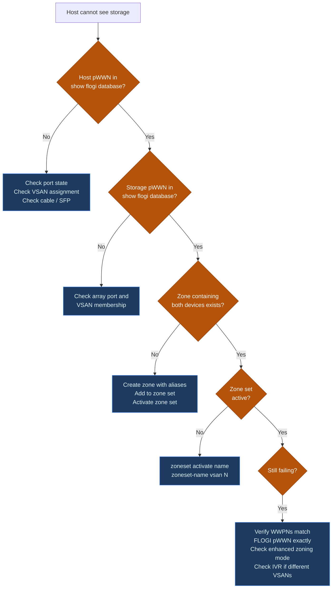

# MDS — Common Issues


<div class="kb-summary">
> Part of the [Cisco MDS](../../index.md) reference.
</div>

---

## Triage Checklist

When investigating a SAN fault, capture state in this order to build a complete picture before making any changes.

```bash
# 1. Identify down or errDisabled interfaces
show interface brief

# 2. Identify missing host or storage logins
show flogi database

# 3. Check syslog for the fault event and timeline
show logging last 100

# 4. Rule out hardware faults
show environment

# 5. Confirm zoning is intact
show zoneset active vsan all

# 6. Check ISL and fabric topology
show topology
show trunk
show port-channel summary

# 7. Check domain IDs for conflict
show fcdomain domain-list vsan 10
```
```
┌────────────────────────────── Cisco MDS — Troubleshooting Common Issues ──────────────────────────────┐
│                                                                                                       │
│  Most frequent MDS fabric issues: FLOGI failures, E_Port isolation, zoning errors.                    │
│                                                                                                       │
│   ┌──────────────────────────────────────────────┐  ┌─────────────────────────────────────────────┐   │
│   │                Login Failures                │  │             ISL / E_Port Issues             │   │
│   │      FLOGI rejected: port VSAN mismatch      │  │       E_Port isolated: domain ID clash      │   │
│   │      PLOGI fail: zoning not configured       │  │        ISL down: SFP incompatibility        │   │
│   │         HBA offline: SFP link fault          │  │        Trunk mismatch: VSAN list diff       │   │
│   │          FDISC: NPV mode login fail          │  │         Segmented fabric: FSPF cost         │   │
│   │        Show flogi database to verify         │  │           Show interface fc state           │   │
│   └──────────────────────────────────────────────┘  └─────────────────────────────────────────────┘   │
│                                                                                                       │
│  Login errors require FLOGI/PLOGI trace; ISL errors need domain/VSAN alignment check                  │
│                                                                                                       │
│                          ▼                                                 ▼                          │
│                                                                                                       │
│   ┌──────────────────────────────────────────────┐  ┌─────────────────────────────────────────────┐   │
│   │                Zoning Issues                 │  │              Performance Issues             │   │
│   │       Zone not active: pending commit        │  │           High BB_Credit pressure           │   │
│   │        WWN not in zone: PLOGI denied         │  │         CRC errors: cable or SFP bad        │   │
│   │        Zone merge conflict: mismatch         │  │        Congestion: slow-drain device        │   │
│   │         Default zone deny: block all         │  │          IOCTL timeout: queue depth         │   │
│   │          Show zone active to verify          │  │           Show interface counters           │   │
│   └──────────────────────────────────────────────┘  └─────────────────────────────────────────────┘   │
│                                                                                                       │
│  Physical Infrastructure (the hardware everything above runs on):                                     │
│  MDS line cards · SFP transceivers · ISL fiber · HBA in server · storage array ports                  │
│                                                                                                       │
│  Key terms:                                                                                           │
│                                                                                                       │
│  FLOGI          = Fabric Login; N_Port to switch handshake to join the fabric                         │
│  PLOGI          = Port Login; N_Port to N_Port session establishment through fabric                   │
│  FDISC          = Fabric Discover; VN_Port login in NPIV/NPV environments                             │
│  E_Port         = Expansion Port; ISL port mode between two switches                                  │
│  E_Port isolated= Admin-isolated due to domain ID or parameter conflict                               │
│  Domain ID      = Unique 1-239 identifier for each switch in a fabric                                 │
│  BB_Credit      = Buffer-to-Buffer Credit; flow control units for FC link                             │
│  Slow-drain     = Device accepting frames slowly; causes backpressure upstream                        │
│  Zone merge     = Process of combining zone databases when two fabrics connect                        │
│  Default zone   = Policy for devices not in any explicit zone: deny or permit                         │
│  FSPF           = Fabric Shortest Path First; routing protocol determining ISL paths                  │
│  CRC error      = Frame checksum failure; indicates physical layer problem                            │
│                                                                                                       │
└───────────────────────────────────────────────────────────────────────────────────────────────────────┘
```

```bash
# Check reason
show interface fc1/4
# Look for: "Port is in error-disabled state"

# Check log for the triggering event
show logging last 200 | grep -i "err\|disabled\|fc1/4"
```

**Never re-enable an errDisabled port without first resolving the root cause.** The port will immediately errDisable again.

| errDisabled Reason | Cause | Action |
|---|---|---|
| `fcot-not-present` | SFP missing or not seated | Reseat or replace SFP |
| `link-failure-count-exceeded` | Repeated link flaps | Replace cable/SFP; investigate flapping cause |
| `isolation` | VSAN merge conflict | Resolve VSAN conflict; check trunk allowed VSANs |
| `rcf-failure` | Domain ID conflict in fabric | Resolve domain ID conflict (see below) |
| `cfg-invalid` | Configuration error | Fix VSAN assignment or port mode config |

**Recovery after resolving root cause:**

```bash
interface fc1/4
  shutdown
  no shutdown

show interface fc1/4
# Confirm state returns to 'up'
```

---

## Host Cannot See Storage

**Symptom:** A host reports no FC storage paths. A newly connected server cannot discover any LUNs. Multipath shows one fewer path than expected.

**Structured triage:**

```bash
# 1. Is the host HBA logged into the fabric?
show flogi database vsan 10 | grep <host-pwwn>

# 2. Is the storage target logged in?
show flogi database vsan 10 | grep <storage-pwwn>

# 3. Is there a zone pairing these two devices?
show zone member pwwn <host-pwwn> vsan 10

# 4. Is the zoneset containing that zone currently active?
show zoneset active vsan 10

# 5. Are both ports in the same VSAN?
show vsan membership interface fc<host-port>
show vsan membership interface fc<storage-port>
```

**Decision tree:**



---

## Zoning: Zone Set Not Activating

**Symptom:** `zoneset activate` fails or does not propagate across the fabric.

```bash
# Check zone status
show zone status vsan 10

# Check for pending changes in enhanced mode
zone commit vsan 10

# Retry activate
zoneset activate name <zoneset-name> vsan 10
```

**Common blockers:**

| Issue | Check | Fix |
|---|---|---|
| Enhanced zoning — uncommitted changes | `show zone status vsan <id>` shows pending | `zone commit vsan <id>` before activating |
| Device alias not committed | `show device-alias status` shows pending | `device-alias commit` |
| Zone member has invalid PWWN format | `show zone vsan <id>` shows error markers | Remove and re-add with correct WWPN |
| CFS distribution failure | `show cfs lock` | Clear lock: `clear cfs session`; investigate CFS conflict |
| Zone set name mismatch | Activating wrong zone set | `show zoneset vsan <id>` — list all zone sets to confirm name |

---

## ISL Down or Isolated

**Symptom:** `show topology` shows a missing ISL link between switches, or a VSAN shows as `isolated` on the ISL port.

```bash
# Check ISL port state
show interface fc2/1
show interface fc2/1 counters errors

# Check trunk state and VSAN allowance
show trunk

# Check port-channel membership if applicable
show port-channel summary

# Check for VSAN isolation reason
show vsan
show vsan <id>
```

**Isolation causes and fixes:**

| Cause | Diagnostic | Fix |
|---|---|---|
| VSAN not allowed on trunk | `show trunk` — VSAN missing from allowed list | `switchport trunk allowed vsan add <id>` |
| VSAN suspended on one switch | `show vsan <id>` — state `suspended` | `no vsan <id> suspend` in `vsan database` |
| Domain ID conflict after merge | `show fcdomain domain-list vsan <id>` — duplicate IDs | Assign unique static domain ID before connecting ISL |
| Speed/mode mismatch | Both ends not `TE` or speed differs | Force same speed and `switchport mode TE` on both ends |

---

## Domain ID Conflict

**Symptom:** After connecting a new MDS switch or recovering from a network partition, a VSAN goes isolated. `show fcdomain` shows a conflict.

```bash
show fcdomain vsan 10
show fcdomain domain-list vsan 10
```

**Resolution:**

1. Shut the ISL connecting the two switches: `interface fc2/1` → `shutdown`
2. On the new or conflicting switch, assign a unique static domain ID:
   ```bash
   fcdomain domain 4 static vsan 10
   ```
3. Bring the ISL back up: `no shutdown`
4. Verify: `show fcdomain domain-list vsan 10` — each switch should have a unique ID

---

## FLOGI Instability / Port Flapping

**Symptom:** `show logging` contains repeated `link down`/`link up` or `FLOGI accepted`/`rejected` events on the same port. This degrades fabric stability and can cause I/O disruptions on dependent zones.

```bash
# Identify flapping port
show logging last 200 | grep "link down\|link up\|flogi" | head -40

# Check error counters on the suspect port
show interface fc1/6 counters errors

# Check optical power levels
show interface fc1/6 transceiver
```

**Resolution:**

1. Shut the flapping port to stop the instability: `interface fc1/6` → `shutdown`
2. Replace the SFP — optical degradation is the most common cause
3. If SFP replacement does not help, replace the fibre cable
4. If both are replaced and problem persists, check the HBA or storage array port on the connected device
5. Re-enable the port once root cause is confirmed resolved

---

## High CPU / Slow CLI

**Symptom:** CLI responses are slow; `show system resources` shows CPU > 80%.

```bash
# Check overall CPU and memory
show system resources

# Find top CPU consumers
show processes cpu sort | head -20

# Check if caused by port flap storm (many FLOGI events)
show logging last 200 | grep -ci "link down"
```

If the high CPU is caused by FLOGI storms (many link events in the log), shut the offending port. If CPU is high without an obvious cause, collect `show tech-support` and open a TAC case.

---

## Configuration Lost After Reload

**Symptom:** Changes made before a reload (zone updates, VSAN changes, new device aliases) are missing after the switch comes back up.

**Cause:** `copy running-config startup-config` was not run after the changes.

```bash
# Always run this after every configuration change
copy running-config startup-config

# Verify startup config was updated
show startup-config | grep <changed-item>
```

For large changes, also take a checkpoint:

```bash
checkpoint post-change
show checkpoint summary
```

---

## Known Issues Reference

Add site-specific known issues below as they are discovered and resolved. Include: date, symptom, root cause, and resolution.

| Date | Switch | Symptom | Root Cause | Resolution |
|---|---|---|---|---|
| — | — | — | — | — |
