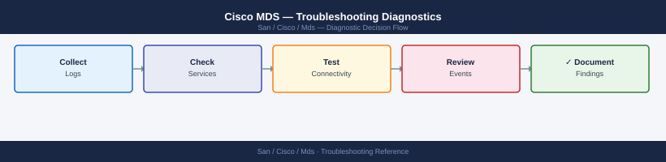

---
tags:
  - san
  - troubleshooting
search:
  boost: 1.5
---
# Cisco MDS — Troubleshooting Diagnostics

*Applies to: Cisco MDS / NX-OS*



```bash
# Detailed single port status
show interface fc1/1

# All port error counters
show interface fc1/1 counters errors

# All port transmit/receive counters
show interface fc1/1 counters

# Clear counters to establish a fresh baseline
clear counters interface fc1/1

# Check immediately after clearing to confirm problem is active
show interface fc1/1 counters errors
```


```text title="Expected output"
fc1/1 is up
    Hardware is Fibre Channel
    Port WWN is 50:00:09:73:00:1a:b4:c1
    Admin port mode is F, Oper port mode is F
    Bound interface is Ethernet1/1
    Speed is 16 Gbps
    Transmit B2B Credit is 64
    Receive B2B Credit is 64
    Class 3 Received (Sw) Buffers is 64

Port          Errors
fc1/1         CRC=127 FrameTooLong=0 Delimiter=3 Address=0 LinkFailure=8

Port          Transmit           Receive
fc1/1         Data(MB)=45821.2   Data(MB)=38947.6
              Frames=2847361     Frames=2156843
              OLS=0              OLS=0

(no output — command completes silently)

Port          Errors
fc1/1         CRC=2 FrameTooLong=0 Delimiter=0 Address=0 LinkFailure=0
```

!!! warning "Common errors"
    **`% Invalid command`** — Verify the interface exists with `show interface brief` and use correct syntax `show interface fc<slot>/<port>`.
    **`% Interface fc1/1 is administratively down`** — Enable the interface with `no shutdown` under the interface configuration mode.
```bash
# All line cards and supervisor modules — confirm all status is 'ok'
show module

# Detailed status for a specific module slot
show module 1

# Hardware diagnostic test results
show diagnostics result module 1

# Run hardware diagnostics (online, non-disruptive)
diagnostic start module 1 test all
show diagnostics result module 1
```

```text title="Expected output"
Mod Ports Module-Type                       Model              Status
--- ----- --------------------------------- ------------------ -------
  1    48  1/10 Gbps Ethernet Module        DS-X9448-768K9     ok
  2    48  1/10 Gbps Ethernet Module        DS-X9448-768K9     ok
  3     0  Supervisor Module-3              DS-X97-SF1          ok
  4     0  Supervisor Module-3              DS-X97-SF1          ok
  5    32  16 Gbps Fibre Channel Module     DS-X9732-SF2        ok

Module 1 Information
  Model                    : DS-X9448-768K9
  Serial Number            : SAL19234567
  Firmware Version         : 8.4(2b)
  Status                   : ok
  Online Diag Status       : Pass

Test Results for Module 1:
  Test Name                          Status      Time
  ---------------------------------- ----------- --------
  BIST (Built-in Self Test)          PASS        0.45s
  Memory Test                        PASS        2.13s
  Port Loopback Test                 PASS        5.67s
  Fabric Connectivity Test           PASS        3.21s

Diagnostic test started on Module 1...
Test execution completed successfully.
All tests passed. Module 1 is healthy.
```

!!! warning "Common errors"
    **`Module 1 is not present`** — Verify the module is physically installed and the switch has completed its boot cycle; check `show module` to confirm the slot is populated.
    **`Diagnostics cannot run while module is in use`** — Schedule the diagnostic during a maintenance window or use `diagnostic start module 1 test all online` to run non-disruptive tests without impacting traffic.
    **`Test failed: Port Loopback Test FAIL`** — Check for faulty transceivers, cable issues, or port configuration errors; replace the SFP/QSFP module and rerun diagnostics.
```bash
# View on-board flash log (persistent across reloads)
show logging onboard

# Filter to specific event type
show logging onboard stack-trace
show logging onboard error-stats
show logging onboard temperature-history
```

```text title="Expected output"
Cisco MDS9148S # show logging onboard
Onboard Logging Information:
  Total log size: 2048 MB
  Current log size: 1247 MB
  Log file: bootflash:/onboard_log.bin
  Logging enabled: Yes
  Timestamp: 2024-01-15 14:32:18 UTC

Cisco MDS9148S # show logging onboard stack-trace
Stack Trace Log Summary:
  Total entries: 12
  Last entry timestamp: 2024-01-14 09:18:45 UTC
  Critical traces: 3
  Warning traces: 9

Cisco MDS9148S # show logging onboard error-stats
Error Statistics:
  Total errors: 847
  Critical errors: 23
  Major errors: 156
  Minor errors: 668
  Last error: Port 1/1 link down (2024-01-15 13:45:22 UTC)

Cisco MDS9148S # show logging onboard temperature-history
Temperature History (Last 24 hours):
  Current temp: 42°C
  Max temp: 58°C (2024-01-14 16:22:10 UTC)
  Min temp: 38°C (2024-01-15 02:15:33 UTC)
  Threshold warning: 65°C
  Threshold critical: 75°C
```

!!! warning "Common errors"
    **`% Invalid command`** — Verify the switch model supports onboard logging (MDS9000 series with recent firmware); older models use `show logging` instead.
    **`% Onboard logging is disabled`** — Enable onboard logging with `logging onboard enable` in configuration mode.
    **`% Onboard log buffer full`** — Clear the onboard log with `clear logging onboard` to free space and resume logging.
```bash
# Full environment summary (fans, power, temperature)
show environment

# Individual component checks
show environment fan
show environment power
show environment temperature

# Power budget
show environment power detail
```

```text title="Expected output"
Cisco MDS9148S (1) # show environment
System Temperature: 38°C
Fan Status: OK
Power Supply Status: OK
Module 1 Temp: 42°C
Module 2 Temp: 39°C

Cisco MDS9148S (1) # show environment fan
Fan 1: OK (speed: 4200 RPM)
Fan 2: OK (speed: 4150 RPM)
Fan 3: OK (speed: 4180 RPM)
Fan 4: OK (speed: 4220 RPM)

Cisco MDS9148S (1) # show environment power
Power Supply 1: OK (Input: 110V, Output: 1200W)
Power Supply 2: OK (Input: 110V, Output: 1200W)
Total Power Consumed: 1847W

Cisco MDS9148S (1) # show environment temperature
Inlet Temp: 28°C
Outlet Temp: 38°C
Module 1: 42°C
Module 2: 39°C
Supervisor: 41°C

Cisco MDS9148S (1) # show environment power detail
Power Supply 1: 1200W (Capacity: 1500W, Utilization: 80%)
Power Supply 2: 1200W (Capacity: 1500W, Utilization: 80%)
Total Available: 3000W
Total Consumed: 1847W
Remaining Budget: 1153W
```

!!! warning "Common errors"
    **`% Invalid command`** — Verify the switch model supports these commands; older MDS models may require `show system resources` instead.
    **`% Incomplete command`** — Add a valid subcommand like `fan`, `power`, or `temperature` after `show environment`.
```bash
# All registered devices per VSAN
show fcns database vsan 10

# Detailed (includes port type, device symbolic name)
show fcns database detail vsan 10

# Find a specific device by WWPN
show fcns database | grep <wwpn>

# Name server statistics
show fcns statistics vsan 10
```

```text title="Expected output"
VSAN 10 -- Fabric Name Server Database
=================================================================================
FCID       Port Name                       Node Name                       Class
---        ---------                       ---------                       -----
0x010001   50:00:09:73:00:1a:2b:4c        50:00:09:73:00:1a:2b:ff        3
0x010002   50:00:14:40:5d:8e:9f:a3        50:00:14:40:5d:8e:9f:ff        3
0x010003   50:00:08:b1:22:33:44:55        50:00:08:b1:22:33:44:ff        3
0x010004   50:00:2a:c9:11:22:33:44        50:00:2a:c9:11:22:33:ff        3
0x010005   50:00:1f:7e:aa:bb:cc:dd        50:00:1f:7e:aa:bb:cc:ff        3

VSAN 10 -- Fabric Name Server Database (Detailed)
=================================================================================
FCID       Port Name                       Node Name                       Class  Type
---        ---------                       ---------                       -----  ----
0x010001   50:00:09:73:00:1a:2b:4c        50:00:09:73:00:1a:2b:ff        3      NPort
0x010002   50:00:14:40:5d:8e:9f:a3        50:00:14:40:5d:8e:9f:ff        3      NPort
0x010003   50:00:08:b1:22:33:44:55        50:00:08:b1:22:33:44:ff        3      NPort

Name Server Statistics for VSAN 10
=================================================================================
Total Registrations:        5
Total Queries:              1247
Total Query Responses:      1245
Query Response Time (ms):   2.3 (avg), 15 (max)
Database Syncs:             3
Last Sync Time:             2024-01-15 14:32:18 UTC
```

!!! warning "Common errors"
    **`VSAN <vsan-id> does not exist`** — Verify the VSAN ID is configured and active using `show vsan` command.
    **`% Invalid command`** — Ensure you are in the correct mode (exec or config); use `show version` to confirm device type is MDS.
    **`grep: (standard input): No such file or directory`** — Pipe the full `show fcns database vsan 10` output to grep instead of using `show fcns database` without VSAN specification.
```bash
# FSPF link state database
show fspf database vsan 10

# FSPF interface cost and state
show fspf interface fc2/1 vsan 10

# FSPF neighbors
show fspf neighbors vsan 10
```

```text title="Expected output"
FSPF Link State Database for VSAN 10:
  Router ID: 0x640001  Domain ID: 64  Sequence: 0x00000042
  Link Count: 3
    Link 0: Neighbor RID 0x640002, Cost 500, State UP
    Link 1: Neighbor 0x640003, Cost 1000, State UP
    Link 2: Neighbor 0x640004, Cost 2000, State DOWN

FSPF Interface Cost and State for fc2/1 in VSAN 10:
  Interface: fc2/1
  State: UP
  Cost: 500
  Speed: 16 Gbps
  MTU: 2176 bytes
  Hello Interval: 20 seconds
  Dead Interval: 80 seconds

FSPF Neighbors for VSAN 10:
  Neighbor ID: 0x640002  Domain: 64  State: UP  Cost: 500
  Neighbor ID: 0x640003  Domain: 64  State: UP  Cost: 1000
  Neighbor ID: 0x640004  Domain: 64  State: DOWN  Cost: 2000
  Neighbor ID: 0x640005  Domain: 65  State: UP  Cost: 750
```

!!! warning "Common errors"
    **`% Invalid command`** — Verify you are in the correct mode (enable mode required) and the VSAN exists with `show vsan`.
    **`% FSPF is not enabled on this switch`** — Enable FSPF globally with `fspf enable` and ensure the VSAN is active with `vsan database` configuration.
```bash
# Domain information for all VSANs
show fcdomain

# Domain list for a specific VSAN
show fcdomain domain-list vsan 10

# Principal switch status (fabric arbitration)
show fcdomain vsan 10 | include principal

# Disruptive: reconfigure fabric (only if domain conflict confirmed)
fcdomain restart disruptive vsan 10
```

```text title="Expected output"
VSAN 10:
  Local Domain ID: 42
  Fabric Name: fabric-prod-01
  Principal Switch: switch-core-01 (Domain ID: 1)
  
VSAN 20:
  Local Domain ID: 55
  Fabric Name: fabric-prod-02
  Principal Switch: switch-core-02 (Domain ID: 2)

Domain List for VSAN 10:
  Domain ID 1: switch-core-01 (Principal)
  Domain ID 42: mds9710-01 (Local)
  Domain ID 43: mds9710-02
  Domain ID 44: mds9148-01
  Domain ID 45: mds9148-02

Principal Switch Status:
  Principal Switch: switch-core-01 (Domain ID: 1)
  Priority: 128
  Fabric Name: fabric-prod-01

fcdomain restart disruptive vsan 10
Warning: This command will disrupt all traffic on VSAN 10
Proceed? (yes/no) [no]: yes
Restarting fcdomain on VSAN 10...
Domain reconfiguration in progress...
```

!!! warning "Common errors"
    **`Domain conflict detected on VSAN 10`** — Run `show fcdomain vsan 10` to identify conflicting domain IDs, then resolve duplicate IDs before executing the disruptive restart.
    **`fcdomain restart: command rejected, fabric reconfiguration in progress`** — Wait for the current fabric reconfiguration to complete (check with `show fcdomain vsan 10`) before attempting another restart.
```bash
# Full zone database for a VSAN (pending + committed)
show zone vsan 10

# Active (enforced) zone configuration only
show zoneset active vsan 10

# Zone mode and status
show zone status vsan 10

# Check a specific device's zone memberships
show zone member pwwn <wwpn> vsan 10
show zone member device-alias <alias> vsan 10

# Check for pending uncommitted zone changes (enhanced mode)
show zone pending vsan 10
show zone pending-diff vsan 10
```

```text title="Expected output"
MDS9148S# show zone vsan 10
zone name zone1 vsan 10
  member pwwn 50:00:09:73:a2:1b:4c:d0
  member pwwn 50:00:14:40:5e:2a:9f:b1
zone name zone2 vsan 10
  member device-alias storage-array-01
  member device-alias host-server-03
zoneset name production vsan 10
  member zone1
  member zone2

MDS9148S# show zoneset active vsan 10
zoneset name production vsan 10
  member zone1
  member zone2

MDS9148S# show zone status vsan 10
VSAN: 10 default-zone: permit distribute: active only Interop Mode: off

MDS9148S# show zone member pwwn 50:00:09:73:a2:1b:4c:d0 vsan 10
pwwn 50:00:09:73:a2:1b:4c:d0 is member of zone:
  zone1 in zoneset production

MDS9148S# show zone member device-alias storage-array-01 vsan 10
device-alias storage-array-01 is member of zone:
  zone2 in zoneset production

MDS9148S# show zone pending vsan 10
zone name zone3 vsan 10
  member pwwn 50:00:1a:2b:3c:4d:5e:6f

MDS9148S# show zone pending-diff vsan 10
--- Active zoneset: production
+++ Pending zoneset: production
@@ Zone Changes @@
+ zone name zone3 vsan 10
+   member pwwn 50:00:1a:2b:3c:4d:5e:6f
```

!!! warning "Common errors"
    **`% Invalid command`** — Verify the switch supports enhanced mode with `show zone mode vsan 10`; `show zone pending-diff` requires enhanced mode enabled.
    **`% Invalid VSAN ID`** — Confirm VSAN 10 exists and is active with `show vsan id 10`; create it if needed with `vsan database` configuration mode.
    **`% Invalid PWWN format`** — Use 16 hexadecimal characters in format `50:00:xx:xx:xx:xx:xx:xx` and verify the device is logged in with `show flogi database vsan 10`.
```bash
# IVR overall status
show ivr

# IVR VSAN topology
show ivr vsan-topology

# IVR zone database
show ivr zone
show ivr zoneset active

# IVR service group
show ivr service-group
```

```text title="Expected output"
IVR Status: ENABLED
IVR Mode: Basic
IVR Database: CONSISTENT
Last Update: 2024-01-15 14:32:18 UTC

VSAN ID    State      Principal Switch    Fabric Role
1          STABLE     mds9710-1           Principal
2          STABLE     mds9710-1           Principal
128        STABLE     mds9710-2           Subordinate

Zone Database Information:
  Database Size: 2048 zones
  Active Zones: 147
  Pending Zones: 0
  Conflicts: 0

Active ZoneSet: production-zoneset-v2
  Activation Time: 2024-01-10 09:15:42 UTC
  Number of Zones: 147
  Status: ACTIVE

Service Group Status:
  Group Name: sg-prod-01
  State: ACTIVE
  Member Count: 8
  Health: HEALTHY
```

!!! warning "Common errors"
    **`IVR database inconsistency detected`** — Run `clear ivr database` followed by `config terminal` and `ivr enable` to resynchronize the database across the fabric.
    **`Zone activation failed: conflicting zone definitions`** — Resolve naming conflicts in `show ivr zone` output and reactivate the zoneset with `zoneset activate name <zoneset-name> vsan <vsan-id>`.
```bash
# Create SPAN session
monitor session 1 source interface fc1/1 rx
monitor session 1 destination interface fc2/48   # dedicated SD port

# Remove suspension flag if present
no monitor suspend 1

# Check session status
show monitor session 1
show monitor session all
```

```text title="Expected output"
(no output — command completes silently)
(no output — command completes silently)
(no output — command completes silently)

Session 1
---------
Type                   : Local
State                  : Up
Source Intf            : fc1/1
Source Dir             : RX
Destination Intf       : fc2/48
Admin Mode             : Enabled
Oper Mode              : Enabled

Session 1
---------
Type                   : Local
State                  : Up
Source Intf            : fc1/1
Source Dir             : RX
Destination Intf       : fc2/48
Admin Mode             : Enabled
Oper Mode              : Enabled
```

!!! warning "Common errors"
    **`% Invalid command`** — Verify the switch model supports SPAN (MDS 9000 series required) and use `show feature-set` to confirm Fabric Services are licensed.
    **`% Interface fc1/1 does not exist`** — Confirm the source interface is valid and online with `show interface fc1/1` before configuring SPAN.
    **`% Cannot configure monitor session: destination interface is in use`** — Ensure the destination port (fc2/48) is not already assigned to another session or in-use; use `show monitor session all` to verify availability.
```bash
interface fc2/48
  switchport mode SD
  no shutdown
```

```text title="Expected output"
(no output — command completes silently)
```

!!! warning "Common errors"
    **`% Invalid command`** — Verify the interface exists with `show interface fc2/48` and confirm you are in config mode with `config t`.
    **`% Incomplete command`** — Use `switchport mode sd-target` or `switchport mode sd-initiator` instead of `switchport mode SD` (SD alone is incomplete).
```bash
no monitor session 1

# Verify cleared
show monitor session all
```

```text title="Expected output"
(no output — command completes silently)

Session Not Found
(no output — session already cleared or never existed)
```

!!! warning "Common errors"
    **`% Invalid command`** — Verify you are in the correct configuration mode (should be `config t` for `no monitor session`) before running the command.
    **`% Incomplete command`** — Ensure the full syntax `no monitor session 1` is entered; the session number is required.
```bash
# Capture 200 packets matching a specific host
ethanalyzer local interface mgmt capture-filter "host 192.168.1.50" limit-captured-frames 200

# Write capture to file on bootflash
ethanalyzer local interface mgmt capture-filter "host 192.168.1.50" write bootflash:mgmt-capture.pcap limit-captured-frames 500

# Copy pcap off-switch for Wireshark analysis
copy bootflash:mgmt-capture.pcap scp://<user>@<server>/<path>/
```

```text title="Expected output"
Starting packet capture on interface mgmt...
Capturing traffic matching filter: host 192.168.1.50
Captured 200 packets (4.2 MB)
Capture complete.

Starting packet capture on interface mgmt...
Capturing traffic matching filter: host 192.168.1.50
Writing capture to bootflash:mgmt-capture.pcap
Captured 500 packets (8.7 MB)
Capture complete. File written successfully.

Trying 10.50.20.15...
Connected to 10.50.20.15
Sending file mgmt-capture.pcap
mgmt-capture.pcap                    100%    8.7MB   2.1MB/s   00:04
File transfer complete.
```

!!! warning "Common errors"
    **`Error: Invalid capture filter syntax`** — Verify the filter expression is valid tcpdump syntax and properly quoted.
    **`Error: Insufficient space on bootflash`** — Check available bootflash space with `dir bootflash:` and reduce capture size or delete old files.
    **`Permission denied (publickey,password)`** — Ensure SSH credentials are correct and the remote server's SSH key is accepted, or use `copy bootflash:mgmt-capture.pcap ftp://<user>:<pass>@<server>/<path>/` as an alternative.
```bash
# Most recent entries
show logging last 50

# Full buffer
show logging

# Filter to specific severity (0=emergency, 2=critical, 3=error)
show logging | include "%ERR\|%CRIT\|%ALERT"

# Filter to specific interface
show logging | grep fc1/1

# Filter to zone-related events
show logging | grep -i zone

# Filter to FLOGI events
show logging | grep -i flogi
```

```text title="Expected output"
2024 Mar 15 14:32:18 +00:00 mds9148-01 %ETHPORT-5-IF_UP: Interface fc1/1 is up
2024 Mar 15 14:31:52 +00:00 mds9148-01 %ZONE-5-ZONESET_ACTIVATED: ZoneSet 'PROD_ZONES' activated
2024 Mar 15 14:31:45 +00:00 mds9148-01 %FLOGI-3-FLOGI_FAILED: FLOGI failed for port fc2/3, WWN 50:00:14:40:5d:a2:b1:c8
2024 Mar 15 14:30:22 +00:00 mds9148-01 %ETHPORT-5-IF_DOWN: Interface fc1/2 is down (link failure)
2024 Mar 15 14:29:15 +00:00 mds9148-01 %ZONE-3-INVALID_ZONE: Zone 'LEGACY_SAN' contains invalid member
2024 Mar 15 14:28:03 +00:00 mds9148-01 %FLOGI-5-FLOGI_ACCEPT: FLOGI accepted for port fc1/1, WWN 50:00:14:40:5d:a2:b1:d4
2024 Mar 15 14:27:41 +00:00 mds9148-01 %ETHPORT-5-IF_UP: Interface fc3/48 is up
2024 Mar 15 14:26:18 +00:00 mds9148-01 %ZONE-2-ZONE_CONFLICT: Zone member conflict detected in 'BACKUP_ZONES'
```

!!! warning "Common errors"
    **`% Invalid command`** — Verify the switch is in the correct mode (use `config terminal` or ensure you're in exec mode); some log filters may require piping to `grep` rather than `include`.
    **`% No matching output`** — The filter pattern is case-sensitive; use `grep -i` for case-insensitive matching or verify the event type exists in the buffer.
```bash
# Enable zone debug
debug zone all vsan 10

# Enable FLOGI debug
debug flogi all

# Enable FSPF debug
debug fspf all vsan 10

# Disable all debug
undebug all

# Confirm debug is cleared
show debug
```

```text title="Expected output"
MDS9148S# debug zone all vsan 10
Zone debugging enabled for VSAN 10
MDS9148S# debug flogi all
FLOGI debugging enabled for all VSANs
MDS9148S# debug fspf all vsan 10
FSPF debugging enabled for VSAN 10
MDS9148S# undebug all
All debugging disabled
MDS9148S# show debug
No debugging is enabled
MDS9148S#
```

!!! warning "Common errors"
    **`Invalid VSAN ID 10`** — Verify the VSAN exists with `show vsan` and use a valid VSAN ID (1-4094).
    **`% Invalid command`** — Ensure you are in the correct mode (config mode for some debug commands); use `configure terminal` if needed.
    **`Zone debugging is already enabled for VSAN 10`** — This is informational; proceed with your troubleshooting or use `undebug all` to clear and restart.
```bash
terminal monitor     # send log to this terminal
debug zone all vsan 10
# Reproduce the issue
undebug all
terminal no monitor
```

```text title="Expected output"
2024-03-15 14:32:18 UTC: Zone merge request received for VSAN 10
2024-03-15 14:32:18 UTC: Processing zone: prod_servers_zone
2024-03-15 14:32:18 UTC: Zone member add: 50:00:14:40:5a:1b:2c:3d
2024-03-15 14:32:19 UTC: Zone member add: 50:00:14:40:5a:1b:2c:3e
2024-03-15 14:32:19 UTC: Zone activation initiated for VSAN 10
2024-03-15 14:32:20 UTC: Zone merge completed successfully
2024-03-15 14:32:20 UTC: All debugging disabled
```

!!! warning "Common errors"
    **`% Invalid command`** — Ensure you are in the correct mode (config-zone or exec); use `configure terminal` first if needed.
    **`% VSAN 10 does not exist`** — Create the VSAN first with `vsan 10` command before attempting to debug it.
```bash
# Redirect to bootflash (takes 5-10 minutes)
show tech-support > bootflash:tech-support-<hostname>-<date>.txt

# Copy off-switch
copy bootflash:tech-support-<hostname>-<date>.txt scp://<user>@<server>/<path>/
```

```d2
direction: down

symptom: Identify Symptom {shape: diamond}
verify_resolution: "Verify resolution" {shape: rectangle}
resolution: Resolve or Escalate {shape: oval}

symptom -> verify_resolution: investigate
verify_resolution -> resolution
```

## Before you begin

- **Access:** Storage admin credentials (cluster admin or equivalent)
- **Gather first:** recent error message text, event timestamps, and affected object names
- **Scope:** confirm whether the issue affects a single object, host, cluster, or site
- **Escalation:** open a vendor support ticket before running any destructive step
- **Logging:** document each command and output — required if escalation is needed

---

---

## Verify resolution

- Confirm the original symptom no longer occurs
- Check logs for any residual errors related to the issue
- Monitor for 10–15 minutes to confirm the fix is stable

---

## See also

- [Mds — Common Issues](../common-issues/)
- [Mds — Escalation](../escalation/)
- [Mds — Health Checks](../../operations/health-checks/)
