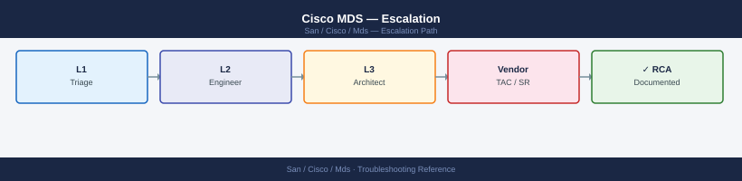
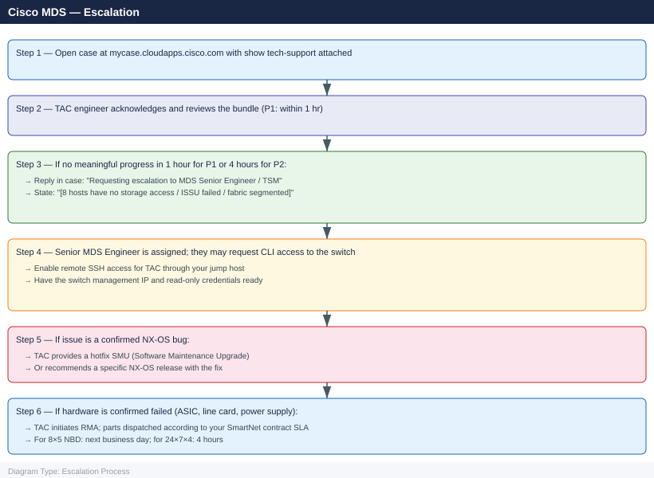

---
tags:
  - san
  - troubleshooting
search:
  boost: 1.5
---
# Cisco MDS — Escalation

<div class="kb-summary">
How to escalate Cisco MDS SAN switch issues to Cisco TAC: what data to collect, how to run show tech-support, step-by-step case creation on Cisco's support portal, and the escalation path when progress stalls.

*Applies to: Cisco MDS 9000 series · NX-OS 8.x / 9.x*
</div>



---

```d2
direction: down

symptom: Identify Symptom {shape: diamond}
preescalation_selfcheck: "Pre-Escalation Self-Check" {shape: rectangle}
stepbystep_data_collection: "Step-by-Step Data Collection" {shape: rectangle}
how_to_open_the_sr_on_cisco_tac_port: "How to Open the SR on Cisco TAC Portal" {shape: rectangle}
escalation_path: "Escalation Path" {shape: rectangle}
what_not_to_do: "What NOT to Do" {shape: rectangle}
useful_commands_for_case_updates: "Useful Commands for Case Updates" {shape: rectangle}
resolution: Resolve or Escalate {shape: oval}

symptom -> preescalation_selfcheck: investigate
symptom -> stepbystep_data_collection: investigate
symptom -> how_to_open_the_sr_on_cisco_tac_port: investigate
symptom -> escalation_path: investigate
symptom -> what_not_to_do: investigate
symptom -> useful_commands_for_case_updates: investigate
preescalation_selfcheck -> resolution
stepbystep_data_collection -> resolution
how_to_open_the_sr_on_cisco_tac_port -> resolution
escalation_path -> resolution
what_not_to_do -> resolution
useful_commands_for_case_updates -> resolution
```

## Before you begin

- **Access required:** SSH to Cisco MDS switch (admin credentials); Cisco account at mycase.cloudapps.cisco.com with SmartNet contract registered
- **Do this first:** collect show tech-support from ALL affected switches before touching anything. TAC will ask for it in their first response
- **Enforce a change freeze:** no zone changes, no module reloads, no ISSU upgrades during the incident. Every change adds a variable and delays diagnosis
- **Verify SmartNet:** before opening the case, confirm your serial number has active SmartNet coverage. Without coverage, TAC will ask for payment before assisting

---

## Pre-Escalation Self-Check

Run these from each MDS switch SSH session.

| Check | Command | Expected result |
|---|---|---|
| NX-OS version | `show version` | Note full NX-OS version string |
| Switch health | `show module` | All modules show `ok` status |
| VSAN membership | `show vsan` | All expected VSANs present; `active` state |
| FC port state | `show interface fc brief` | All expected ports `up` |
| Port errors | `show interface fc brief counters errors` | No ports with incrementing CRC or link failures |
| Zone config active | `show zoneset active vsan <id>` | Active zoneset matches expected baseline |
| FCNS entries | `show fcns database vsan <id>` | All expected WWPNs are logged in |
| PSIRT check | [psirt.cisco.com](https://psirt.cisco.com) | No active critical advisories for this NX-OS version |

---

## Step-by-Step Data Collection

Run on each affected MDS switch. SSH as admin.

### 1. Get the NX-OS version and switch serial number

```bash
# NX-OS version — include full string in TAC case description
show version

# Switch inventory — serial number required for TAC case and SmartNet validation
show inventory

# Example output:
# NAME: "Chassis",  DESCR: "MDS 9396T"
# PID: DS-C9396T   ,  VID: V01 ,  SN: JAE2XXXXXXX
```


```text title="Expected output"
Cisco MDS Switch Software
Copyright (c) 2002-2023 by Cisco Systems, Inc.
Compiled: 03/15/2023 18:45:32 +0000
System uptime is 247 days, 14 hours, 32 minutes

Software
  BIOS: version 3.45.0
  Kickstart: version 9.2(2)
  System: version 9.2(2)
  FPGA versions:
    PS1: 0x20180612
    PS2: 0x20180612

NAME: "Chassis",  DESCR: "MDS 9396T"
PID: DS-C9396T   ,  VID: V01 ,  SN: JAE2K4A8N2P1

NAME: "Module 1",  DESCR: "MDS 9396T 96-port 32Gb Fibre Channel Module"
PID: DS-X97-SF1-384-K9  ,  VID: V02 ,  SN: JAE2K4A8N2P2

NAME: "Power Supply 1",  DESCR: "MDS 9396T Power Supply"
PID: PWR-C9396-1400DC  ,  VID: V01 ,  SN: PSU2K4A8N2P3

NAME: "Fan 1",  DESCR: "MDS 9396T Fan Module"
PID: FAN-C9396-F  ,  VID: V01 ,  SN: FAN2K4A8N2P4
```

!!! warning "Common errors"
    **`% Invalid command`** — Verify you are in the correct mode (use `enable` if needed) and check NX-OS version compatibility for the `show` command.
    **`% Incomplete command`** — Type the complete command `show version` or `show inventory` without truncation or typos.
### 2. Capture switch state (before anything changes)

```bash
# VSAN configuration — shows all VSANs and their state
show vsan

# Active zoneset for each VSAN
show zoneset active vsan 10
show zoneset active vsan 20

# FC domain configuration
show fcdomain vsan 10

# Port state summary
show interface fc brief

# FCNS database (logged-in WWPNs)
show fcns database vsan 10

# Recent syslog
show logging last 500
```


```text title="Expected output"
vsan 1 information
  vsan 1:Operational (Allowed)
vsan 10 information
  vsan 10:Operational (Allowed)
vsan 20 information
  vsan 20:Operational (Allowed)

zoneset name PROD_ZONE vsan 10
  zone name PROD_HOSTS vsan 10
    fcid 0x620100 [pwwn 50:00:14:40:5a:2b:c1:e0]
    fcid 0x620200 [pwwn 50:00:14:40:5a:2b:c1:e1]
  zone name PROD_STORAGE vsan 10
    fcid 0x630100 [pwwn 50:00:09:73:a2:5f:b4:22]

zoneset name DR_ZONE vsan 20
  zone name DR_HOSTS vsan 20
    fcid 0x640100 [pwwn 50:00:14:40:5a:2b:c2:f0]

fcdomain state: Stable
Local switch WWN: 20:00:00:05:73:a2:5f:b4
Domain ID: 0x62
Principal switch WWN: 20:00:00:05:73:a2:5f:b4

Interface  Vsan  Admin  Status  Speed  Type
fc1/1      10    up     up      16G    N_Port
fc1/2      10    up     up      16G    N_Port
fc1/3      20    up     down    16G    N_Port
fc1/4      1     up     up      8G     N_Port
fc2/1      10    up     up      16G    N_Port
...

FCNS Database for vsan 10:
PWWN: 50:00:14:40:5a:2b:c1:e0  FCID: 0x620100  NodeName: 50:00:14:40:5a:2b:c1:df
PWWN: 50:00:14:40:5a:2b:c1:e1  FCID: 0x620200  NodeName: 50:00:14:40:5a:2b:c1:df
PWWN: 50:00:09:73:a2:5f:b4:22  FCID: 0x630100  NodeName: 50:00:09:73:a2:5f:b4:21

2024 Jan 15 14:32:18 mds9710-01 %ETHPORT-5-IF_DOWN_LINK_FAILURE: Interface fc1/3 is down (Link failure or not connected)
2024 Jan 15 14:15:02 mds9710-01 %ZONE-2-ZONESET_ACTIVATE: Zoneset PROD_ZONE activated on vsan 10
2024 Jan 15 13:48:55 mds9710-01 %FCDOMAIN-3-FCDOMAINSTATE_CHANGE: FC domain state changed to Stable
```

!!! warning "Common errors"
    **`% Invalid command`** — Verify the exact VSAN number exists with `show vsan` before
Save all output to a text file and paste the critical sections into the TAC case description.

### 3. Run show tech-support (takes 2–5 minutes)

```bash
# Generate the tech-support bundle — this is the most important data for TAC
show tech-support

# The output is large (several MB). Redirect to a file for SCP transfer:
# From a management workstation: ssh admin@<mds-ip> "show tech-support" > mds-tech-support.txt

# If NX-OS supports it, write directly to a file on bootflash:
show tech-support > bootflash:tech-support-$(hostname)-$(show clock).txt
# Then copy with: copy bootflash:tech-support-*.txt scp://<user>@<server>//<path>
```


```text title="Expected output"
Generating Tech Support Information. This may take a few minutes...
Cisco MDS 9148S (1 Slot) Chassis ("MDS 9100")
Processor Memory: 8388608 Kbytes
Device name: mds-core-01
bootflash: 51200000 Kbytes

------- show version -------
Cisco MDS SAN-OS Software, version 8.4(2c)
System uptime is 127 days, 14 hours, 23 minutes

------- show inventory -------
NAME: "Chassis",  DESCR: "MDS 9148S 16G FC (1 Slot) Chassis"
PID: DS-C9148S-K9,  VID: V01,  SN: SSI2012345A

------- show interface brief -------
Interface  Status         Speed    Trunk Mode
fc1/1      notConnected   auto(2) F
fc1/2      notConnected   auto(2) F
fc1/3      connected      2Gbps   F
...
Tech-support data collection completed successfully.
Output file size: 4.2 MB
```

!!! warning "Common errors"
    **`% Invalid command`** — Verify the MDS model supports direct output redirection; older NX-OS versions require `copy` command instead of `>` operator.
    **`% No space left on device`** — Free bootflash space with `delete bootflash:old-files` before attempting to write the tech-support bundle.
    **`Connection refused`** — Ensure SSH is enabled on the MDS (`feature ssh`) and the management IP is reachable from your workstation before attempting remote SCP transfer.
Run show tech-support on EVERY MDS switch in the affected fabric, not just the one where the issue first appeared.

### 4. Capture zone configuration history (if zoning issue)

```bash
# Show the zone change log — shows who changed what and when
show zone analysis vsan <id>

# Show the full zone configuration (active and inactive)
show zoneset vsan <id>
show zone status vsan <id>
```


```text title="Expected output"
Zone Analysis for VSAN 1:
  Zone Name: prod_zone_01
    Member: pwwn 50:00:14:40:5a:1b:2c:3d
    Member: pwwn 50:00:14:40:5a:1b:2c:4e
    Last Modified: 2024-01-15 14:32:18 UTC
    Modified By: admin
  Zone Name: backup_zone_02
    Member: pwwn 50:00:14:40:5a:1b:2c:5f
    Last Modified: 2024-01-10 09:15:42 UTC
    Modified By: netadmin

zoneset name active_zoneset_vsan1 vsan 1
  zone name prod_zone_01 vsan 1
    member pwwn 50:00:14:40:5a:1b:2c:3d
    member pwwn 50:00:14:40:5a:1b:2c:4e
  zone name backup_zone_02 vsan 1
    member pwwn 50:00:14:40:5a:1b:2c:5f

VSAN 1 Zone Status:
  Active Zoneset: active_zoneset_vsan1
  Number of Zones: 2
  Number of Members: 3
  Config Status: Activated
  Last Activation: 2024-01-15 14:35:01 UTC
```

!!! warning "Common errors"
    **`% Invalid command`** — Verify the VSAN ID exists with `show vsan` and confirm you are in the correct mode (device# not device(config)#).
    **`% VSAN <id> does not exist`** — Check that the VSAN is created and active using `show vsan id <id>` before querying zone configuration.
### 5. Write the timeline

```text
NX-OS version: 9.3(2)
Switch: mds-core-01.corp.local (chassis serial: JAE2XXXXXXX)
Fabric: Fabric A (VSANs 10 and 20)
Issue first observed: 2026-06-14 14:30 UTC
Last known good state: 2026-06-14 12:00 UTC
Changes in 24h before the issue:
  - 12:00: zoneset update committed — added 3 new initiator WWPNs to zone storage-zone-A
  - 14:30: 8 hosts lost access to storage in VSAN 10
  - show fcns database: WWPNs of 8 hosts are no longer in the FCNS database
Steps already taken:
  - show zoneset active: zone config shows the correct members
  - show logging: "ZONE: Zoneset activation failed on FC domain 1" at 14:29
  - Did NOT modify the zoneset or reload any modules
Blast radius: 8 hosts in VSAN 10 cannot see storage; VMs on those hosts have I/O stalled
```

---

## How to Open the SR on Cisco TAC Portal

1. Go to **mycase.cloudapps.cisco.com** (Cisco's case management portal) and sign in with your Cisco.com account. Your account must be linked to your company's SmartNet contract for entitlement.

2. Click **Open New Case** (top right).

3. Under **Technology**, select **Storage Networking** → **MDS**.

4. Under **Product**, select **Cisco MDS 9000 Series Multilayer Switches**.

5. Under **Software Version**, enter your NX-OS version from Step 1.

6. Under **Serial Number**, enter the chassis serial from `show inventory`. This validates your SmartNet entitlement.

7. Under **Severity**, select:
   - **Severity 1 — Network Down**: Complete fabric outage; all hosts in this fabric cannot access storage; production is halted; no workaround
   - **Severity 2 — Degraded**: Partial fabric outage; some hosts affected; some alternate paths still exist; significant business impact
   - **Severity 3 — Partial/Intermittent**: Single switch or port issue; fabric is stable; intermittent errors; limited user impact
   - **Severity 4 — Minor/General**: How-to, planning, PSIRT advisory review, or non-urgent configuration question

8. In the **Subject** field: switch model + symptom + scope. Example: `Cisco MDS 9396T mds-core-01 — VSAN 10 zone activation failed, 8 hosts lost storage at 14:30 UTC`.

9. In the **Problem Description** field, paste:
   - NX-OS version and chassis serial from Step 1
   - VSAN state from Step 2
   - Zone change log from Step 4
   - The `show logging last 500` output showing the failure message
   - The timeline from Step 5

10. Under **Attachments**, upload:
    - The show tech-support output from Step 3 (one file per switch)

11. Click **Submit**. A case number is generated immediately.

12. **Severity 1 only:** call Cisco TAC immediately after submission:
    - North America: 1-800-553-2447 (24×7 for SmartNet with Sev1)
    - EMEA: +32 2 704 5555
    - State "Severity 1 — MDS fabric down, hosts have no storage" at the start of the call.

---

## Escalation Path



---

## What NOT to Do

| Do NOT do this | Why | What to do instead |
|---|---|---|
| Commit a zone configuration change mid-investigation | Changes the enforcement state TAC is analysing; may fix or worsen the issue unpredictably | Freeze all zone changes; show TAC the current config and let them direct the change |
| Reload a line card module without TAC | Can drop all traffic traversing that module; may not fix the root cause | Only reload if TAC specifically instructs and provides the exact command sequence |
| Swap SFPs or fiber without TAC confirmation | SFP failure is one possible cause, but may not be the only one | Confirm with TAC which port is failing before pulling hardware |
| Run ISSU during the incident | An upgrade during an active failure may leave NX-OS in a mixed state | Freeze all software changes until the incident is resolved |
| Modify AAA / SSH config mid-case | May lock TAC out of the remote session | Keep remote access configuration stable during the case |
| Open a second case for the same fabric | Splits TAC's diagnostic context | Use one case; add all updates to the same SR |

---

## Useful Commands for Case Updates

```bash
# Switch state summary — paste into every case update
show version
show module
show interface fc brief

# VSAN state
show vsan
show fcdomain vsan <id>

# Zone enforcement state
show zoneset active vsan <id>
show zone status vsan <id>

# FCNS — logged-in WWPNs (confirm initiators are visible)
show fcns database vsan <id>

# Recent syslog (last 100 lines)
show logging last 100

# Port error counters (flag CRC, link failures)
show interface fc brief counters errors
```


```text title="Expected output"
Cisco MDS9148S (1) -- Supervisor-3 (Active)
System uptime is 247 days 14 hours 23 minutes
Kernel uptime is 247 days 14 hours 19 minutes
System version: 9.2(2)

Mod Ports Module-Type Model Status
--- ----- ------------------------- ----------- ---------
1   48    MDS 9000 Fabric Switch    DS-MDS9148S ok
2   48    MDS 9000 Fabric Switch    DS-MDS9148S ok

Interface  Fabric  Port  Channel  Type  Speed   State
fc1/1      --      --    --       F     16Gbps  up
fc1/2      --      --    --       F     16Gbps  up
fc1/3      --      --    --       F     16Gbps  down
fc1/4      --      --    --       F     16Gbps  up
...

VSAN ID  Name                 State   Interoperability
1        VSAN0001             active  default
2        VSAN0002             active  default
10       VSAN0010_PROD        active  default

Active zone set: ZONESET_PROD
Zone: ZONE_INITIATORS
  member pwwn 50:00:14:40:5a:2b:c1:e0
  member pwwn 50:00:14:40:5a:2b:c1:e1

Zone: ZONE_TARGETS
  member pwwn 50:00:0e:1e:00:a0:1b:2f
  member pwwn 50:00:0e:1e:00:a0:1b:30

Zone status:
  Default zone: permit
  Session ID: 0x0
  Activation time: 2024-01-15 09:23:17 +00:00

FCNS Database for VSAN 1:
PWWN: 50:00:14:40:5a:2b:c1:e0 (Initiator-HBA-01)
  Port Name: 50:00:14:40:5a:2b:c1:e1
  Port Index: 0x010001
  State: Logged In
  Port Address: 0x010001

PWWN: 50:00:0e:1e:00:a0:1b:2f (Array-Storage-01)
  Port Name: 50:00:0e:1e:00:a0:1b:30
  Port Index: 0x020001
  State: Logged In
  Port Address: 0x020001

2024 Jan 15 14:32:11 mds-switch-01 %ETHPORT-5-IF_DOWN_LINK_FAILURE: Interface fc1/3 is down (Link failure or not connected)
2024 Jan 15 13:45:22 mds-switch-01 %ZONE-3-ZONESET_ACTIVATE_FAILED: Zone set activation failed for VSAN 2
2024 Jan 15 12:10:05 mds-switch-01 %FCPORT-2-FCPORT_CRC_ERROR: CRC errors detected on port fc1/7

Interface  C
```
---

## Support SLA Reference

| Severity | Definition | Initial Response SLA |
|---|---|---|
| P1 — Network Down | Fabric completely down; all I/O paths lost | 1 hour (24×7 — requires SmartNet 24×7) |
| P2 — Degraded | Partial outage; some paths lost; alternate paths exist | 4 hours (24×7 — requires SmartNet 24×7) |
| P3 — Partial | Single switch/port issue; limited impact | 1 business day |
| P4 — General | How-to, planning, advisory review | Best effort |

---

## See also

- [MDS — Diagnostics](../diagnostics/)
- [MDS — Common Issues](../common-issues/)

---

## Verify resolution

- Run `show interface fc brief` and confirm all expected ports are `up`
- Run `show fcns database vsan <id>` and confirm all expected WWPNs are logged in
- Run `show logging last 50` and confirm no new error events related to the original issue
- Run `show interface fc brief counters errors` and confirm error counters are not incrementing
- Confirm hosts can access storage: run an I/O test from an affected host and confirm storage responds
- Monitor for 15 minutes before closing the case and confirming resolution to TAC
