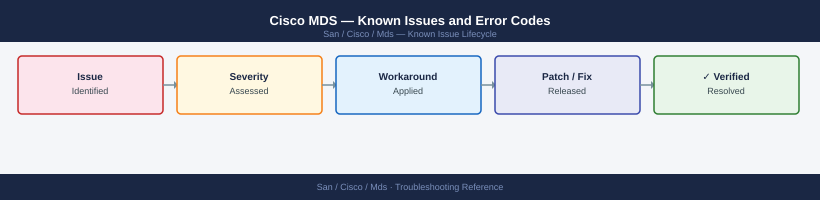

---
tags:
  - troubleshooting
  - cisco-mds
  - san
  - known-issues
---
# Cisco MDS — Known Issues and Error Codes

<div class="kb-summary">
Catalog of known Cisco MDS SAN switch bugs, error codes, and workarounds covering FC ports, VSAN, zoning, and IVR.

*Applies to: Cisco MDS NX-OS 8.x / 9.x*
</div>



```d2
direction: down

symptom: Identify Symptom {shape: diamond}
fc_ports: "FC Ports" {shape: rectangle}
zoning: "Zoning" {shape: rectangle}
vsan: "VSAN" {shape: rectangle}
resolution: Resolve or Escalate {shape: oval}

symptom -> fc_ports: investigate
symptom -> zoning: investigate
symptom -> vsan: investigate
fc_ports -> resolution
zoning -> resolution
vsan -> resolution
```

## Before you begin

- `show interface fc1/1` for port status; `show flogi database` for logged-in devices.
- `show tech-support` for full diagnostic bundle.
- `show logging` for recent syslog entries.

## FC Ports

| Error / Symptom | Affected Versions | Cause | Workaround / Fix | Fixed In |
|---|---|---|---|---|
| Port `sfpAbsent` or `noOperReason` | MDS NX-OS 8.x | SFP not inserted or not supported | Verify SFP installed; check `show interface fc x/y transceiver` for support | N/A |
| Port `errDisabled` — link flapping | MDS NX-OS 8.x | Excessive link state changes (LOS events) | Check fiber; replace SFP; `shut/no shut` to re-enable after fixing root cause | N/A |

## Zoning

| Error / Symptom | Affected Versions | Cause | Workaround / Fix | Fixed In |
|---|---|---|---|---|
| `Zone not found in active zoneset` | MDS NX-OS 8.x | Zoneset activated without the new zone included | Re-activate zoneset: `zoneset activate name <name> vsan <id>` | N/A |
| `Merge failure` between MDS switches | MDS NX-OS 8.x | Zone database conflict between switches | Resolve with `show zone merge-control vsan <id>`; manually align zone DBs | N/A |

## VSAN

| Error / Symptom | Affected Versions | Cause | Workaround / Fix | Fixed In |
|---|---|---|---|---|
| VSAN isolated after trunk link change | MDS NX-OS 8.x | VSAN not included in trunk allowed list on ISL | Add VSAN to trunk: `switchport trunk allowed vsan add <id>` | N/A |

## See also

- [Cisco MDS — Common Issues](../common-issues/)
- [Cisco DCNM — Known Issues](../../cisco-dcnm/troubleshooting/known-issues.md)
