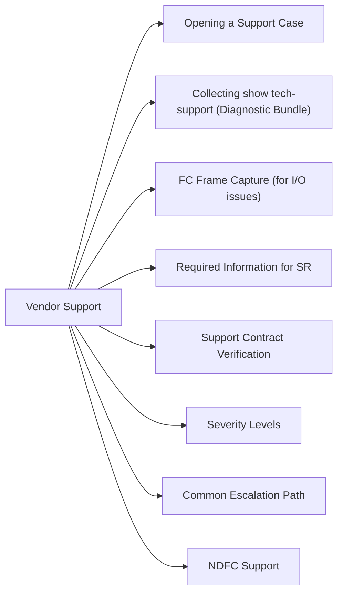

# Cisco MDS Vendor Support



## Opening a Support Case

TAC portal: [mycase.cisco.com](https://mycase.cisco.com)

Alternatively, call TAC for P1/P2 cases (number on your Cisco contract documentation).

1. Select product: Cisco MDS 9000 Series
2. Select NX-OS version and model
3. Enter switch serial number to link to SmartNet contract
4. Upload `show tech-support` output immediately (see below)

## Collecting show tech-support (Diagnostic Bundle)

```bash
# Redirect output to a file (takes 5–10 minutes on a busy switch)
show tech-support > bootflash:tech-support-$(hostname)-$(date +%Y%m%d).txt

# Copy to SCP server
copy bootflash:tech-support-*.txt scp://<username>@<scp-server>/<path>

# Or via TFTP
copy bootflash:tech-support-*.txt tftp://<tftp-server>/<path>/
```

Contents of `show tech-support`:
- Running and startup configuration
- NX-OS version info, hardware inventory
- Interface state, port statistics
- VSAN database and zone configuration
- FCNS (Name Server) entries
- Syslog and error logs

## FC Frame Capture (for I/O issues)

```bash
# Data-plane FC frame capture via SPAN
monitor session 1 source interface fc1/1 rx
monitor session 1 destination interface fc2/1   # Dedicated capture port
no monitor suspend 1

# Management-plane packet capture
ethanalyzer local interface mgmt capture-filter "host <mgmt-ip>" write bootflash:capture.pcap
```

## Required Information for SR

| Field | Where to Find |
|---|---|
| NX-OS version | `show version` |
| Serial number | `show inventory` or chassis label |
| VSAN topology | `show vsan` + `show fcdomain vsan <id>` |
| Error log excerpts | `show logging last 500` |
| Affected WWPNs | `show fcns database vsan <id>` |
| Problem description | Exact symptom, timestamps (with timezone), frequency |

## Support Contract Verification

Check SmartNet coverage:
- [cisco.com/go/contractcenter](https://www.cisco.com/c/en/us/support/web/tools/contractor/main.html)
- `show inventory` provides serial numbers for all modules

## Severity Levels

| Severity | Criteria | SLA (SmartNet) |
|---|---|---|
| P1 | Fabric-wide outage; production I/O impacted | 1 hour (24/7) |
| P2 | Significant degradation; redundancy lost | 4 hours |
| P3 | Non-critical; workaround available | Next business day |
| P4 | How-to, enhancement request | Best effort |

## Common Escalation Path

1. Open TAC case online (faster for P3/P4)
2. Call TAC for P1/P2 to get immediate engineer assignment
3. No progress within SLA → request Technical Support Manager involvement in case notes
4. For firmware issues with known bugs: request upgrade to a specific recommended release

## NDFC Support

For issues with Nexus Dashboard Fabric Controller managing MDS switches, open SR against "Cisco Nexus Dashboard Fabric Controller (NDFC)" product and include NDFC support bundle:
- NDFC UI → Operations → Tech Support → Download
