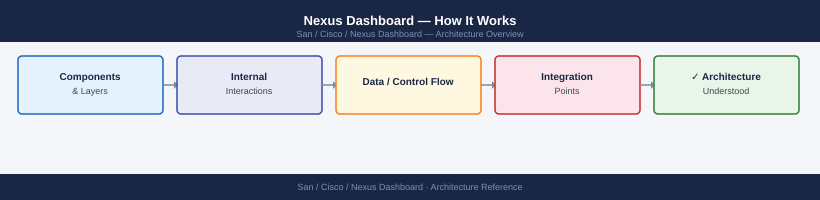
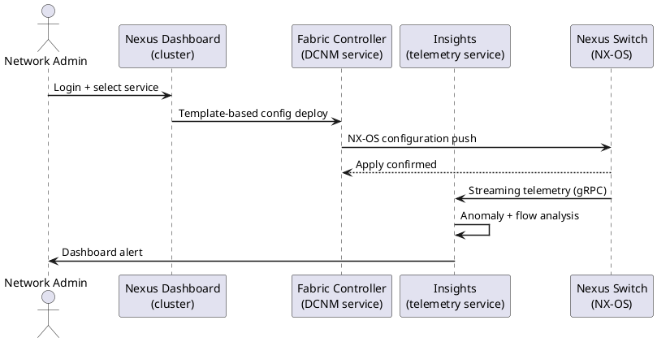
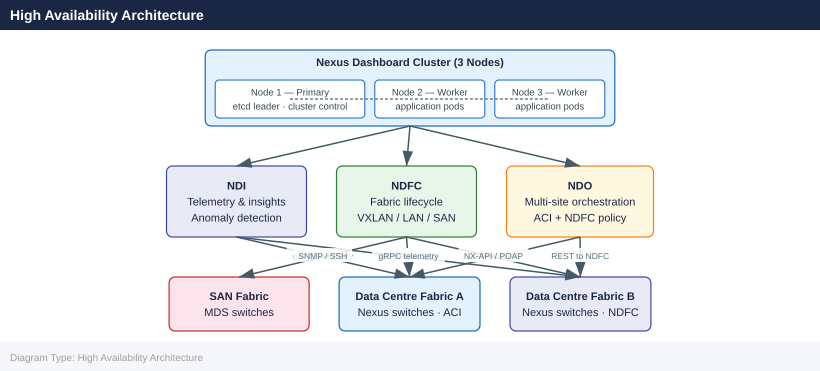

---
tags:
  - architecture
  - san
---
# Nexus Dashboard — How It Works

How It Works reference covering Overview, Key Hosted Applications, Deployment Topology, Node Types, Network Interfaces Per Node and 3 more sections.

*Applies to: Cisco MDS · Nexus*

## Software Versioning

Nexus Dashboard uses independent version streams for the platform and hosted applications. Check the Cisco compatibility matrix before any upgrade to confirm ND platform version compatibility with each installed application version.

| Component | Example Version |
|---|---|
| Nexus Dashboard platform | 3.1.1 |
| NDFC application | 12.2.2 |
| NDI application | 6.3.1 |

## Multi-Site Fabric Management

Nexus Dashboard is the single pane of glass for multiple data centre fabrics operating in parallel. It abstracts each fabric as a **site** — a logical boundary that can represent an ACI pod, an NDFC-managed VXLAN fabric, or a standalone Nexus switch domain.

- **VXLAN EVPN fabrics** — ND discovers underlay topology and BGP EVPN overlays; NDFC manages full lifecycle.
- **ACI fabrics** — ND integrates with the APIC cluster; NDO orchestrates cross-site policy.
- **FabricPath / classical Ethernet** — managed via NDFC in LAN Classic mode.

Cross-site capabilities include stretched VRFs, inter-site L3Out, shared services, and coordinated maintenance windows across sites without touching individual fabric controllers directly.

## Nexus Dashboard Fabric Controller (NDFC)

NDFC is the successor to Cisco DCNM, rehosted as an application on the Nexus Dashboard platform from version 12.0 onward. It covers the full fabric lifecycle for NX-OS environments.

**Fabric modes supported:**

| Mode | Use Case |
|---|---|
| VXLAN EVPN | Modern underlay/overlay DC fabric; automated BGP and NVE provisioning |
| FabricPath | Legacy L2 fabric (migration path to VXLAN) |
| LAN Classic | Traditional L2/L3 NX-OS management without overlay |
| SAN | FC zoning and VSAN management for MDS switches |

NDFC automates underlay provisioning (IS-IS or OSPF, iBGP peering, loopbacks), overlay provisioning (VRFs, VLANs, VNIs, L3VNI), and day-2 operations including fabric recalculation after topology changes.

## Nexus Dashboard Insights

NDI is the telemetry and analytics application hosted on Nexus Dashboard. It collects streaming telemetry from Nexus switches via gRPC and provides:

- **Anomaly detection** — baseline learning over time; statistical deviation alerts for latency, packet drops, and interface errors.
- **Flow path analysis** — traces a packet flow hop-by-hop through the fabric; identifies where drops or delays occur.
- **Protocol-level diagnostics** — BGP neighbour state history, OSPF adjacency flaps, VXLAN tunnel health, and ARP/ND table anomalies.
- **Compliance** — checks running configuration against best-practice rules and flags deviations.

Telemetry data is stored in Elasticsearch on the ND cluster. Retention is configurable (default 30 days for flow data, longer for counters).

## Nexus Dashboard Orchestrator

NDO provides multi-site policy orchestration across ACI and NDFC fabrics from a single workflow. Key concepts:

- **Schema and templates** — policy is defined in a schema (collection of templates); each template is associated with one or more sites.
- **Stretched VRFs and EPGs** — the same VRF and endpoint group can span multiple ACI or NDFC sites; NDO pushes consistent policy to each site's controller.
- **Disaster recovery policy** — NDO coordinates which site is primary for a given VRF/EPG and can orchestrate failover policy changes across sites.
- **Delta deploy** — NDO tracks what has been pushed; only changed objects are sent to the remote APIC or NDFC on each deploy cycle.

NDO does not replace APIC or NDFC — it orchestrates them. Each site controller continues to enforce policy locally; NDO ensures consistency.

## High Availability Architecture

Nexus Dashboard runs as a 3-node or 5-node cluster. Each node is a physical appliance (UCS) or virtual machine (VMware ESXi / KVM).

| Role | Count | Function |
|---|---|---|
| Primary node | 1 | Cluster leader; hosts control-plane services |
| Worker nodes | 2 (or 4) | Run application workloads (NDFC, NDI, NDO) |

**Internal cluster mechanics:**

- **etcd** — distributed key-value store for cluster state; requires quorum (≥2 nodes healthy in a 3-node cluster).
- **Kubernetes** — all ND services and hosted apps run as containerised pods; Kubernetes schedules and restarts failed pods automatically.
- **Rolling upgrade** — upgrades proceed node-by-node; the cluster remains operational throughout. A node is drained, upgraded, and rejoined before moving to the next.
- **Persistent volumes** — application data (Elasticsearch indices, configuration database) resides on persistent volumes that survive node restarts.

A 3-node cluster tolerates the loss of one node. For upgrades, always upgrade the ND platform before upgrading hosted application versions.

---

## See also

- [Nexus Dashboard — Design Standards](../design-standards/)
- [Nexus Dashboard — Integrations](../integrations/)
- [Nexus Dashboard — Deploy](../../deploy/)
