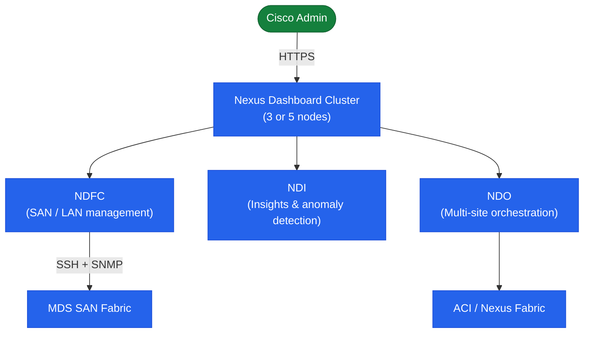

# Nexus Dashboard — Architecture

Cisco Nexus Dashboard is an app-hosting platform for Cisco data centre management. A 3-node or 5-node cluster provides shared identity, multi-site connectivity, and API gateway. NDFC (SAN/LAN), NDI (Insights), and NDO (Orchestrator) run as hosted applications on the cluster.

<a class="kb-card" href="how-it-works/"><strong>How It Works</strong>How it works, integrations, and design standards.</a>
<a class="kb-card" href="integrations/"><strong>Integrations</strong>Integration with MDS SAN, ACI, VXLAN, and Nexus fabrics.</a>
<a class="kb-card" href="design-standards/"><strong>Design Standards</strong>Cluster sizing, form factor selection, and multi-site design standards.</a>

## Hosted Applications

| Application | Abbreviation | Role |
|---|---|---|
| Nexus Dashboard Fabric Controller | NDFC | SAN and LAN fabric management (successor to DCNM) |
| Nexus Dashboard Insights | NDI | Network assurance, anomaly detection, flow telemetry |
| Nexus Dashboard Orchestrator | NDO | Multi-site ACI and VXLAN fabric policy orchestration |

## Cluster Topology

