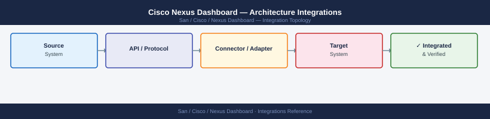

---
tags:
  - architecture
  - san
---
# Cisco Nexus Dashboard — Architecture Integrations


```bash
# SSH to any ND cluster node
ssh ndadmin@nd-node1.corp.example.com

# Configure syslog forwarding via ND CLI
acs system syslog add --server 10.10.3.50 --port 514 --protocol udp

# Verify
acs system syslog show
```

## Overview

Nexus Dashboard integrates with Cisco ACI and NX-OS fabric infrastructure as its core data sources, and extends to ITSM, SIEM, notification, and AAA platforms for operational workflows.

## ACI APIC Integration

The ACI APIC cluster is the primary integration for ACI-based fabrics. NDFC and NDI use the APIC REST API for policy management, fabric visibility, and health data.

```text
┌───────────────────────────────── Nexus Dashboard — Integration Guide ─────────────────────────────────┐
│                                                                                                       │
│   ┌──────────────────────────────────────────────┐  ┌─────────────────────────────────────────────┐   │
│   │               ITSM Integration               │  │             Observability Stack             │   │
│   │              ServiceNow webhook              │  │                Syslog to SIEM               │   │
│   │             Auto incident create             │  │              Splunk HEC forward             │   │
│   │               PagerDuty events               │  │             Prometheus exporter             │   │
│   │              Webex Teams notify              │  │              Custom REST client             │   │
│   │              Email SMTP alerts               │  │             Grafana data source             │   │
│   └──────────────────────────────────────────────┘  └─────────────────────────────────────────────┘   │
│                                                                                                       │
│  Physical Infrastructure:                                                                             │
│  ND on-prem · outbound TCP 443 to ITSM SaaS · syslog UDP 514 or TCP 514 to SIEM                       │
│                                                                                                       │
│  Key terms:                                                                                           │
│                                                                                                       │
│  ServiceNow webhook = NDI POST to ServiceNow Event endpoint on alert fire                             │
│  Auto incident = ServiceNow incident auto-created from NDI alert payload                              │
│  PagerDuty = NDI sends Events API v2 payload; on-call routing by severity                             │
│  Webex Teams = Cisco collaboration; NDI posts event summary to room via webhook                       │
│  Syslog = NDI events forwarded as syslog to SIEM for security correlation                             │
│  Splunk HEC = HTTP Event Collector; NDI events for log analytics                                      │
│  Prometheus = NDI /metrics endpoint scraped by Prometheus                                             │
│  Grafana = ND REST API proxied as Grafana data source for custom panels                               │
│  REST client = Script polling NDI API and pushing to proprietary monitoring                           │
│  SMTP = Email notification for NDI events; configured in ND admin settings                            │
│                                                                                                       │
└───────────────────────────────────────────────────────────────────────────────────────────────────────┘

```
## ServiceNow ITSM Integration

P1/P2 fabric faults auto-create incidents in ServiceNow via the ND alert notification webhook.

Admin > Notifications > Create Notification
- Trigger: NDI Fault severity = Critical or Major
- Action: Webhook
- URL: https://<instance>.service-now.com/api/now/table/incident
- Auth: Basic (svc-nd-snow service account)
- Payload:
  {
    "short_description": "Cisco ND P1 Fault: {{fault.title}} — {{fabric.name}}",
    "severity": "1",
    "assignment_group": "network-ops",
    "description": "{{fault.description}}\nFabric: {{fabric.name}}\nNode: {{node.name}}"
  }

## AAA / LDAP Integration

Admin > Authentication > Remote Login Domains > Add
- Protocol: LDAP (LDAPS recommended)
- Server: ldaps://<AD-DC>:636
- Bind DN: CN=svc-nd-ldap,OU=ServiceAccounts,DC=company,DC=com
- Search base: OU=Network,DC=company,DC=com
- Role mapping:
  - AD group: ND_Admins → Nexus Dashboard Admin
  - AD group: ND_Operators → Fabric Operator
  - AD group: ND_ReadOnly → ReadOnly

Set the default login domain to LDAP and retain a local break-glass admin account.

## SMTP Notifications

Admin > System Settings > SMTP
- SMTP server: relay.company.com
- Port: 587 (STARTTLS)
- From: nexus-dashboard-alerts@company.com

Create notification rules to email specific distribution lists for P2/P3 faults.

## Aria Operations Integration

The Cisco Network Insights management pack for Aria Operations imports NDI fabric health data into vROps for correlation with VMware workload metrics.

Aria Operations > Admin > Solutions > Cisco Network Insights MP
- Nexus Dashboard API URL: https://<ND-VIP>
- Username / password: (read-only service account)

## Integration Summary

| Integration | Type | Purpose |
|---|---|---|
| ACI APIC | Inbound | Policy management and ACI fabric visibility |
| NX-OS / NDFC | Inbound | NX-OS fabric management and telemetry |
| SIEM (syslog) | Outbound | Fabric fault and admin event forwarding |
| ServiceNow ITSM | Outbound | P1/P2 fault ticketing |
| LDAP / AAA | Inbound | Centralised user authentication and RBAC |
| SMTP | Outbound | Alert email notifications |
| Aria Operations | Outbound | Correlated VMware + Cisco fabric visibility |

---

## See also

- [Nexus Dashboard — How It Works](how-it-works/)
- [Nexus Dashboard — Design Standards](design-standards/)
