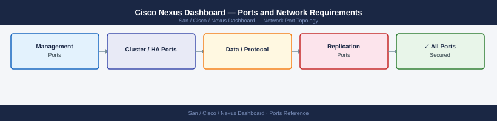

---
tags:
  - cisco
  - nexus-dashboard
  - san
  - networking
  - firewall
  - ports
---
# Cisco Nexus Dashboard — Ports and Network Requirements

<div class="kb-summary">
Firewall port reference for Cisco Nexus Dashboard (ND). Nexus Dashboard is the modern replacement for DCNM, providing multi-fabric management for NX-OS switches and MDS SANs via Nexus Dashboard Fabric Controller (NDFC).

*Applies to: Cisco Nexus Dashboard 3.x / NDFC 12.x*
</div>


## Inbound — Admin to Nexus Dashboard

| Port | Protocol | Source | Purpose |
|---|---|---|---|
| 443 | TCP | Admin browsers | Nexus Dashboard web UI and REST API |
| 22 | TCP | Jump hosts | SSH — ND appliance OS access (rescue/diagnostic) |

## Nexus Dashboard to Managed Devices

| Port | Protocol | Source | Destination | Purpose |
|---|---|---|---|---|
| 22 | TCP | ND | NX-OS switches, MDS | SSH — device configuration and telemetry |
| 161 | UDP | ND | NX-OS switches, MDS | SNMP polling |
| 443 | TCP | ND | NX-API capable switches | NX-API REST |
| 830 | TCP | ND | Devices supporting NETCONF | NETCONF over SSH |

## Inbound — From Managed Devices to ND

| Port | Protocol | Source | Destination | Purpose |
|---|---|---|---|---|
| 162 | UDP | NX-OS / MDS switches | ND | SNMP traps |
| 9898 | TCP | Switches (streaming telemetry) | ND | gRPC telemetry ingestion |

## Nexus Dashboard Cluster (Node-to-Node)

| Port | Protocol | Between | Purpose |
|---|---|---|---|
| 443 | TCP | ND nodes | Inter-node API |
| 2379/2380 | TCP | ND nodes | etcd peer (consensus) |
| 8884 | TCP | ND nodes | Cluster keepalive |

## Firewall Zone Summary

| From | To | Ports | Notes |
|---|---|---|---|
| Admin clients | ND | 443 | UI and REST API |
| ND | Managed devices | 22, 161 UDP, 443 | Management |
| Devices | ND | 162 UDP, 9898 | Traps and streaming telemetry |
| ND nodes | ND nodes | 443, 2379, 2380 | Cluster internal |

## Verify

```bash
# From admin workstation — test ND API
curl -sk -o /dev/null -w "%{http_code}" https://<nd-ip>/login

# From ND — test switch SSH
nc -zv <switch-ip> 22

# From ND — test SNMP
snmpget -v2c -c <community> <switch-ip> 1.3.6.1.2.1.1.1.0
```


```text title="Expected output"
200
Connection to 192.168.100.50 22 port [tcp/ssh] succeeded!
SNMPv2-MIB::sysDescr.0 = STRING: Cisco NX-OS Software, Nexus 9000 Series
```

!!! warning "Common errors"
    **`curl: (60) SSL certificate problem: self signed certificate`** — Add the `-k` flag to skip certificate verification, or import the ND's CA certificate into your system trust store.
    **`nc: connect to 192.168.100.50 port 22 (tcp) failed: Connection refused`** — Verify the switch IP is correct and SSH is enabled on the switch with `show feature | grep ssh`.
    **`snmpget: Unknown Object Identifier (Sub-id not found: (top))`** — Confirm the SNMP community string matches the switch configuration and the OID is valid for your NX-OS version.
## See also

- [Cisco Nexus Dashboard — Architecture](../how-it-works/)
- [Cisco DCNM — Ports](../../cisco-dcnm/architecture/ports.md)
- [Cisco MDS — Ports](../../mds/architecture/ports.md)
