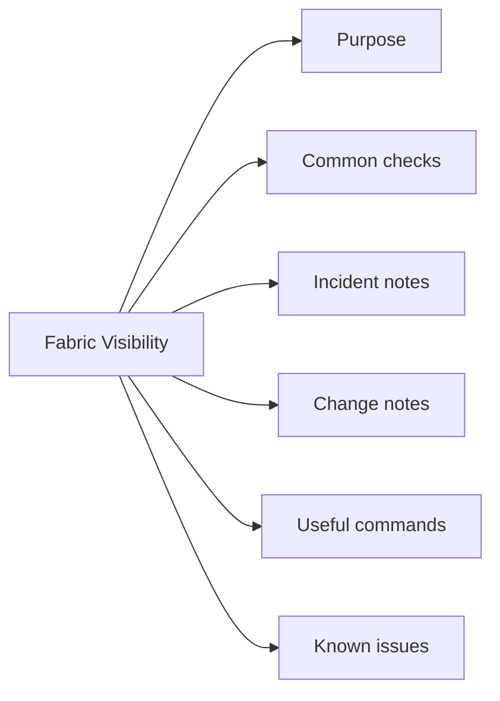

# Fabric Visibility

## Purpose

Use this page for practical Nexus Dashboard Fabric Visibility notes, checks, troubleshooting, commands, change notes, and field references.

## Common checks

- Confirm current health
- Review active alerts
- Check recent changes
- Confirm dependencies
- Check logs, events, and monitoring
- Capture current state before changes

## Incident notes

Capture:

- Symptom
- Start time
- Impact
- System or service name
- Error message
- What changed
- What was checked
- Next action

## Change notes

- Confirm change approval
- Confirm maintenance window
- Confirm rollback plan
- Capture current state
- Make one change at a time
- Validate after the change

## Useful commands

Add tested commands here.

## Known issues

Add known issues here as they come up.
