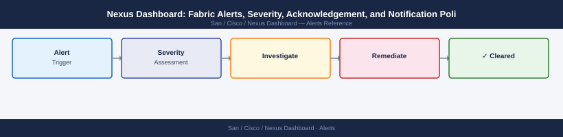

---
tags:
  - operations
  - san
description: "Nexus Dashboard: Fabric Alerts, Severity, Acknowledgement, and Notification Policies reference covering Acknowledging Alerts, Notification Policies, Alert..."
---
# Nexus Dashboard: Fabric Alerts, Severity, Acknowledgement, and Notification Policies

Nexus Dashboard: Fabric Alerts, Severity, Acknowledgement, and Notification Policies reference covering Acknowledging Alerts, Notification Policies, Alert Suppression During Maintenance, Common Alert Issues.

*Applies to: Cisco MDS · Nexus*

## Before you begin

- **Access:** Storage admin credentials (cluster admin or equivalent)
- **Timing:** safe to run during business hours unless a step is marked ⚠ (causes interruption)
- **Dependencies:** no active upgrades or migrations on the same infrastructure
- **Logging:** capture command output — paste into the change record on completion

---

## Common Alert Issues

| Issue | Likely Cause | Fix |
|---|---|---|
| Duplicate alerts for same interface | Multiple collection cycles before resolution | Increase de-duplication window in NDI settings |
| Alerts not cleared after fix | Telemetry not yet updated | Wait one collection cycle (default 5 min) |
| No alerts in UI | NDI service not receiving telemetry | Check switch telemetry config and NDI connectivity |
| Email not delivered | SMTP relay not reachable from ND VM | Verify network path and SMTP server configuration |
| Historical alerts missing | Alert retention policy set too low | Increase retention in Admin > System Settings |

---

## Verify

- Confirm the operation completed without errors in the log or management UI
- Verify the expected state change is visible (service running, object created, config applied)
- Document the outcome in the change record

## See also

- [Cisco Nexus Dashboard — Operations Backup & Restore](backup-restore.md)
- [Cisco Nexus Dashboard — Operations CLI Reference](cli-reference.md)
- [Cisco Nexus Dashboard — Operations Common Issues](../common-issues/)
- [Nexus Dashboard — Operations](index.md)
- [Nexus Dashboard — Architecture](../../architecture/)
- [Nexus Dashboard — Initial Deployment](../../deploy/)
- [Nexus Dashboard — Security](../../security/)
- [Cisco Nexus Dashboard — Troubleshooting](../../troubleshooting/)
