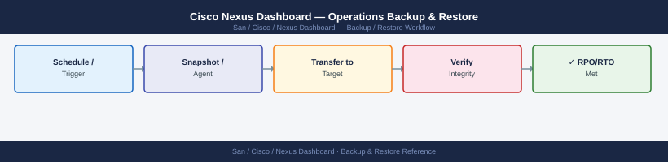

---
tags:
  - operations
  - san
---
# Cisco Nexus Dashboard — Operations Backup & Restore

*Applies to: Cisco MDS / NX-OS*


```bash
ssh ndadmin@nd-dc1-1.corp.example.com

# Trigger manual backup to remote SCP target
acs backup create \
  --remote-server backup-server.corp.example.com \
  --remote-path /backups/nexus-dashboard/dc1/ \
  --remote-user nd-bkp \
  --encryption-passphrase-file /home/ndadmin/.nd-backup-pass

# Check backup status
acs backup status

# List available backups
acs backup list
```


```text title="Expected output"
Last login: Wed Jan 15 14:32:18 2025 from 10.45.12.89
Nexus Dashboard CLI v2.3.1.4a
nd-dc1-1#

Backup creation initiated...
Backup ID: bkp-20250115-143245-7f8e2d9c
Remote server: backup-server.corp.example.com
Remote path: /backups/nexus-dashboard/dc1/
Encryption: AES-256 (enabled)
Status: IN_PROGRESS

Backup Status:
ID: bkp-20250115-143245-7f8e2d9c
Progress: 87%
Elapsed time: 4m 23s
Estimated remaining: 45s
Status: RUNNING

Available Backups:
ID                                    Size      Date                Status
bkp-20250115-143245-7f8e2d9c         2.4 GB    2025-01-15 14:32   RUNNING
bkp-20250114-022015-a1b2c3d4         2.3 GB    2025-01-14 02:20   COMPLETED
bkp-20250113-022010-9x8y7z6w         2.3 GB    2025-01-13 02:20   COMPLETED
bkp-20250112-022005-5m4n3o2p         2.2 GB    2025-01-12 02:20   COMPLETED
...
```

!!! warning "Common errors"
    **`Permission denied (publickey,password).`** — Verify SSH key is loaded with `ssh-add` or use password authentication; confirm ndadmin user exists on nd-dc1-1.
    **`Error: Unable to connect to remote server backup-server.corp.example.com:22`** — Ensure backup-server is reachable from Nexus Dashboard and firewall allows outbound SCP on port 22.
    **`Error: Passphrase file not found: /home/ndadmin/.nd-backup-pass`** — Create the passphrase file with `echo "your-passphrase" > /home/ndadmin/.nd-backup-pass && chmod 600 /home/ndadmin/.nd-backup-pass`.
## Before you begin

- **Access:** Storage admin credentials (cluster admin or equivalent)
- **Timing:** safe to run during business hours unless a step is marked ⚠ (causes interruption)
- **Dependencies:** no active upgrades or migrations on the same infrastructure
- **Logging:** capture command output — paste into the change record on completion

---

---

## Verify

- Confirm the operation completed without errors in the log or management UI
- Verify the expected state change is visible (service running, object created, config applied)
- Document the outcome in the change record

---

## See also

- [Nexus Dashboard — Procedures](../procedures/)
- [Nexus Dashboard — Health Checks](../health-checks/)
- [Nexus Dashboard — Common Issues](../../troubleshooting/common-issues/)
