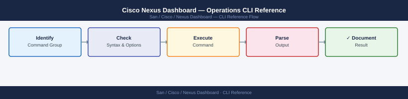

---
tags:
  - operations
  - san
---
# Cisco Nexus Dashboard — Operations CLI Reference


```bash
# Show cluster health summary
acs health

# List all cluster nodes with status
acs nodes list

# Show cluster configuration
acs cluster info

# Show platform version
acs version
```

```bash
# Upload an upgrade image
acs upgrade upload /tmp/aci-nd-dk9.3.1.1.ova

# List uploaded upgrade images
acs upgrade images

# Start cluster upgrade
acs upgrade start --version 3.1.1

# Monitor upgrade progress
acs upgrade status

# Show upgrade history
acs upgrade history
```
```bash
# Show node network configuration
acs network show

# Show NTP status
acs system ntp show

# Show DNS configuration
acs system dns show

# Test connectivity to a host
acs network test --host 10.20.1.5 --port 22
```
```bash
# Show current TLS certificate details
acs certificates show

# Import a new certificate (key + cert bundle)
acs certificates import \
  --key /tmp/nd.key \
  --cert /tmp/nd-bundle.crt \
  --name nd-dc1-cert

# Set the imported certificate as active
acs certificates activate --name nd-dc1-cert
```
```bash
# Show all pod status (run as ndadmin — kubectl is available)
kubectl get pods --all-namespaces

# Show pods with issues only
kubectl get pods --all-namespaces | grep -Ev "Running|Completed|Terminating"

# Show pod logs (replace <pod-name> and <namespace>)
kubectl logs -n ndfc <pod-name> --tail=100

# Describe a failing pod (shows events and resource constraints)
kubectl describe pod -n ndfc <pod-name>

# Show persistent volume usage
kubectl get pv
kubectl get pvc --all-namespaces
```
```bash
# Show system resource usage per node
acs system resources

# Show system logs (platform-level)
acs system logs --tail 100

# Generate a diagnostic support bundle for Cisco TAC
acs techsupport --output /tmp/nd-support-$(date +%Y%m%d).tar.gz

# Collect support bundle and transfer to your workstation
scp ndadmin@nd-dc1.corp.example.com:/tmp/nd-support-*.tar.gz ./
```
```bash
# Authenticate — returns a bearer token
TOKEN=$(curl -sk -X POST https://nd-dc1.corp.example.com/login \
  -H "Content-Type: application/json" \
  -d '{
    "userName": "svc-automation",
    "userPasswd": "<password>",
    "domain": "local"
  }' | python3 -c "import sys,json; print(json.load(sys.stdin)['token'])")

echo "Token obtained"

# Refresh token (before expiry)
TOKEN=$(curl -sk -X POST https://nd-dc1.corp.example.com/login/refresh \
  -H "Authorization: Bearer ${TOKEN}" \
  | python3 -c "import sys,json; print(json.load(sys.stdin)['token'])")

# Logout (invalidate token)
curl -sk -X POST https://nd-dc1.corp.example.com/logout \
  -H "Authorization: Bearer ${TOKEN}"
```
```bash
ND="https://nd-dc1.corp.example.com"

# List registered sites
curl -sk "${ND}/nexus/api/v1/sites" \
  -H "Authorization: Bearer ${TOKEN}" | python3 -m json.tool

# List cluster nodes
curl -sk "${ND}/nexus/api/v1/nodes" \
  -H "Authorization: Bearer ${TOKEN}" | python3 -m json.tool

# List installed apps
curl -sk "${ND}/nexus/api/v1/apps" \
  -H "Authorization: Bearer ${TOKEN}" | python3 -m json.tool

# List users
curl -sk "${ND}/nexus/api/v1/users" \
  -H "Authorization: Bearer ${TOKEN}" | python3 -m json.tool
```
```bash
NDFC_BASE="${ND}/appcenter/cisco/ndfc/api/v1"

# List all fabrics
curl -sk "${NDFC_BASE}/san/fabrics" \
  -H "Authorization: Bearer ${TOKEN}" | python3 -m json.tool

# List all switches (inventory)
curl -sk "${NDFC_BASE}/inventory/switches" \
  -H "Authorization: Bearer ${TOKEN}" | python3 -m json.tool

# List VSANs for a fabric
curl -sk "${NDFC_BASE}/san/vsans?fabricName=DC1-SAN" \
  -H "Authorization: Bearer ${TOKEN}" | python3 -m json.tool

# List active zone sets
curl -sk "${NDFC_BASE}/san/zoning/activezonesets?fabricName=DC1-SAN" \
  -H "Authorization: Bearer ${TOKEN}" | python3 -m json.tool

# List device aliases
curl -sk "${NDFC_BASE}/san/devicealias?fabricName=DC1-SAN" \
  -H "Authorization: Bearer ${TOKEN}" | python3 -m json.tool

# List active alarms
curl -sk "${NDFC_BASE}/alarms/activealarms" \
  -H "Authorization: Bearer ${TOKEN}" | python3 -m json.tool

# List firmware images in NDFC repository
curl -sk "${NDFC_BASE}/fm/image" \
  -H "Authorization: Bearer ${TOKEN}" | python3 -m json.tool
```
```bash
NDI_BASE="${ND}/appcenter/cisco/ndinsight/api/v1"

# List all anomalies (last 24 hours)
curl -sk "${NDI_BASE}/anomalies?timeRange=LAST_DAY&severity=CRITICAL,MAJOR" \
  -H "Authorization: Bearer ${TOKEN}" | python3 -m json.tool

# Get anomaly details
curl -sk "${NDI_BASE}/anomalies/<anomaly-id>" \
  -H "Authorization: Bearer ${TOKEN}" | python3 -m json.tool

# List flows (SAN Insights)
curl -sk "${NDI_BASE}/san/flows?fabricName=DC1-SAN&timeRange=LAST_HOUR" \
  -H "Authorization: Bearer ${TOKEN}" | python3 -m json.tool
```
```bash
# Count switches by management state
curl -sk "${NDFC_BASE}/inventory/switches" \
  -H "Authorization: Bearer ${TOKEN}" \
  | python3 -c "
import sys, json, collections
data = json.load(sys.stdin)
states = collections.Counter(s.get('managementState','unknown') for s in data)
print(dict(states))
"

# List all non-healthy ND pods
kubectl get pods --all-namespaces --no-headers \
  | awk '{if ($4 != "Running" && $4 != "Completed") print $0}'

# Export NDFC switch inventory to CSV
curl -sk "${NDFC_BASE}/inventory/switches" \
  -H "Authorization: Bearer ${TOKEN}" \
  | python3 -c "
import sys, json, csv
data = json.load(sys.stdin)
fields = ['switchName','ipAddress','model','release','managementState','fabricName']
w = csv.DictWriter(sys.stdout, fieldnames=fields, extrasaction='ignore')
w.writeheader()
for s in data: w.writerow(s)
" > ndfc-switches-$(date +%Y%m%d).csv
```

## Before you begin

- **Access:** Storage admin credentials (cluster admin or equivalent)
- **Timing:** safe to run during business hours unless a step is marked ⚠ (causes interruption)
- **Dependencies:** no active upgrades or migrations on the same infrastructure
- **Logging:** capture command output — paste into the change record on completion

---

---

## Verify

- Confirm the operation completed without errors in the log or management UI
- Verify the expected state change is visible (service running, object created, config applied)
- Document the outcome in the change record

---

## See also

- [Nexus Dashboard — Procedures](../procedures/)
- [Nexus Dashboard — Scripts](../scripts/)
- [Nexus Dashboard — Health Checks](../health-checks/)
