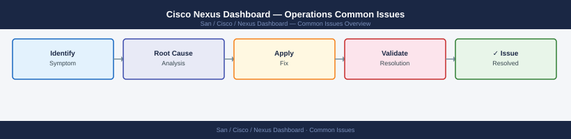

---
tags:
  - operations
  - san
---
# Cisco Nexus Dashboard — Operations Common Issues


```bash
ssh ndadmin@nd-dc1-1.corp.example.com

# Check cluster health
acs health

# Show node detail
acs nodes list

# Check if Kubernetes agrees with ND's view
kubectl get nodes
# Expected: all nodes Ready

# Check failing pods on the affected node
kubectl get pods --all-namespaces --field-selector spec.nodeName=<node-hostname> | grep -v Running
```


```text title="Expected output"
Last login: Wed Mar 13 14:32:18 2024 from 10.45.22.88
nd-dc1-1.corp.example.com#

nd-dc1-1.corp.example.com# acs health
Cluster Health Status: HEALTHY
  Node nd-dc1-1: HEALTHY (CPU: 45%, Memory: 62%, Disk: 78%)
  Node nd-dc1-2: HEALTHY (CPU: 38%, Memory: 58%, Disk: 75%)
  Node nd-dc1-3: HEALTHY (CPU: 41%, Memory: 61%, Disk: 76%)
Last health check: 2024-03-13T14:31:45Z

nd-dc1-1.corp.example.com# acs nodes list
Node Name          Status    Role      IP Address      Version
nd-dc1-1           ACTIVE    Leader    10.45.22.101    14.1.2.1
nd-dc1-2           ACTIVE    Follower  10.45.22.102    14.1.2.1
nd-dc1-3           ACTIVE    Follower  10.45.22.103    14.1.2.1

nd-dc1-1.corp.example.com# kubectl get nodes
NAME      STATUS   ROLES   AGE    VERSION
nd-dc1-1  Ready    master  287d   v1.24.8
nd-dc1-2  Ready    worker  287d   v1.24.8
nd-dc1-3  Ready    worker  287d   v1.24.8

nd-dc1-1.corp.example.com# kubectl get pods --all-namespaces --field-selector spec.nodeName=nd-dc1-2 | grep -v Running
NAMESPACE     NAME                                    READY   STATUS             RESTARTS   AGE
kube-system   coredns-558bd4d5db-7k2m9               0/1     CrashLoopBackOff   12         4h22m
mso           mso-app-deployment-5d8c9f7b2-xq9r4    1/3     ImagePullBackOff   0          2h15m
```

!!! warning "Common errors"
    **`Permission denied (publickey,password)`** — Verify SSH key is loaded with `ssh-add` or use `-i` flag to specify the correct private key file.
    **`kubectl: command not found`** — Ensure kubectl is installed on the Nexus Dashboard node or SSH to a node where it's available in the PATH.
    **`spec.nodeName=<node-hostname>: No such file or directory`** — Replace `<node-hostname>` with an actual node name from the `kubectl get nodes` output (e.g., `nd-dc1-2`).
```bash
ssh ndadmin@nd-dc1-1.corp.example.com

# Test remote backup connectivity
acs backup remote test

# Check backup status and last error
acs backup status

# Check backup logs
acs system logs --component backup --tail 50
```


```text title="Expected output"
ndadmin@nd-dc1-1.corp.example.com's password: 
Cisco Nexus Dashboard (Version 3.1.2)
nd-dc1-1# acs backup remote test
Remote backup connectivity test initiated...
Testing connection to backup.corp.example.com:22... OK
Testing NFS mount point /mnt/backups... OK
Testing write permissions... OK
Remote backup test completed successfully
nd-dc1-1# acs backup status
Backup Status Report
====================
Last Backup: 2024-01-15 02:30:15 UTC
Status: SUCCESS
Duration: 12 minutes 43 seconds
Size: 4.2 GB
Next Scheduled: 2024-01-16 02:30:00 UTC
Last Error: None
nd-dc1-1# acs backup system logs --component backup --tail 50
2024-01-15T02:30:15.234Z [backup] INFO: Backup job started (Job ID: bkp-20240115-0230)
2024-01-15T02:31:02.567Z [backup] INFO: Database snapshot created successfully
2024-01-15T02:40:18.891Z [backup] INFO: Compressing backup data...
2024-01-15T02:42:45.123Z [backup] INFO: Uploading to remote storage (4.2 GB)
2024-01-15T02:43:12.456Z [backup] INFO: Backup upload completed
2024-01-15T02:43:15.789Z [backup] INFO: Backup job completed successfully
```

!!! warning "Common errors"
    **`Remote backup test failed: Connection refused to backup.corp.example.com:22`** — Verify the backup server hostname/IP is reachable and SSH service is running with `ssh -v backup.corp.example.com`.
    **`Permission denied: Cannot write to /mnt/backups`** — Ensure the ndadmin user has write permissions on the NFS mount point with `sudo chmod 755 /mnt/backups` on the backup server.
    **`acs: command not found`** — SSH into the Nexus Dashboard appliance using the correct admin account or verify you are in the correct CLI context with `show version`.
## Before you begin

- **Access:** Storage admin credentials (cluster admin or equivalent)
- **Timing:** safe to run during business hours unless a step is marked ⚠ (causes interruption)
- **Dependencies:** no active upgrades or migrations on the same infrastructure
- **Logging:** capture command output — paste into the change record on completion

---

---

## Verify

- Confirm the operation completed without errors in the log or management UI
- Verify the expected state change is visible (service running, object created, config applied)
- Document the outcome in the change record

## See also

- [Nexus Dashboard: Fabric Alerts, Severity, Acknowledgement, and Notification Policies](alerts.md)
- [Cisco Nexus Dashboard — Operations Backup & Restore](backup-restore.md)
- [Cisco Nexus Dashboard — Operations CLI Reference](cli-reference.md)
- [Nexus Dashboard — Operations](index.md)
- [Nexus Dashboard — Architecture](../../architecture/)
- [Nexus Dashboard — Initial Deployment](../../deploy/)
- [Nexus Dashboard — Security](../../security/)
- [Cisco Nexus Dashboard — Troubleshooting](../../troubleshooting/)
