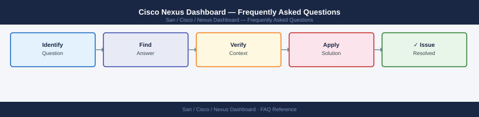

---
tags:
  - nexus-dashboard
  - faq
  - operations
description: "Common questions about Cisco Nexus Dashboard operations, configuration, and troubleshooting. For step-by-step procedures, see the Operations section."
---
# Cisco Nexus Dashboard — Frequently Asked Questions

*Applies to: Cisco MDS / NX-OS*

Common questions about Cisco Nexus Dashboard operations, configuration, and troubleshooting. For step-by-step procedures, see the <a href="index.md">Operations</a> section.

## General

**Q: What Nexus Dashboard version is recommended?**
A: Nexus Dashboard 3.1.x with NDFC 12.2.x is the current recommendation. Check via UI → Admin → System Settings → About. Nexus Dashboard runs as a cluster of 3 or 5 nodes.

**Q: How do I check the current Cisco Nexus Dashboard version?**
A: `acs version  # on ND CLI`

## Configuration

**Q: What is the default cluster size and when should it be changed?**
A: 3-node cluster is the minimum for production (provides HA). Scale to 5 nodes for large deployments with multiple services (NDFC + NDI + NDO) co-hosted. Single-node is for lab/evaluation only.

**Q: How do I enable Nexus Dashboard Insights (NDI) on an existing cluster?**
A: Go to Admin → Services → install NDI from Cisco App Store or upload the service image. NDI requires minimum 3 nodes and specific memory (128 GB per node recommended). Enable after NDI install under the Services hub.

## Operations

**Q: How do I upgrade the Nexus Dashboard cluster without downtime?**
A: ND supports rolling upgrades: Admin → Software Management → Upgrade. One node upgrades at a time; the cluster remains operational during the process. The upgrade completes when all nodes are on the new version.

**Q: What is the correct procedure to add a new site to Nexus Dashboard?**
A: Go to Sites → Add Site. For ACI: provide APIC IP and credentials. For DCNM/NDFC: provide NDFC IP. ND discovers the site inventory. Associate the site with NDO/NDFC/NDI services as needed.

## Troubleshooting

**Q: Nexus Dashboard shows 'Cluster Health Degraded'. What does it mean?**
A: One or more ND nodes are unhealthy. Check Admin → System Status for node-level details. Common causes: disk full, node unreachable, or service crash. Review ND node logs via `acs logs` on the affected node.

**Q: Nexus Dashboard UI is slow or services are unresponsive — where do I start?**
A: Check cluster resource utilisation: Admin → Infrastructure → Nodes. If disk is above 80%, purge old data. Check Kubernetes pod health with `kubectl get pods -A` from the ND CLI. Restart unhealthy pods if needed.

## Backup and Recovery

**Q: How often should I back up Nexus Dashboard?**
A: Weekly via Admin → System Settings → Backup & Restore. Backup includes ND cluster configuration and all service data. Store externally (remote SCP/SFTP). Back up before every upgrade.

**Q: Can I restore a single service's data without a full ND restore?**
A: Not independently for all services. NDFC allows individual fabric backup/restore. NDI data is re-synced from the fabric after restore. For full ND failure, restore from the cluster backup.

## See Also

- [Cisco Nexus Dashboard Operations](index.md)
- [Cisco Nexus Dashboard Troubleshooting](../troubleshooting/index.md)
