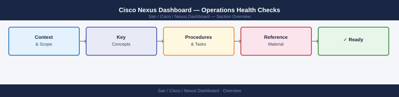

---
tags:
  - operations
  - san
---
# Cisco Nexus Dashboard — Operations Health Checks



```bash
# SSH to any cluster node
ssh ndadmin@nd-dc1-1.corp.example.com

# Show cluster health summary
acs health

# Show all nodes
acs nodes list
# Expected: all nodes in Active or Standby state, no Unhealthy

# Show app deployment status
acs apps status
# Expected: all apps in Running state (NDFC, NDI if installed)

# Show any failing Kubernetes pods
kubectl get pods --all-namespaces | grep -Ev "Running|Completed"
# Zero output = all pods healthy; any output needs investigation
```


```d2
direction: right

hub: "Nexus Dashboard\nOperations" {shape: hexagon}
run_this_routine: "Run This Routine" {shape: rectangle}
verify: "Verify" {shape: rectangle}

hub -> run_this_routine
hub -> verify
```

## Before you begin

- **Access:** Storage admin credentials (cluster admin or equivalent)
- **Timing:** safe to run during business hours unless a step is marked ⚠ (causes interruption)
- **Dependencies:** no active upgrades or migrations on the same infrastructure
- **Logging:** capture command output — paste into the change record on completion

---

## Run This Routine

1. Nexus Dashboard UI → System → Services — verify all platform services show **Running**; any Stopped or Error state needs investigation
2. Nexus Dashboard → Sites — confirm all registered sites show **Connected**; Disconnected sites block policy deployment
3. NDFC → Fabric Builder → switch inventory — verify all fabric switches appear as **Managed** with no discovery errors
4. NDFC → Fabric → deployment status — check for any switches with **pending** or **failed** configuration deployments; resolve before next change window
5. Nexus Dashboard → Alerts → open alarms — filter Critical and Major severity; review, assign, and escalate unacknowledged alarms
6. NDFC → Operations → Backup — confirm last successful backup timestamp is within the last 24 hours; trigger manual backup if overdue
7. SSH to each ND node: `df -h /data` — alert and escalate if any node filesystem usage exceeds **80%** (Elasticsearch fills fast)

```bash
ssh ndadmin@nd-dc1-1.corp.example.com

# List recent backups
acs backup list

# Check backup destination
acs backup remote show
```
```bash
# Check ND UI certificate expiry
openssl s_client -connect nd-dc1.corp.example.com:443 \
  -servername nd-dc1.corp.example.com </dev/null 2>/dev/null \
  | openssl x509 -noout -dates

# Days until expiry
python3 -c "
from datetime import datetime
import subprocess, re
r = subprocess.run(['openssl','s_client','-connect','nd-dc1.corp.example.com:443',
  '-servername','nd-dc1.corp.example.com'], capture_output=True, input=b'')
c = subprocess.run(['openssl','x509','-noout','-enddate'], input=r.stdout, capture_output=True).stdout.decode()
d = re.search(r'notAfter=(.*)', c).group(1).strip()
exp = datetime.strptime(d, '%b %d %H:%M:%S %Y %Z')
print(f'Expires in {(exp - datetime.utcnow()).days} days ({exp.date()})')
"
# Alert if < 60 days remaining
```
```bash
ssh ndadmin@nd-dc1-1.corp.example.com

# Check NTP status
acs system ntp show
# Expected: all configured NTP servers reachable, synchronized

# Check cluster time consistency across nodes
acs nodes list --format json | python3 -c "
import sys, json
nodes = json.load(sys.stdin)
for n in nodes:
    print(n.get('hostname'), n.get('currentTime'))
"
# All nodes should show times within 1 second of each other
```

---

## Verify

- Confirm the operation completed without errors in the log or management UI
- Verify the expected state change is visible (service running, object created, config applied)
- Document the outcome in the change record

---

## See also

- [Nexus Dashboard — Procedures](procedures/)
- [Nexus Dashboard — CLI Reference](cli-reference/)
- [Nexus Dashboard — Common Issues](../troubleshooting/common-issues/)
