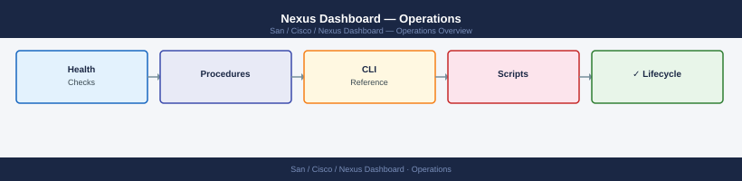

---
tags:
  - operations
  - san
---
# Nexus Dashboard — Operations

Nexus Dashboard daily operations — fabric health monitoring, flow visibility, alert management, and operational runbooks.

*Applies to: Cisco MDS · Nexus*

<a class="kb-card" href="procedures/">
  <strong>Procedures</strong>
  Step-by-step operational procedures and runbooks.
</a>

<a class="kb-card" href="health-checks/">
  <strong>Health Checks</strong>
  Proactive Nexus Dashboard health monitoring and validation.
</a>

<a class="kb-card" href="common-issues/">
  <strong>Common Issues</strong>
  Known problems, symptoms, and resolution steps.
</a>

<a class="kb-card" href="install-upgrade/">
  <strong>Install & Upgrade</strong>
  Nexus Dashboard installation, upgrade, and version management.
</a>

<a class="kb-card" href="backup-restore/">
  <strong>Backup & Restore</strong>
  Configuration backup, restore operations, and recovery validation.
</a>

<a class="kb-card" href="cli-reference/">
  <strong>CLI Reference</strong>
  Command reference for day-to-day operations.
</a>

<a class="kb-card" href="scripts/"><strong>Scripts</strong>Automation scripts for common operational tasks.</a>
<a class="kb-card" href="fabric-health/"><strong>Fabric Health</strong>Fabric health checks, ISL utilization, and overall fabric state.</a>
<a class="kb-card" href="visibility/"><strong>Visibility</strong>Device discovery, topology views, and flow visibility.</a>
<a class="kb-card" href="alerts/"><strong>Alerts</strong>Alert management, suppression rules, and notification configuration.</a>

  <a class="kb-card" href="faq/"><strong>FAQ</strong>Frequently asked questions, common issues, and quick answers for day-to-day operations.</a>

