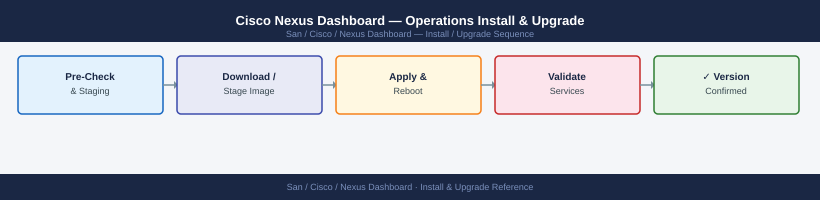

---
tags:
  - operations
  - san
---
# Cisco Nexus Dashboard — Operations Install & Upgrade



```bash
# SSH to node 1 (the designated primary)
ssh ndadmin@nd-dc1-1.corp.example.com

# Initialize the cluster from node 1
acs cluster init \
  --name nd-dc1 \
  --primary-ip 10.10.5.21 \
  --node-ips 10.10.5.22,10.10.5.23 \
  --app-ips 192.168.100.1,192.168.100.2,192.168.100.3

# Monitor cluster formation (takes 10-20 minutes)
acs health
# Wait until all nodes show Healthy
```

```bash
# Deploy two additional OVA nodes as per Step 1 above
# Configure their IPs but do not initialize them

# From the primary node, add the new nodes
acs cluster add-node --node-ip 10.10.5.24 --app-ip 192.168.100.4
acs cluster add-node --node-ip 10.10.5.25 --app-ip 192.168.100.5

# Monitor cluster expansion (takes 20-40 minutes)
acs health
acs nodes list
```

## Before you begin

- **Access:** Storage admin credentials (cluster admin or equivalent)
- **Timing:** safe to run during business hours unless a step is marked ⚠ (causes interruption)
- **Dependencies:** no active upgrades or migrations on the same infrastructure
- **Logging:** capture command output — paste into the change record on completion

---

## Upgrade Overview

Nexus Dashboard supports rolling upgrades — the cluster upgrades one node at a time to maintain service availability throughout the process. Services (NDFC, NDI) are upgraded separately from the base ND platform.

**Always check compatibility before upgrading.**

## Compatibility Matrix

Before any upgrade, validate all component versions using the [Cisco Nexus Dashboard Compatibility Matrix](https://www.cisco.com/c/en/us/support/data-center-analytics/nexus-dashboard/products-device-support-tables-list.html).

Check compatibility between:
- Nexus Dashboard base platform version
- NDFC version
- NDI version
- ACI APIC firmware version
- NX-OS fabric switch firmware version

A version mismatch between ND and its managed fabrics can result in loss of management connectivity.

## Pre-Upgrade Checklist

```text
┌─────────────────────────────── Nexus Dashboard — Lifecycle Management ────────────────────────────────┐
│                                                                                                       │
│   ┌──────────────────────────────────────────────┐  ┌─────────────────────────────────────────────┐   │
│   │                    Deploy                    │  │                   Upgrade                   │   │
│   │              Bootstrap 3 nodes               │  │             Check release notes             │   │
│   │            Assign mgmt + data IPs            │  │             Backup config first             │   │
│   │             Form cluster via UI              │  │              acs upgrade apply              │   │
│   │            Install apps (NDI etc)            │  │             Rolling node upgrade            │   │
│   │               Onboard fabrics                │  │               Verify apps post              │   │
│   │              Configure ITSM out              │  │               Rollback if fail              │   │
│   └──────────────────────────────────────────────┘  └─────────────────────────────────────────────┘   │
│                                                                                                       │
│  Physical Infrastructure:                                                                             │
│  3 physical or VM nodes · Cisco ISO install · upgrade via acs CLI or ND UI                            │
│                                                                                                       │
│  Key terms:                                                                                           │
│                                                                                                       │
│  Bootstrap = Initial ND node setup: assign hostname, IPs, NTP, DNS via console                        │
│  Cluster form = Joining 3 nodes into quorum cluster via ND web UI                                     │
│  App install = Installing NDI, NDFC, NDO as apps from ND admin > Apps                                 │
│  Fabric onboard = Adding APIC or NX-OS fabric to ND with credentials                                  │
│  acs upgrade = CLI command to apply upgrade image to cluster                                          │
│  Rolling upgrade = Upgrading nodes sequentially to maintain quorum                                    │
│  Backup = acs backup create before upgrade; stored externally                                         │
│  Rollback = Restoring from backup if upgrade causes data loss                                         │
│  Release notes = Cisco release notes; check for breaking changes before upgrade                       │
│  Verify apps = Post-upgrade check: NDI collecting, NDFC managing, NDO syncing                         │
│                                                                                                       │
└───────────────────────────────────────────────────────────────────────────────────────────────────────┘
### Replacing a Failed Node
```

1. Remove the failed node: Admin > Cluster Configuration > [Node] > Delete
2. Deploy a new ND node (OVA or physical) with identical network configuration
3. Join the new node: Admin > Cluster Configuration > Add Node
4. Verify cluster returns to full quorum

## Backup and Restore

### Automated Backup Schedule

Admin > Backup and Restore > Scheduled Backup
- Destination: SFTP (sftp://<backup-host>/nexus-dashboard/)
- Schedule: weekly, Sunday 02:00
- Retention: keep 4 most recent

### Manual Backup

Admin > Backup and Restore > Backup Now
- Backs up: cluster configuration, NDFC policies, NDI baselines, user accounts
- Note: does not back up NDI telemetry history (that data is ephemeral)

### Restore

Admin > Backup and Restore > Restore
- Upload backup file
- Select what to restore (full cluster or specific services)
- Confirm — cluster will be restored to the backup state

## EOL Tracking

- Cisco EOL/EOS notices: [cisco.com/go/eos](https://cisco.com/go/eos)
- Search for "Nexus Dashboard" to find current EOS announcements
- Review quarterly and plan upgrades to stay on supported versions
- Upgrade packages: [software.cisco.com](https://software.cisco.com)

## Version Cadence

Cisco releases ND major versions approximately annually and maintenance releases (bug fixes) every 2–3 months. Target staying within 1–2 minor versions of the current release. Older versions typically see EOS announced 18–24 months after release.

---

## Verify

- Confirm the operation completed without errors in the log or management UI
- Verify the expected state change is visible (service running, object created, config applied)
- Document the outcome in the change record

---

## See also

- [Nexus Dashboard — Procedures](procedures/)
- [Nexus Dashboard — Health Checks](health-checks/)
- [Nexus Dashboard — Deploy](../deploy/)
