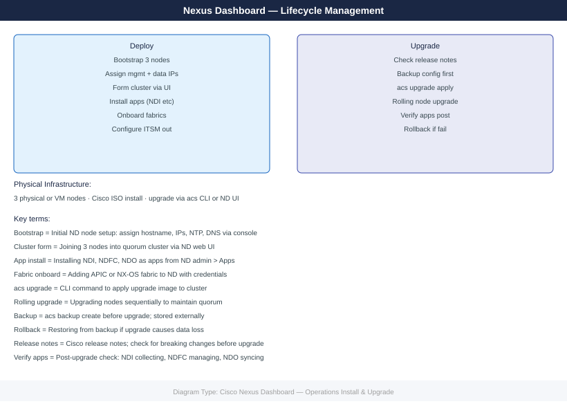

---
tags:
  - operations
  - san
---
# Cisco Nexus Dashboard — Operations Install & Upgrade

*Applies to: Cisco MDS / NX-OS*


```bash
# SSH to node 1 (the designated primary)
ssh ndadmin@nd-dc1-1.corp.example.com

# Initialize the cluster from node 1
acs cluster init \
  --name nd-dc1 \
  --primary-ip 10.10.5.21 \
  --node-ips 10.10.5.22,10.10.5.23 \
  --app-ips 192.168.100.1,192.168.100.2,192.168.100.3

# Monitor cluster formation (takes 10-20 minutes)
acs health
# Wait until all nodes show Healthy
```


```text title="Expected output"
Last login: Thu Jan 16 14:32:18 2025 from 10.10.4.50
nd-dc1-1#

Initializing cluster nd-dc1...
Primary node IP: 10.10.5.21
Secondary nodes: 10.10.5.22, 10.10.5.23
Application VIPs: 192.168.100.1, 192.168.100.2, 192.168.100.3
Cluster initialization started. Cluster UUID: 550e8400-e29b-41d4-a716-446655440000
Waiting for node discovery...
Node nd-dc1-1 (10.10.5.21) registered
Node nd-dc1-2 (10.10.5.22) registered
Node nd-dc1-3 (10.10.5.23) registered

Cluster Health Status:
  nd-dc1-1: Healthy
  nd-dc1-2: Healthy
  nd-dc1-3: Healthy
Overall Status: Healthy
```

!!! warning "Common errors"
    **`error: Primary IP 10.10.5.21 is not reachable from this node`** — Verify network connectivity and ensure the primary IP is assigned to node 1's management interface.
    **`error: Node 10.10.5.22 failed to join cluster: authentication failed`** — Confirm ndadmin credentials are synchronized across all nodes and SSH key-based auth is configured.
    **`error: Application VIP 192.168.100.1 overlaps with existing subnet`** — Choose application VIPs from an unused IP range that doesn't conflict with existing network subnets.
```bash
# Deploy two additional OVA nodes as per Step 1 above
# Configure their IPs but do not initialize them

# From the primary node, add the new nodes
acs cluster add-node --node-ip 10.10.5.24 --app-ip 192.168.100.4
acs cluster add-node --node-ip 10.10.5.25 --app-ip 192.168.100.5

# Monitor cluster expansion (takes 20-40 minutes)
acs health
acs nodes list
```


```text title="Expected output"
Adding node 10.10.5.24 to cluster...
Node 10.10.5.24 registered successfully
App IP 192.168.100.4 assigned
Adding node 10.10.5.25 to cluster...
Node 10.10.5.25 registered successfully
App IP 192.168.100.5 assigned

Cluster Health Status:
Overall Status: DEGRADED
Primary Node: 10.10.5.20 (HEALTHY)
Secondary Node: 10.10.5.21 (HEALTHY)
Tertiary Node: 10.10.5.22 (HEALTHY)
Node 10.10.5.24: INITIALIZING
Node 10.10.5.25: INITIALIZING

Cluster Nodes:
UUID                                  Hostname           IP            Status       Role
550e8400-e29b-41d4-a716-446655440000  nd-primary         10.10.5.20    HEALTHY      PRIMARY
6ba7b810-9dad-11d1-80b4-00c04fd430c8  nd-secondary       10.10.5.21    HEALTHY      SECONDARY
6ba7b811-9dad-11d1-80b4-00c04fd430c8  nd-tertiary        10.10.5.22    HEALTHY      TERTIARY
7ca8c920-1eae-12e2-91c5-11d15fd540d9  nd-node-4          10.10.5.24    INITIALIZING WORKER
8db9d931-2fbf-13f3-a2d6-22e26ge651ea  nd-node-5          10.10.5.25    INITIALIZING WORKER
```

!!! warning "Common errors"
    **`Error: Node 10.10.5.24 unreachable — verify network connectivity and that the OVA node has completed boot and has the correct IP address configured.`** — Verify network connectivity and that the OVA node has completed boot and has the correct IP address configured.
    **`Error: App IP 192.168.100.4 already in use — choose an unused IP address from the app network pool and retry the add-node command.`** — Choose an unused IP address from the app network pool and retry the add-node command.
## Before you begin

- **Access:** Storage admin credentials (cluster admin or equivalent)
- **Timing:** safe to run during business hours unless a step is marked ⚠ (causes interruption)
- **Dependencies:** no active upgrades or migrations on the same infrastructure
- **Logging:** capture command output — paste into the change record on completion

---

## Upgrade Overview

Nexus Dashboard supports rolling upgrades — the cluster upgrades one node at a time to maintain service availability throughout the process. Services (NDFC, NDI) are upgraded separately from the base ND platform.

**Always check compatibility before upgrading.**

## Compatibility Matrix

Before any upgrade, validate all component versions using the [Cisco Nexus Dashboard Compatibility Matrix](https://www.cisco.com/c/en/us/support/data-center-analytics/nexus-dashboard/products-device-support-tables-list.html).

Check compatibility between:
- Nexus Dashboard base platform version
- NDFC version
- NDI version
- ACI APIC firmware version
- NX-OS fabric switch firmware version

A version mismatch between ND and its managed fabrics can result in loss of management connectivity.

## Pre-Upgrade Checklist



1. Remove the failed node: Admin > Cluster Configuration > [Node] > Delete
2. Deploy a new ND node (OVA or physical) with identical network configuration
3. Join the new node: Admin > Cluster Configuration > Add Node
4. Verify cluster returns to full quorum

## Backup and Restore

### Automated Backup Schedule

Admin > Backup and Restore > Scheduled Backup
- Destination: SFTP (sftp://<backup-host>/nexus-dashboard/)
- Schedule: weekly, Sunday 02:00
- Retention: keep 4 most recent

### Manual Backup

Admin > Backup and Restore > Backup Now
- Backs up: cluster configuration, NDFC policies, NDI baselines, user accounts
- Note: does not back up NDI telemetry history (that data is ephemeral)

### Restore

Admin > Backup and Restore > Restore
- Upload backup file
- Select what to restore (full cluster or specific services)
- Confirm — cluster will be restored to the backup state

## EOL Tracking

- Cisco EOL/EOS notices: [cisco.com/go/eos](https://cisco.com/go/eos)
- Search for "Nexus Dashboard" to find current EOS announcements
- Review quarterly and plan upgrades to stay on supported versions
- Upgrade packages: [software.cisco.com](https://software.cisco.com)

## Version Cadence

Cisco releases ND major versions approximately annually and maintenance releases (bug fixes) every 2–3 months. Target staying within 1–2 minor versions of the current release. Older versions typically see EOS announced 18–24 months after release.

---

## Verify

- Confirm the operation completed without errors in the log or management UI
- Verify the expected state change is visible (service running, object created, config applied)
- Document the outcome in the change record

---

## See also

- [Nexus Dashboard — Procedures](../procedures/)
- [Nexus Dashboard — Health Checks](../health-checks/)
- [Nexus Dashboard — Deploy](../../deploy/)
