---
tags:
  - operations
  - san
---
# Nexus Dashboard — Procedures

Nexus Dashboard and NDFC procedures — site registration, SAN fabric discovery, VSAN management, host zoning, MDS firmware upgrade via NDFC, fabric health monitoring, and configuration compliance.

*Applies to: Cisco MDS · Nexus*

> Part of the [Nexus Dashboard](../index.md) reference.

---

## Before you begin

- **Access:** Storage admin credentials (cluster admin or equivalent)
- **Timing:** safe to run during business hours unless a step is marked ⚠ (causes interruption)
- **Dependencies:** no active upgrades or migrations on the same infrastructure
- **Logging:** capture command output — paste into the change record on completion

---

## Overview

This page covers the most common operational procedures performed through Nexus Dashboard and NDFC: site registration, fabric discovery, zoning, device alias management, firmware upgrades, alert handling, and NDI anomaly investigation.

---

## 1. Registering a New Site (Fabric)

Sites in Nexus Dashboard represent managed data centre locations. Each site is associated with one or more fabrics managed by NDFC.

1. Navigate to **Admin Console > Infrastructure > Sites > Add Site**.
2. Enter:
   - Site name: `DC1-SAN` (follow naming convention)
   - Location (optional but recommended for multi-site deployments)
3. Click **Add**. The site appears in the sites list but has no managed fabric yet.
4. In NDFC, discover the fabric under this site: **NDFC > Fabrics > Discover**.
5. Associate the discovered fabric with the new site.

---

## 2. Discovering a New SAN Fabric (NDFC)

1. Navigate to **NDFC > Fabrics > Discover**.
2. Enter the seed switch IP address.
3. Enter credentials:
   - SSH username: `ndfc_mgmt`
   - SSH password: service account password
   - SNMP v3: username, auth protocol (SHA), auth password, priv protocol (AES-128), priv password
4. Click **Discover**. NDFC crawls from the seed switch to all reachable switches.
5. After discovery, navigate to **NDFC > Fabrics** to verify the new fabric appears with all expected switches.
6. Rename the fabric: select it and click **Edit** — set name to `DC1-FABRIC-A`.
7. Associate with the correct site if multi-site is configured.

---

## 3. VSAN Management (NDFC)

### Create a New VSAN

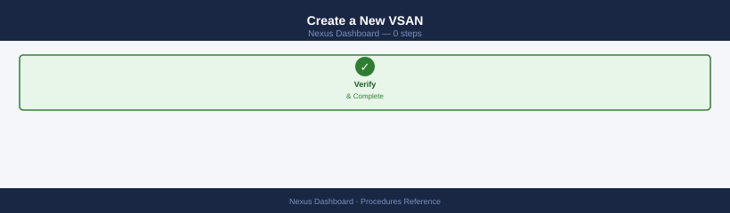

1. Navigate to **NDFC > Fabrics > [Fabric] > VSANs > Create VSAN**.
2. Enter:
   - VSAN ID: follow the VSAN numbering standard (production: 10-99)
   - VSAN name: `DC1-VSAN-10`
3. Select member switches.
4. Click **Create**. NDFC pushes the VSAN config to all selected switches.
5. Verify: **NDFC > VSANs** — VSAN should show **Active** on all member switches.

### Assign a Port to a VSAN

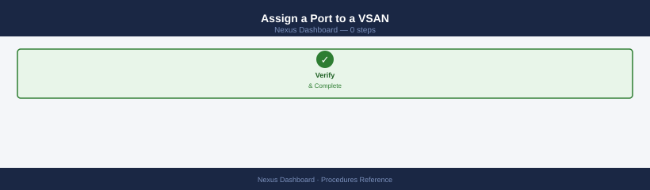

1. Navigate to **NDFC > Fabrics > [Fabric] > Interfaces**.
2. Select the target switch and port.
3. Click **Edit** and set the VSAN.
4. Click **Deploy**. NDFC pushes the port VSAN assignment.

---

## 4. Zoning — Add a Host Zone (NDFC)

### Prerequisites

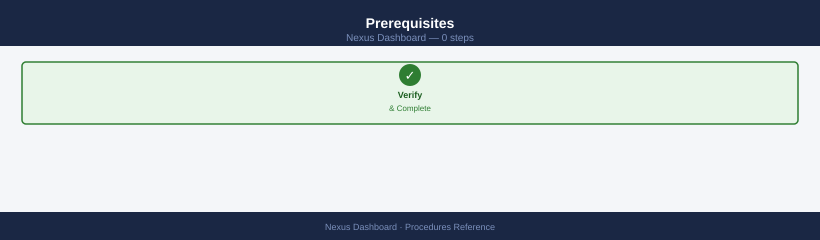

- Host HBA WWN: obtain from HBA driver, from ESXi host, or from NDFC **End Devices** view after HBA is connected
- Storage port WWN: obtain from storage array or NDFC End Devices
- Device aliases for both HBA and storage port (create first if not existing)

### Create Device Aliases

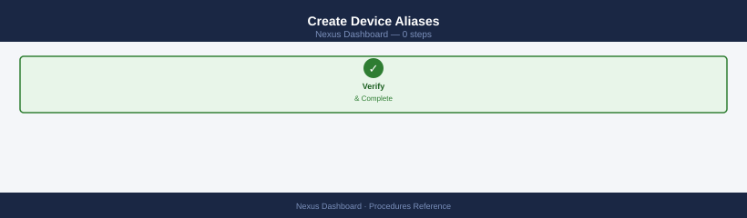

1. Navigate to **NDFC > Fabrics > [Fabric] > Device Alias > Create**.
2. Enter:
   - Alias name: `esxi01-hba0`
   - WWN: `50:00:10:00:00:ab:cd:ef`
3. Click **Create**.
4. Repeat for the storage port alias.
5. Click **Commit** to distribute aliases fabric-wide via CFS.

### Create the Zone

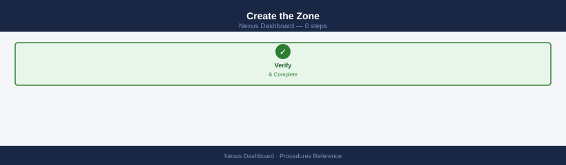

1. Navigate to **NDFC > Fabrics > [Fabric] > Zoning**.
2. Select the VSAN from the dropdown.
3. Click **New Zone**:
   - Zone name: `HOST-esxi01-purestor01-ct0fc0`
   - Zone type: Enhanced
4. Add members:
   - Add initiator: `esxi01-hba0`
   - Add target: `purestor01-ct0-fc0`
5. Click **Save Zone**.
6. Add zone to zone set: select `DC1-FABRIC-A-ZONESET` and click **Add Zone**.
7. Click **Activate Zone Set**. NDFC pushes the activation to all fabric switches.

**Validate:** From the host, trigger a storage rescan. The new LUN should appear.

---

## 5. MDS Firmware Upgrade via NDFC

### Upload Firmware Image

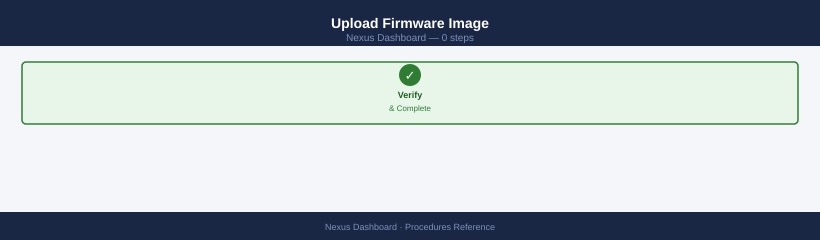

1. Navigate to **NDFC > Image Management > Manage Images > Upload**.
2. Select the MDS NX-OS `.bin` file.
3. Wait for upload and checksum validation.

### Upgrade a Switch

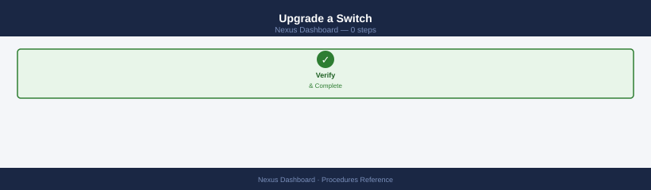

1. Navigate to **NDFC > Image Management > Upgrade**.
2. Select target switches.
3. Select firmware image and install mode:
   - **Non-disruptive (ISSU)** — for dual-supervisor MDS directors (9706, 9710, 9718)
   - **Disruptive** — for single-supervisor or fixed-port switches
4. Click **Upgrade**.
5. Monitor progress under **NDFC > Image Management > Upgrade Status**.

For ISSU on MDS directors: NDFC upgrades the standby supervisor first, triggers a failover, then upgrades the previously active supervisor. I/O is not interrupted.

---

## 6. NDI Anomaly Investigation

NDI detects anomalies across fabric topology, flow telemetry, and configuration compliance. This procedure walks through investigating a flagged anomaly.

1. Navigate to **NDI > Explore > Anomalies**.
2. Filter by severity: **Critical** or **Major**.
3. Select an anomaly to view the detail panel:
   - **Category**: Connectivity, Resource, Compliance, Forwarding, etc.
   - **Affected object**: which switch, port, or flow
   - **Timeline**: when the anomaly first appeared and whether it is ongoing
   - **Similar anomalies**: correlated events
4. Click **Explore** to navigate to the affected object in the topology or flow view.
5. Review the **Recommended Actions** tab for remediation guidance.
6. For false positives or acknowledged known issues: click **Acknowledge** with a note explaining the acceptance.

### Flow Anomaly Investigation (SAN Insights)

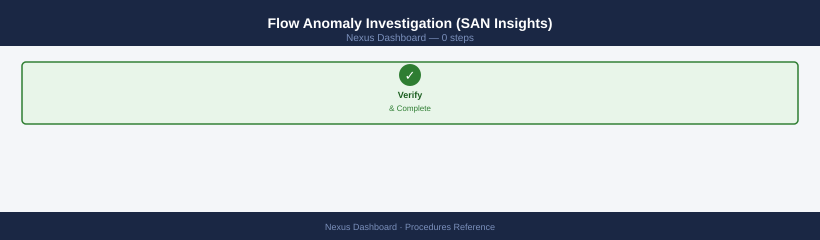

For SAN flow anomalies (high latency, low throughput, slow-drain):

1. Navigate to **NDI > Explore > Flows**.
2. Filter by fabric and VSAN.
3. Sort by **Exchange Completion Time (ECT)** descending.
4. High-ECT flows on a target port suggest a slow-drain device.
5. Click a flow to view the initiator-target-LUN detail.
6. Report findings to the host or storage team for investigation.

---

## 7. Alert and Alarm Management (NDFC)

### Acknowledge and Clear Alarms

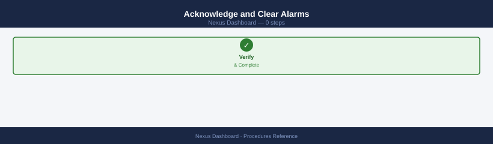

1. Navigate to **NDFC > Monitor > Alarms > Active Alarms**.
2. Select one or more alarms.
3. Click **Acknowledge** — marks the alarm as in-progress and assigns it to your account.
4. After resolving the underlying condition, click **Clear**.

Cleared alarms are retained in the historical alarm log and remain searchable.

### Configure Notification Rules

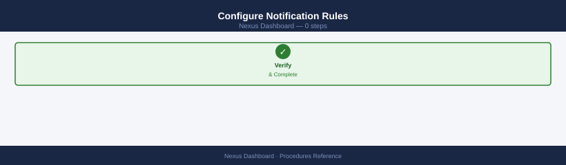

1. Navigate to **NDFC > Monitor > Alarms > Notification Rules**.
2. Click **Add Rule**:
   - Name: `Critical-Email-SAN-Team`
   - Severity: Critical
   - Action: Email
   - To: `san-team@corp.example.com`
   - Scope: All Fabrics (or specific fabric)
3. Click **Save**.
4. Test: **NDFC > Monitor > Alarms > Notification Rules > Test**.

### Suppress Alarms During Maintenance

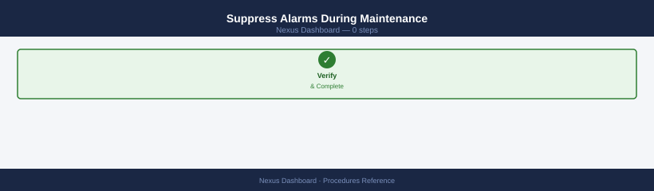

1. Navigate to **NDFC > Monitor > Alarms > Suppression**.
2. Click **Add Suppression Rule**:
   - Name: `MAINT-mds-dc1-20260508`
   - Scope: specific switch or port
   - Duration: maintenance window start and end time
3. Click **Save**. Alarms matching the rule are suppressed during the window.

---

## 8. Generating Reports (NDFC)

### On-Demand Reports

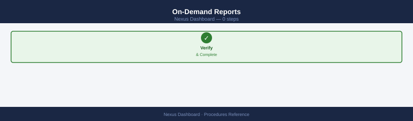

1. Navigate to **NDFC > Reports > Generate**.
2. Select report type:
   - **Inventory** — switch, port, and device inventory
   - **Configuration Compliance** — switch config drift from baseline
   - **Port Statistics** — traffic and error counters
   - **Zone Summary** — zone and zone set report
3. Select scope and output format (PDF or CSV).
4. Click **Generate**. The report downloads or emails to configured recipients.

### Scheduled Reports

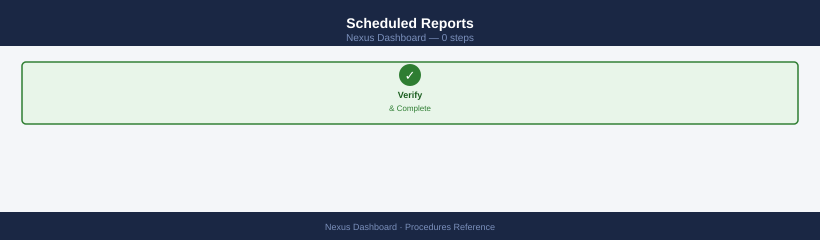

1. Navigate to **NDFC > Reports > Scheduled Reports > New**.
2. Configure: type, schedule (daily/weekly/monthly), recipients, and format.
3. Click **Save**. Reports are emailed at the configured time.

---

## 9. Dashboard Customization

Nexus Dashboard allows custom dashboard layouts for frequently referenced metrics:

1. Navigate to **Nexus Dashboard > Dashboards > Add Dashboard**.
2. Add widgets:
   - **Fabric Health** — overall NDFC fabric health summary
   - **Anomaly Summary** (NDI) — real-time anomaly count by severity
   - **ISL Utilization** — top-N ISL utilization
   - **Active Alarms** — current alarm count
3. Arrange widgets by drag-and-drop.
4. Click **Save**.

Custom dashboards are per-user; each engineer can maintain their own view. Shared dashboards can be created and assigned to user groups.

---

## Verify

- Confirm the operation completed without errors in the log or management UI
- Verify the expected state change is visible (service running, object created, config applied)
- Document the outcome in the change record

---

## See also

- [Nexus Dashboard — Health Checks](../health-checks/)
- [Nexus Dashboard — CLI Reference](../cli-reference/)
- [Nexus Dashboard — Common Issues](../troubleshooting/common-issues/)
