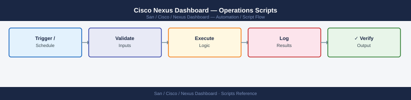

---
tags:
  - operations
  - san
---
# Cisco Nexus Dashboard — Operations Scripts



```bash
#!/usr/bin/env bash
# nd-auth.sh — obtain a Nexus Dashboard API token

ND_HOST="${ND_HOST:-https://nd-dc1.corp.example.com}"
ND_USER="${ND_USER:-svc-automation}"

if [[ -z "${ND_PASS}" ]]; then
  echo "ERROR: Set ND_PASS environment variable"
  exit 1
fi

export ND_TOKEN=$(curl -sk -X POST "${ND_HOST}/login" \
  -H "Content-Type: application/json" \
  -d "{\"userName\":\"${ND_USER}\",\"userPasswd\":\"${ND_PASS}\",\"domain\":\"local\"}" \
  | python3 -c "import sys,json; print(json.load(sys.stdin).get('token',''))")

if [[ -z "${ND_TOKEN}" ]]; then
  echo "ERROR: Failed to obtain ND token — check credentials and ND_HOST"
  exit 1
fi

echo "Authenticated to ${ND_HOST} as ${ND_USER}"

cleanup() {
  curl -sk -X POST "${ND_HOST}/logout" \
    -H "Authorization: Bearer ${ND_TOKEN}" > /dev/null
  echo "Session logged out"
}
trap cleanup EXIT
```

```bash
#!/usr/bin/env bash
# nd-zone-export.sh
# Cron: 0 2 * * * /opt/scripts/nd-zone-export.sh >> /var/log/nd-zone-export.log 2>&1

ND_HOST="${ND_HOST:-https://nd-dc1.corp.example.com}"
NDFC="${ND_HOST}/appcenter/cisco/ndfc/api/v1"
EXPORT_DIR="/opt/nd-exports/zones"
DATE=$(date +%Y%m%d)

mkdir -p "${EXPORT_DIR}"

# Authenticate
TOKEN=$(curl -sk -X POST "${ND_HOST}/login" \
  -H "Content-Type: application/json" \
  -d "{\"userName\":\"svc-automation\",\"userPasswd\":\"${ND_PASS}\",\"domain\":\"local\"}" \
  | python3 -c "import sys,json; print(json.load(sys.stdin)['token'])")

trap "curl -sk -X POST '${ND_HOST}/logout' -H 'Authorization: Bearer ${TOKEN}' > /dev/null" EXIT

# Get fabric list
FABRICS=$(curl -sk "${NDFC}/san/fabrics" \
  -H "Authorization: Bearer ${TOKEN}" \
  | python3 -c "
import sys, json
data = json.load(sys.stdin)
for f in data.get('DATA', data if isinstance(data,list) else []):
    print(f.get('fabricName',''))
")

# Export zone DB for each fabric
for FABRIC in ${FABRICS}; do
  OUTPUT="${EXPORT_DIR}/${FABRIC}-zones-${DATE}.json"
  curl -sk "${NDFC}/san/zoning?fabricName=${FABRIC}" \
    -H "Authorization: Bearer ${TOKEN}" \
    -o "${OUTPUT}"
  echo "Exported: ${OUTPUT}"
done

# Purge exports older than 90 days
find "${EXPORT_DIR}" -name "*-zones-*.json" -mtime +90 -delete

echo "Zone export complete: $(date)"
```
```python
#!/usr/bin/env python3
# nd-anomaly-report.py

import os, json, sys, smtplib, ssl, urllib.request
from email.mime.text import MIMEText
from datetime import datetime

ND_HOST = os.environ.get("ND_HOST", "https://nd-dc1.corp.example.com")
ND_PASS = os.environ.get("ND_PASS", "")
NDI = f"{ND_HOST}/appcenter/cisco/ndinsight/api/v1"

ctx = ssl.create_default_context()
ctx.check_hostname = False
ctx.verify_mode = ssl.CERT_NONE

# Login
req = urllib.request.Request(ND_HOST + "/login", method="POST",
      data=json.dumps({"userName":"svc-monitor","userPasswd":ND_PASS,
                       "domain":"local"}).encode(),
      headers={"Content-Type":"application/json"})
with urllib.request.urlopen(req, context=ctx) as r:
    TOKEN = json.load(r)["token"]

try:
    req = urllib.request.Request(
        f"{NDI}/anomalies?timeRange=LAST_DAY",
        headers={"Authorization": f"Bearer {TOKEN}"})
    with urllib.request.urlopen(req, context=ctx) as r:
        anomalies = json.load(r).get("DATA", [])

    by_severity = {}
    for a in anomalies:
        sev = a.get("severity","UNKNOWN")
        by_severity.setdefault(sev, []).append(a)

    lines = [f"NDI Anomaly Summary — {datetime.utcnow().strftime('%Y-%m-%d')}",
             "=" * 50]
    for sev in ("CRITICAL","MAJOR","MINOR","WARNING"):
        count = len(by_severity.get(sev, []))
        lines.append(f"{sev}: {count}")
    lines.append("")
    for a in by_severity.get("CRITICAL", [])[:10]:
        lines.append(f"[CRITICAL] {a.get('title','')}: {a.get('description','')[:80]}")

    body = "\n".join(lines)
    print(body)

    # Send email
    msg = MIMEText(body)
    msg["Subject"] = f"NDI Daily Anomaly Report — {datetime.utcnow().strftime('%Y-%m-%d')}"
    msg["From"] = "nexus-dashboard@corp.example.com"
    msg["To"] = "san-team@corp.example.com"

    with smtplib.SMTP("smtp.corp.example.com", 587) as smtp:
        smtp.starttls()
        smtp.send_message(msg)

finally:
    urllib.request.urlopen(
        urllib.request.Request(ND_HOST + "/logout", method="POST",
        headers={"Authorization": f"Bearer {TOKEN}"}), context=ctx
    ).close()
```
```python
#!/usr/bin/env python3
# nd-firmware-check.py

import os, sys, json, urllib.request, ssl

ND_HOST = os.environ.get("ND_HOST", "https://nd-dc1.corp.example.com")
ND_PASS = os.environ.get("ND_PASS", "")
NDFC = f"{ND_HOST}/appcenter/cisco/ndfc/api/v1"

BASELINE = {
    "MDS 9718": "8.4(2a)",
    "MDS 9710": "8.4(2a)",
    "MDS 9706": "8.4(2a)",
    "MDS 9396T": "8.4(2a)",
    "MDS 9148T": "8.4(2a)",
    "MDS 9132T": "8.4(2a)",
}

ctx = ssl.create_default_context()
ctx.check_hostname = False
ctx.verify_mode = ssl.CERT_NONE

req = urllib.request.Request(ND_HOST + "/login", method="POST",
      data=json.dumps({"userName":"svc-monitor","userPasswd":ND_PASS,
                       "domain":"local"}).encode(),
      headers={"Content-Type":"application/json"})
with urllib.request.urlopen(req, context=ctx) as r:
    TOKEN = json.load(r)["token"]

req = urllib.request.Request(f"{NDFC}/inventory/switches",
      headers={"Authorization": f"Bearer {TOKEN}"})
with urllib.request.urlopen(req, context=ctx) as r:
    switches = json.load(r)

non_compliant = []
for sw in switches:
    model = sw.get("model","")
    fw = sw.get("release","")
    for prefix, min_ver in BASELINE.items():
        if model.startswith(prefix) and fw < min_ver:
            non_compliant.append((sw.get("switchName",""), model, fw, min_ver))

if non_compliant:
    print(f"NON-COMPLIANT ({len(non_compliant)} switches):")
    for name, model, fw, req_ver in non_compliant:
        print(f"  {name:<35} {model:<15} current={fw} min={req_ver}")
    sys.exit(1)
else:
    print(f"OK: All {len(switches)} switches meet firmware baseline.")

urllib.request.urlopen(
    urllib.request.Request(ND_HOST + "/logout", method="POST",
    headers={"Authorization": f"Bearer {TOKEN}"}), context=ctx
).close()
```

## Before you begin

- **Access:** Storage admin credentials (cluster admin or equivalent)
- **Timing:** safe to run during business hours unless a step is marked ⚠ (causes interruption)
- **Dependencies:** no active upgrades or migrations on the same infrastructure
- **Logging:** capture command output — paste into the change record on completion

---

---

## Verify

- Confirm the operation completed without errors in the log or management UI
- Verify the expected state change is visible (service running, object created, config applied)
- Document the outcome in the change record

---

## See also

- [Nexus Dashboard — Procedures](procedures/)
- [Nexus Dashboard — CLI Reference](cli-reference/)
- [Nexus Dashboard — Health Checks](health-checks/)
