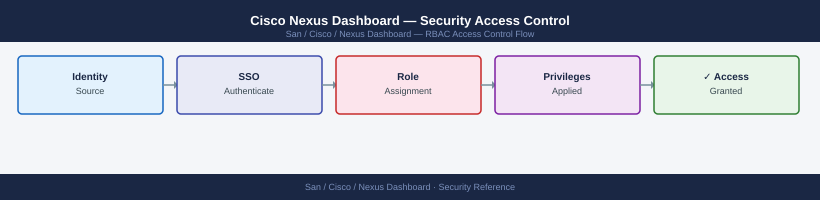

---
tags:
  - san
  - security
---
# Cisco Nexus Dashboard — Security Access Control


```bash
# Via REST API
TOKEN=$(curl -sk -X POST https://nd-dc1.corp.example.com/login \
  -H "Content-Type: application/json" \
  -d '{"userName":"admin","userPasswd":"<pass>","domain":"local"}' \
  | python3 -c "import sys,json; print(json.load(sys.stdin)['token'])")

curl -sk -X POST https://nd-dc1.corp.example.com/nexus/api/v1/users \
  -H "Authorization: Bearer ${TOKEN}" \
  -H "Content-Type: application/json" \
  -d '{
    "username": "svc-monitor",
    "password": "<strong-password>",
    "firstName": "Service",
    "lastName": "Monitor",
    "email": "san-team@corp.example.com",
    "roles": [{"name": "Viewer", "sites": [{"name": "DC1-SAN"}, {"name": "DC2-SAN"}]}]
  }' | python3 -m json.tool
```


```text title="Expected output"
{
  "id": "5f8c3a2b-1e4d-47a9-8f2c-9d7e1a4b5c6d",
  "username": "svc-monitor",
  "firstName": "Service",
  "lastName": "Monitor",
  "email": "san-team@corp.example.com",
  "roles": [
    {
      "name": "Viewer",
      "sites": [
        {
          "name": "DC1-SAN"
        },
        {
          "name": "DC2-SAN"
        }
      ]
    }
  ],
  "lastLoginTime": null,
  "createdTime": 1704067200000,
  "modifiedTime": 1704067200000
}
```

!!! warning "Common errors"
    **`curl: (60) SSL certificate problem: self signed certificate`** — Add `-k` flag to curl command to skip SSL verification (already present; if still failing, verify the Nexus Dashboard hostname resolves correctly).
    **`jq: error (at <stdin>:0): Cannot index string with string "token"`** — Verify the login credentials are correct and the `/login` endpoint returned valid JSON; check the response with `curl -sk -X POST https://nd-dc1.corp.example.com/login ... | python3 -m json.tool` to inspect the actual response structure.
    **`{"error":"Invalid role name: Viewer"}`** — Confirm the role name matches exactly what exists in Nexus Dashboard (check available roles via `curl -sk -H "Authorization: Bearer ${TOKEN}" https://nd-dc1.corp.example.com/nexus/api/v1/roles`).
## Before you begin

- **Access:** Storage admin credentials (cluster admin or equivalent)
- **Change management:** security changes require CAB approval in most environments
- **Rollback plan:** document current state before any security control change
- **Testing:** validate in a non-production environment first where possible

---

---

## See also

- [Nexus Dashboard — Authentication](../authentication/)
- [Nexus Dashboard — Hardening](../hardening/)
- [Nexus Dashboard — Encryption](../encryption/)
