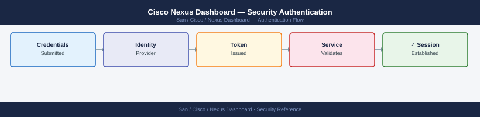

---
tags:
  - san
  - security
---
# Cisco Nexus Dashboard — Security Authentication


```bash
ssh ndadmin@nd-dc1-1.corp.example.com

# Import corporate CA certificate for LDAPS trust
acs certificates import-ca --cert /tmp/corp-ca.crt --name corp-ldap-ca

# Verify
acs certificates show-ca
```

## Before you begin

- **Access:** Storage admin credentials (cluster admin or equivalent)
- **Change management:** security changes require CAB approval in most environments
- **Rollback plan:** document current state before any security control change
- **Testing:** validate in a non-production environment first where possible

---

---

## See also

- [Nexus Dashboard — Access Control](../access-control/)
- [Nexus Dashboard — Hardening](../hardening/)
- [Nexus Dashboard — Encryption](../encryption/)
