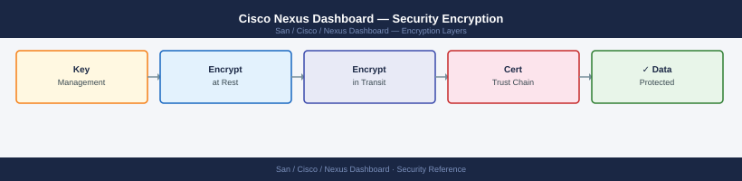

---
tags:
  - san
  - security
---
# Cisco Nexus Dashboard — Security Encryption


```bash
# Check TLS version accepted
openssl s_client -tls1 -connect nd-dc1.corp.example.com:443 </dev/null 2>&1 | grep "alert\|Cipher"
# Expected: alert handshake failure (TLS 1.0 rejected)

openssl s_client -tls1_3 -connect nd-dc1.corp.example.com:443 </dev/null 2>&1 | grep "Protocol"
# Expected: Protocol: TLSv1.3

# Enumerate ciphers (requires nmap)
nmap --script ssl-enum-ciphers -p 443 nd-dc1.corp.example.com
# Acceptable: ECDHE+AESGCM, ECDHE+CHACHA20; No RC4, DES, 3DES, NULL
```

```bash
# The passphrase can also be set via CLI
acs backup settings --encryption-passphrase-file /home/ndadmin/.nd-backup-pass
```
```bash
# Check certificate expiry
openssl s_client -connect nd-dc1.corp.example.com:443 \
  -servername nd-dc1.corp.example.com </dev/null 2>/dev/null \
  | openssl x509 -noout -dates

# Days until expiry
python3 -c "
from datetime import datetime
import subprocess, re
r = subprocess.run(['openssl','s_client','-connect','nd-dc1.corp.example.com:443',
  '-servername','nd-dc1.corp.example.com'], capture_output=True, input=b'')
c = subprocess.run(['openssl','x509','-noout','-enddate'],
  input=r.stdout, capture_output=True).stdout.decode()
d = re.search(r'notAfter=(.*)', c).group(1).strip()
exp = datetime.strptime(d, '%b %d %H:%M:%S %Y %Z')
print(f'Certificate expires in {(exp - datetime.utcnow()).days} days ({exp.date()})')
"
# Alert when < 60 days remaining; renew by < 30 days
```

## Before you begin

- **Access:** Storage admin credentials (cluster admin or equivalent)
- **Change management:** security changes require CAB approval in most environments
- **Rollback plan:** document current state before any security control change
- **Testing:** validate in a non-production environment first where possible

---

---

## See also

- [Nexus Dashboard — Hardening](../hardening/)
- [Nexus Dashboard — Authentication](../authentication/)
- [Nexus Dashboard — Access Control](../access-control/)
