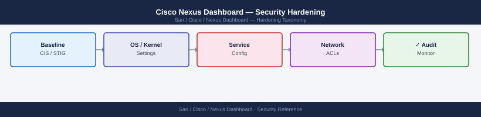

---
tags:
  - san
  - security
---
# Cisco Nexus Dashboard — Security Hardening

*Applies to: Cisco MDS / NX-OS*


```bash
# SSH to the ND cluster
ssh ndadmin@nd-dc1-1.corp.example.com

# Change the default admin password (via GUI: Admin Console > Security > Users > admin)
# For ndadmin OS account on the appliance, change password:
passwd ndadmin
# Use a password meeting corporate complexity policy (20+ characters)
# Store in vault; treat as break-glass
```

```text
   WARNING: This system is for authorized use only.
   All connections are monitored and recorded.
   Unauthorized access is prohibited and may result in legal action.
```
   ```text
3. Click **Save**. The banner appears below the login form.

---

## Before you begin

- **Access:** Storage admin credentials (cluster admin or equivalent)
- **Change management:** security changes require CAB approval in most environments
- **Rollback plan:** document current state before any security control change
- **Testing:** validate in a non-production environment first where possible

---

## 7. Backup Encryption

Enable backup encryption to protect backup archives at rest on the remote backup server:

1. Navigate to **Admin Console > Operations > Backup > Settings**.
2. Enable **Encrypt Backups**.
3. Set a strong passphrase (20+ characters).
4. Store the passphrase in vault immediately.

Without backup encryption, backup archives contain all ND configuration including switch credentials in their encrypted form — still sensitive and should not be stored in plain text on a backup server.

---

## 8. Audit Logging

Ensure audit logging is enabled and forwarded to the SIEM:

1. **Admin Console > Operations > Audit Logs** — confirm events are being recorded.
2. Configure syslog forwarding to forward audit events to the SIEM:
```
   ```bash
   acs system syslog add --server 10.10.3.50 --port 514 --protocol tcp
   ```
3. Set up SIEM alerts for:
   - Multiple failed logins (> 5 in 5 minutes)
   - Admin account login events
   - Configuration changes (zone changes, user additions)
   - Login from unexpected source IP

---

## 9. Kubernetes Security Baseline

ND's Kubernetes control plane has several security defaults that should be verified:

```bash
ssh ndadmin@nd-dc1-1.corp.example.com

# Confirm no pods are running as root unnecessarily
kubectl get pods --all-namespaces -o jsonpath='{range .items[*]}{.metadata.namespace}{"\t"}{.metadata.name}{"\t"}{.spec.securityContext.runAsUser}{"\n"}{end}' | grep -v "^$"

# Confirm no privileged pods (outside of system namespaces)
kubectl get pods --all-namespaces -o json | python3 -c "
import sys, json
data = json.load(sys.stdin)
for item in data['items']:
    ns = item['metadata']['namespace']
    name = item['metadata']['name']
    for c in item['spec'].get('containers',[]):
        if c.get('securityContext',{}).get('privileged'):
            print(f'Privileged: {ns}/{name}/{c[\"name\"]}')
" 2>/dev/null | grep -v "kube-system\|kube-proxy\|cilium"
# ND system pods require some elevated privileges; app pods should not

# Confirm NetworkPolicies are in place (Cilium enforces by default in ND)
kubectl get networkpolicies --all-namespaces | grep -c "NetworkPolicy"
# Should be non-zero
```

```text title="Expected output"
Welcome to Nexus Dashboard
ndadmin@nd-dc1-1.corp.example.com's password:
Last login: Wed Jan 15 14:32:18 2025 from 10.42.18.55

default	nginx-deployment-5d4c8f7b9	1000
default	postgres-app-7c2b1d9e4	2000
kube-system	coredns-558bd4d5c9-k8m2x	65534
kube-system	etcd-nd-dc1-1	0
monitoring	prometheus-operator-0	65534
ingress-nginx	nginx-ingress-controller-abc123	101
Privileged: ingress-nginx/nginx-ingress-controller-abc123/nginx
Privileged: monitoring/alertmanager-0/alertmanager
2
```

!!! warning "Common errors"
    **`error: unable to connect to the server: dial tcp: lookup nd-dc1-1.corp.example.com on 127.0.0.1:53: no such host`** — Verify the hostname is correct and DNS is resolving; check `/etc/hosts` or corporate DNS configuration.
    **`command not found: python3`** — Install Python 3 on the Nexus Dashboard node with `apt-get install python3` or equivalent for your OS.
    **`error: You must be logged in to the server (Unauthorized)`** — Ensure your kubeconfig is valid and your ndadmin user has cluster-admin permissions; run `kubectl auth can-i get pods --all-namespaces` to verify.
```bash
ssh ndadmin@nd-dc1-1.corp.example.com

# Check NTP status on all nodes
acs system ntp show

# If NTP is not configured or not synchronised:
acs system ntp add --server 10.10.0.10 --prefer
acs system ntp add --server 10.10.0.11

# Verify synchronisation (may take 2-5 minutes after adding NTP servers)
acs system ntp show
# Expected: server reachable, stratum ≤ 3, offset < 100ms
```


```text title="Expected output"
Last login: Wed Jan 15 14:32:18 2025 from 10.20.5.42
nd-dc1-1.corp.example.com#

NTP Configuration:
  Server: 10.10.0.10 (prefer)
    Reachable: No
    Stratum: 16
    Offset: 0ms
  Server: 10.10.0.11
    Reachable: No
    Stratum: 16
    Offset: 0ms

NTP Server 10.10.0.10 added successfully (prefer)
NTP Server 10.10.0.11 added successfully

NTP Configuration:
  Server: 10.10.0.10 (prefer)
    Reachable: Yes
    Stratum: 2
    Offset: 12ms
  Server: 10.10.0.11
    Reachable: Yes
    Stratum: 2
    Offset: 18ms

Synchronization Status: SYNCHRONIZED
```

!!! warning "Common errors"
    **`Connection refused`** — Verify the Nexus Dashboard IP address is correct and SSH is enabled on port 22.
    **`NTP Server 10.10.0.10 already exists`** — Remove the existing NTP server with `acs system ntp remove --server 10.10.0.10` before re-adding it.
    **`Synchronization Status: UNSYNCHRONIZED`** — Confirm the NTP servers are reachable from the Nexus Dashboard network and allow UDP port 123 in firewall rules.
---

## See also

- [Nexus Dashboard — Authentication](../authentication/)
- [Nexus Dashboard — Access Control](../access-control/)
- [Nexus Dashboard — Encryption](../encryption/)
