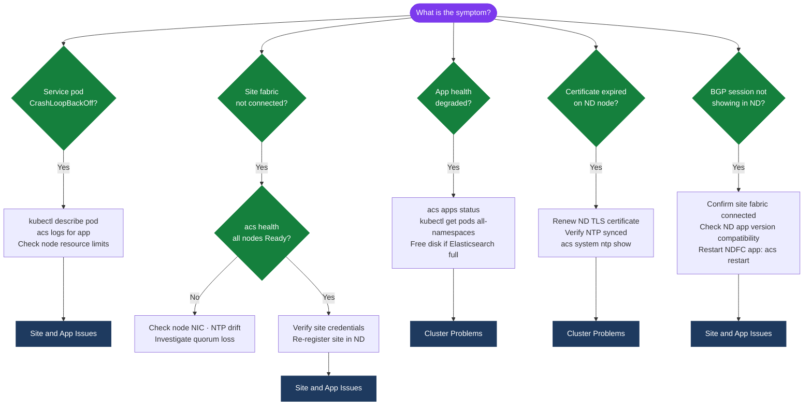

---
tags:
  - san
  - troubleshooting
search:
  boost: 1.5
---
# Cisco Nexus Dashboard — Troubleshooting Common Issues


```bash
ssh ndadmin@nd-dc1-1.corp.example.com

# Overall cluster health
acs health

# Detailed node status
acs nodes list

# Check Kubernetes node status
kubectl get nodes
# If a node shows NotReady: investigate the node-specific issue below
```

```bash
# Check NDI pods
kubectl get pods -n ndi
# All should be Running

# Check flow collector logs
kubectl logs -n ndi deployment/ndi-flow-collector --tail=100 | grep -i "error\|drop\|overflow"

# Check disk usage for NDI data
kubectl exec -n ndi deployment/ndi-elasticsearch -- df -h /usr/share/elasticsearch/data
# If > 85% full: NDI stops writing new data (Elasticsearch circuit breaker)
```
```bash
# Test remote backup connectivity
ssh ndadmin@nd-dc1-1.corp.example.com
acs backup remote test
# Review output for the specific error

# If SSH key authentication: check if key is still authorized on backup server
# Update the backup configuration if credentials changed:
acs backup remote update \
  --server backup-server.corp.example.com \
  --user nd-bkp \
  --key-file /home/ndadmin/.ssh/nd-backup-key
```
```bash
# Check ND authentication service logs for SAML errors
kubectl logs -n nd-platform deployment/nd-keycloak --tail=100 | grep -i "saml\|assertion\|redirect"
```
```bash
ssh ndadmin@nd-dc1-1.corp.example.com

# Check app status
acs apps status

# Check for pods stuck in Init or Error states
kubectl get pods --all-namespaces | grep -Ev "Running|Completed"

# Describe a stuck pod
kubectl describe pod -n ndfc <pod-name>
# Check Events section for resource constraints, image pull errors, etc.

# Check node resource availability
acs system resources
# If nodes are at memory/CPU limit: scale down other apps or add resources

# If the install image is corrupt:
acs apps remove-image <app> <version>
# Re-upload the image from a fresh download
```
```bash
# Check NTP on all nodes
acs system ntp show

# If NTP is not synchronised, re-add NTP servers:
acs system ntp add --server 10.10.0.10 --prefer
acs system ntp add --server 10.10.0.11

# Wait 2-3 minutes and check again
acs system ntp show
# Expected offset: < 100ms

# If offset is large and nodes cannot sync (isolated network):
# Use chronyc on the node OS to force a step correction:
sudo chronyc makestep
```

```d2
direction: down

symptom: Identify Symptom {shape: diamond}
diagnostic_flow: "Diagnostic Flow" {shape: rectangle}
verify_resolution: "Verify resolution" {shape: rectangle}
resolution: Resolve or Escalate {shape: oval}

symptom -> diagnostic_flow: investigate
symptom -> verify_resolution: investigate
diagnostic_flow -> resolution
verify_resolution -> resolution
```

## Diagnostic Flow



---

## Before you begin

- **Access:** Storage admin credentials (cluster admin or equivalent)
- **Gather first:** recent error message text, event timestamps, and affected object names
- **Scope:** confirm whether the issue affects a single object, host, cluster, or site
- **Escalation:** open a vendor support ticket before running any destructive step
- **Logging:** document each command and output — required if escalation is needed

---

---

## Verify resolution

- Confirm the original symptom no longer occurs
- Check logs for any residual errors related to the issue
- Monitor for 10–15 minutes to confirm the fix is stable

---

## See also

- [Nexus Dashboard — Diagnostics](../diagnostics/)
- [Nexus Dashboard — Escalation](../escalation/)
- [Nexus Dashboard — Health Checks](../../operations/health-checks/)
