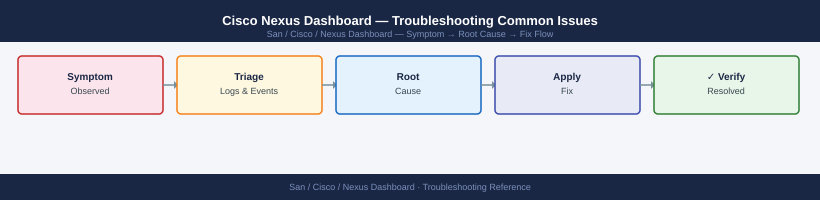

---
tags:
  - san
  - troubleshooting
search:
  boost: 1.5
---
# Cisco Nexus Dashboard — Troubleshooting Common Issues


```bash
ssh ndadmin@nd-dc1-1.corp.example.com

# Overall cluster health
acs health

# Detailed node status
acs nodes list

# Check Kubernetes node status
kubectl get nodes
# If a node shows NotReady: investigate the node-specific issue below
```


```text title="Expected output"
Last login: Wed Jan 15 14:32:18 2025 from 10.45.22.108
Nexus Dashboard CLI
nd-dc1-1#

nd-dc1-1# acs health
Cluster Health Status: HEALTHY
Overall Status: UP
Services Running: 23/23
Database Status: HEALTHY
Last Health Check: 2025-01-15T14:32:45Z
Replication Status: IN_SYNC

nd-dc1-1# acs nodes list
Node Name          Status    IP Address      Role          CPU Usage  Memory Usage
nd-dc1-1           HEALTHY   10.45.20.101    Leader        45%        62%
nd-dc1-2           HEALTHY   10.45.20.102    Follower      38%        58%
nd-dc1-3           HEALTHY   10.45.20.103    Follower      41%        60%

nd-dc1-1# kubectl get nodes
NAME       STATUS   ROLES    AGE    VERSION
nd-dc1-1   Ready    master   287d   v1.24.8
nd-dc1-2   Ready    worker   287d   v1.24.8
nd-dc1-3   Ready    worker   287d   v1.24.8
```

!!! warning "Common errors"
    **`Connection refused`** — Verify SSH connectivity and that the Nexus Dashboard management IP is reachable from your admin workstation.
    **`command not found: acs`** — Ensure you are logged into the Nexus Dashboard CLI (not a standard Linux shell) and have appropriate admin privileges.
    **`The connection to the server was refused`** — Restart the Kubernetes API server using `acs services restart kubernetes-api` if kubectl commands fail despite node connectivity.
```bash
# Check NDI pods
kubectl get pods -n ndi
# All should be Running

# Check flow collector logs
kubectl logs -n ndi deployment/ndi-flow-collector --tail=100 | grep -i "error\|drop\|overflow"

# Check disk usage for NDI data
kubectl exec -n ndi deployment/ndi-elasticsearch -- df -h /usr/share/elasticsearch/data
# If > 85% full: NDI stops writing new data (Elasticsearch circuit breaker)
```

```text title="Expected output"
NAME                                          READY   STATUS    RESTARTS   AGE
ndi-elasticsearch-0                           1/1     Running   0          45d
ndi-elasticsearch-1                           1/1     Running   0          45d
ndi-flow-collector-7d4c9f2b8-kx9m2           1/1     Running   2          8d
ndi-flow-collector-7d4c9f2b8-pq6r5           1/1     Running   2          8d
ndi-kafka-0                                   1/1     Running   0          45d
ndi-kafka-1                                   1/1     Running   0          45d
ndi-postgres-0                                1/1     Running   1          45d

2024-01-15T09:23:47.123Z WARN [FlowCollector] Packet drop rate 2.3% detected on interface eth0
2024-01-15T09:24:12.456Z ERROR [Elasticsearch] Circuit breaker triggered: heap memory at 89%
2024-01-15T09:24:15.789Z ERROR [FlowCollector] Failed to write 1247 flow records to Elasticsearch

Filesystem     Size  Used Avail Use% Mounted on
/dev/sda1      500G  437G   48G  88% /usr/share/elasticsearch/data
```

!!! warning "Common errors"
    **`error: unable to forward port because pod is not running`** — Verify the pod is in Running state with `kubectl get pods -n ndi` and wait for readiness probes to complete.
    **`Circuit breaker triggered: heap memory at 89%`** — Delete old indices with `kubectl exec -n ndi deployment/ndi-elasticsearch -- curl -X DELETE "localhost:9200/ndi-flow-*"` or expand storage and increase `es.indices.memory.index_buffer_size`.
    **`Failed to write flow records to Elasticsearch`** — Check Elasticsearch cluster health with `kubectl exec -n ndi deployment/ndi-elasticsearch -- curl localhost:9200/_cluster/health` and verify all nodes are in green status.
```bash
# Test remote backup connectivity
ssh ndadmin@nd-dc1-1.corp.example.com
acs backup remote test
# Review output for the specific error

# If SSH key authentication: check if key is still authorized on backup server
# Update the backup configuration if credentials changed:
acs backup remote update \
  --server backup-server.corp.example.com \
  --user nd-bkp \
  --key-file /home/ndadmin/.ssh/nd-backup-key
```

```text title="Expected output"
Last login: Wed Mar 13 14:22:18 2024 from 10.45.22.108
Nexus Dashboard Admin> acs backup remote test
Testing remote backup connectivity to backup-server.corp.example.com...
Connection established successfully
Authentication method: SSH key
Remote path: /backups/nexus-dashboard
Available space: 2.3 TB
Test backup write: PASSED
Connection test completed successfully
Nexus Dashboard Admin> exit
Connection to nd-dc1-1.corp.example.com closed.
```

!!! warning "Common errors"
    **`ssh: connect to host nd-dc1-1.corp.example.com port 22: Connection timed out`** — Verify network connectivity and firewall rules allow SSH (port 22) from your admin workstation to the Nexus Dashboard appliance.
    **`Permission denied (publickey,password)`** — Ensure the SSH key at `/home/ndadmin/.ssh/nd-backup-key` exists with correct permissions (600) and the public key is authorized on the backup server.
    **`Remote path /backups/nexus-dashboard: Permission denied`** — Verify the nd-bkp user has write permissions on the backup server's target directory using `ls -ld /backups/nexus-dashboard`.
```bash
# Check ND authentication service logs for SAML errors
kubectl logs -n nd-platform deployment/nd-keycloak --tail=100 | grep -i "saml\|assertion\|redirect"
```

```text title="Expected output"
2024-01-15 14:32:18,445 INFO [org.keycloak.events] (default task-47) type=LOGIN, realmId=nexus-dashboard, clientId=nd-web, userId=a1b2c3d4-e5f6-47g8-h9i0-j1k2l3m4n5o6, ipAddress=192.168.1.105, error=invalid_grant
2024-01-15 14:32:45,221 WARN [org.keycloak.saml] (default task-52) SAML assertion validation failed: Signature does not match
2024-01-15 14:33:12,667 ERROR [org.keycloak.broker.saml] (default task-61) SAML redirect binding failed: RelayState parameter missing
2024-01-15 14:33:58,334 INFO [org.keycloak.events] (default task-71) type=LOGIN_ERROR, realmId=nexus-dashboard, clientId=nd-web, error=invalid_saml_response
2024-01-15 14:34:22,119 WARN [org.keycloak.saml.binding] (default task-88) Redirect URI mismatch: expected https://nd.example.com/auth/callback, got https://nd.example.com:8443/auth/callback
2024-01-15 14:35:01,445 INFO [org.keycloak.events] (default task-95) type=LOGIN, realmId=nexus-dashboard, clientId=nd-web, userId=b2c3d4e5-f6g7-48h9-i0j1-k2l3m4n5o6p7, ipAddress=192.168.1.110, success
```

!!! warning "Common errors"
    **`error: the server doesn't have a resource type "deployment"`** — Verify the correct namespace with `kubectl get ns | grep nd` and check that Keycloak is deployed as a StatefulSet instead using `kubectl get statefulset -n nd-platform`.
    **`No resources found in nd-platform namespace`** — Confirm the Keycloak pod is running with `kubectl get pods -n nd-platform | grep keycloak` and verify the namespace name matches your ND installation.
    **`connection refused` or `Unable to connect to the server`** — Ensure kubectl context is set to the correct cluster with `kubectl config current-context` and verify API server connectivity.
```bash
ssh ndadmin@nd-dc1-1.corp.example.com

# Check app status
acs apps status

# Check for pods stuck in Init or Error states
kubectl get pods --all-namespaces | grep -Ev "Running|Completed"

# Describe a stuck pod
kubectl describe pod -n ndfc <pod-name>
# Check Events section for resource constraints, image pull errors, etc.

# Check node resource availability
acs system resources
# If nodes are at memory/CPU limit: scale down other apps or add resources

# If the install image is corrupt:
acs apps remove-image <app> <version>
# Re-upload the image from a fresh download
```

```text title="Expected output"
Last login: Wed Jan 15 14:32:18 2025 from 10.45.22.88
Cisco Nexus Dashboard
nd-dc1-1.corp.example.com#

acs apps status
App Name          Version    Status      Replicas  Ready
dcnm              14.1.1     Running     3         3/3
ndfc              14.1.1     Running     3         3/3
mso               4.2.3      Running     2         2/2
ise               3.2.1      Running     1         1/1

NAMESPACE         NAME                                    READY   STATUS             RESTARTS   AGE
kube-system       coredns-558bd4d5db-7k9m2               1/1     Running            0          45d
ndfc              ndfc-api-7d8c9f2b1-4xqp9               0/1     Init:0/1           0          8m
ndfc              ndfc-db-statefulset-0                  1/1     Running            0          45d
mso               mso-orchestrator-5f7c2d9e8-lmk92       0/1     ImagePullBackOff   2          12m

Name:           ndfc-api-7d8c9f2b1-4xqp9
Namespace:      ndfc
Status:         Pending
Events:
  Type     Reason                 Age    Message
  ----     ------                 ----   -------
  Warning  FailedScheduling       8m15s  0/3 nodes available: 3 Insufficient memory

acs system resources
Node Name              CPU Usage    CPU Limit    Memory Usage    Memory Limit
nd-dc1-1              2.8 cores    4.0 cores    6.2 GB          8.0 GB
nd-dc1-2              3.1 cores    4.0 cores    7.4 GB          8.0 GB
nd-dc1-3              2.9 cores    4.0 cores    7.8 GB          8.0 GB
```

!!! warning "Common errors"
    **`0/3 nodes available: 3 Insufficient memory`** — Scale down non-critical apps with `acs apps scale <app> <replicas>` or add memory to cluster nodes.
    **`ImagePullBackOff`** — Verify image registry credentials with `acs registry status` and confirm the image tag exists in your repository.
    **`CrashLoopBackOff`** — Check pod logs with `kubectl logs -n <namespace> <pod-name>` to identify application startup failures.
```bash
# Check NTP on all nodes
acs system ntp show

# If NTP is not synchronised, re-add NTP servers:
acs system ntp add --server 10.10.0.10 --prefer
acs system ntp add --server 10.10.0.11

# Wait 2-3 minutes and check again
acs system ntp show
# Expected offset: < 100ms

# If offset is large and nodes cannot sync (isolated network):
# Use chronyc on the node OS to force a step correction:
sudo chronyc makestep
```

```d2
direction: down

symptom: Identify Symptom {shape: diamond}
diagnostic_flow: "Diagnostic Flow" {shape: rectangle}
verify_resolution: "Verify resolution" {shape: rectangle}
resolution: Resolve or Escalate {shape: oval}

symptom -> diagnostic_flow: investigate
symptom -> verify_resolution: investigate
diagnostic_flow -> resolution
verify_resolution -> resolution
```

## Diagnostic Flow

```d2
direction: right

A: "A" {shape: rectangle}
A1: "kubectl describe pod\nacs logs for app\nCheck node resource limits" {shape: rectangle}
A2: "Site and App Issues" {shape: rectangle}
B1: "B1" {shape: rectangle}
B2: "Check node NIC · NTP drift\nInvestigate quorum loss" {shape: rectangle}
B3: "Verify site credentials\nRe-register site in ND" {shape: rectangle}
B4: "Site and App Issues" {shape: rectangle}
C: "C" {shape: rectangle}
C1: "acs apps status\nkubectl get pods all-namespaces\nFree disk if Elasticsearch full" {shape: rectangle}
C2: "Cluster Problems" {shape: rectangle}
D: "D" {shape: rectangle}
D1: "Renew ND TLS certificate\nVerify NTP synced\nacs system ntp show" {shape: rectangle}
D2: "Cluster Problems" {shape: rectangle}
E: "E" {shape: rectangle}
E1: "Confirm site fabric connected\nCheck ND app version compatibility\nRestart NDFC app: acs restart" {shape: rectangle}
E2: "Site and App Issues" {shape: rectangle}
S: "What is the symptom?" {shape: rectangle}
B: "B" {shape: rectangle}

A -> A1
A1 -> A2
B1 -> B2
B1 -> B3
B3 -> B4
C -> C1
C1 -> C2
D -> D1
D1 -> D2
E -> E1
E1 -> E2
```

---

## Before you begin

- **Access:** Storage admin credentials (cluster admin or equivalent)
- **Gather first:** recent error message text, event timestamps, and affected object names
- **Scope:** confirm whether the issue affects a single object, host, cluster, or site
- **Escalation:** open a vendor support ticket before running any destructive step
- **Logging:** document each command and output — required if escalation is needed

---

---

## Verify resolution

- Confirm the original symptom no longer occurs
- Check logs for any residual errors related to the issue
- Monitor for 10–15 minutes to confirm the fix is stable

---

## See also

- [Nexus Dashboard — Diagnostics](../diagnostics/)
- [Nexus Dashboard — Escalation](../escalation/)
- [Nexus Dashboard — Health Checks](../../operations/health-checks/)
