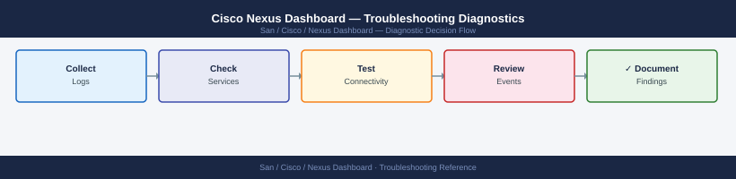

---
tags:
  - san
  - troubleshooting
search:
  boost: 1.5
---
# Cisco Nexus Dashboard — Troubleshooting Diagnostics



```bash
ssh ndadmin@nd-dc1-1.corp.example.com

# View platform-level logs
acs system logs --tail 100

# Filter by component
acs system logs --component ndfc --tail 100
acs system logs --component ndi --tail 100
acs system logs --component security --tail 100

# Show audit log entries (user activity)
acs system logs --component audit --tail 50
```

```bash
# CPU and memory usage per node
acs system resources

# Detailed Kubernetes node metrics
kubectl top nodes

# Per-pod resource usage (most memory/CPU hungry pods)
kubectl top pods --all-namespaces --sort-by=memory | head -20

# Node disk usage
kubectl get nodes -o wide
# SSH to each node and check:
df -h
du -sh /data/
```
```bash
# Recent cluster events (shows pod failures, scheduling issues, etc.)
kubectl get events --all-namespaces --sort-by='.lastTimestamp' | tail -50

# Events in a specific namespace
kubectl get events -n ndfc --sort-by='.lastTimestamp' | tail -20
```
```bash
# Check etcd cluster health
ETCDCTL_API=3 etcdctl \
  --endpoints=https://127.0.0.1:2379 \
  --cacert=/etc/kubernetes/pki/etcd/ca.crt \
  --cert=/etc/kubernetes/pki/etcd/server.crt \
  --key=/etc/kubernetes/pki/etcd/server.key \
  endpoint health

# Check etcd leader
ETCDCTL_API=3 etcdctl \
  --endpoints=https://127.0.0.1:2379 \
  --cacert=/etc/kubernetes/pki/etcd/ca.crt \
  --cert=/etc/kubernetes/pki/etcd/server.crt \
  --key=/etc/kubernetes/pki/etcd/server.key \
  endpoint status --write-out=table

# Expected: one LEADER, two followers for a 3-node cluster
```
```bash
# Check discovery manager logs for a specific switch
kubectl logs -n ndfc deployment/ndfc-discovery-manager --tail=500 \
  | grep "<switch-ip>"

# Test SSH from ND data network
acs network test --host <switch-ip> --port 22

# Test SNMP v3
kubectl exec -n ndfc deployment/ndfc-server -- \
  snmpget -v3 -u ndfc_poll -l authPriv -a SHA -A <auth-pass> \
  -x AES -X <priv-pass> <switch-ip> sysDescr.0

# Trigger a manual rediscovery via API
TOKEN=$(curl -sk -X POST https://nd-dc1.corp.example.com/login \
  -H "Content-Type: application/json" \
  -d '{"userName":"admin","userPasswd":"<pass>","domain":"local"}' \
  | python3 -c "import sys,json; print(json.load(sys.stdin)['token'])")

curl -sk -X POST \
  "https://nd-dc1.corp.example.com/appcenter/cisco/ndfc/api/v1/san/fabrics/rediscover" \
  -H "Authorization: Bearer ${TOKEN}" \
  -H "Content-Type: application/json" \
  -d '{"fabricName":"DC1-FABRIC-A","rediscoverAll":false,"switchSerialNumbers":["<serial>"]}'
```
```bash
# Check NDFC zone manager logs
kubectl logs -n ndfc deployment/ndfc-zone-manager --tail=200 \
  | grep -i "error\|fail\|conflict"

# Verify zone consistency on a specific MDS switch (NX-OS CLI)
# From a terminal to the switch:
show zoneset active vsan <vsan-id>
show zone status vsan <vsan-id>
show zone merge-failure vsan <vsan-id>
```
```bash
# Connect to NDFC database (PostgreSQL)
kubectl exec -n ndfc deployment/ndfc-server -- \
  psql -U postgres -c "\l"
# Lists databases: ndfc, pmdb, etc.

# Check NDFC main DB size
kubectl exec -n ndfc deployment/ndfc-server -- \
  psql -U postgres -c "SELECT pg_size_pretty(pg_database_size('ndfc'));"

# Find large tables
kubectl exec -n ndfc deployment/ndfc-server -- \
  psql -U postgres ndfc -c "
SELECT relname, pg_size_pretty(pg_relation_size(relid)) AS size
FROM pg_catalog.pg_statio_user_tables
ORDER BY pg_relation_size(relid) DESC
LIMIT 10;"
```
```bash
# Check NDI flow collector pod
kubectl get pods -n ndi | grep collector
kubectl logs -n ndi deployment/ndi-flow-collector --tail=200 | grep -i "error\|drop"

# Check Elasticsearch health (NDI primary storage)
kubectl exec -n ndi deployment/ndi-elasticsearch -- \
  curl -sk http://localhost:9200/_cluster/health?pretty
# Expected: status "green"; if "red": shards are unassigned (disk or node issue)

# Check Elasticsearch disk usage
kubectl exec -n ndi deployment/ndi-elasticsearch -- \
  curl -sk http://localhost:9200/_cat/allocation?v
# If disk.percent > 85%: Elasticsearch watermark triggered, stops accepting writes
```
```bash
# Check anomaly engine logs
kubectl logs -n ndi deployment/ndi-anomaly-engine --tail=200 | grep -i "error\|fail"

# Verify NDI license is valid
kubectl exec -n ndi deployment/ndi-anomaly-engine -- \
  curl -sk http://nd-license-service/api/v1/licenses | python3 -m json.tool | grep -i "ndi\|insights"
```
```bash
ssh ndadmin@nd-dc1-1.corp.example.com

# Test connectivity to all managed switch IPs
acs network test --host <switch-ip> --port 22     # SSH
acs network test --host <switch-ip> --port 161    # SNMP
acs network test --host ldap.corp.example.com --port 636  # LDAPS

# Capture traffic on the data interface (requires tcpdump)
kubectl exec -n ndfc deployment/ndfc-discovery-manager -- \
  timeout 30 tcpdump -i eth0 -n host <switch-ip> -c 50

# Check SNMP trap reception
kubectl exec -n ndfc deployment/ndfc-server -- \
  timeout 30 tcpdump -i eth0 -n udp port 162 -c 10
```
```bash
# ND cluster resource snapshot
acs system resources

# Kubernetes resource usage per namespace
kubectl top pods --all-namespaces --sort-by=cpu | head -20

# Measure REST API response time
time curl -sk -X POST https://nd-dc1.corp.example.com/login \
  -H "Content-Type: application/json" \
  -d '{"userName":"svc-monitor","userPasswd":"<pass>","domain":"local"}'
# Expected: < 2 seconds; > 5 seconds indicates platform performance issue

# Check NDFC API response time
TOKEN=$(... obtain token ...)
time curl -sk \
  "https://nd-dc1.corp.example.com/appcenter/cisco/ndfc/api/v1/inventory/switches" \
  -H "Authorization: Bearer ${TOKEN}" > /dev/null
# Expected: < 5 seconds for < 200 switches
```
```bash
# Patch NDFC server log level to DEBUG
kubectl set env deployment/ndfc-server -n ndfc LOG_LEVEL=DEBUG

# Reproduce the issue and collect logs
kubectl logs -n ndfc deployment/ndfc-server --tail=500 | grep -i "debug\|error" > /tmp/ndfc-debug.log

# Return to INFO level after troubleshooting
kubectl set env deployment/ndfc-server -n ndfc LOG_LEVEL=INFO
kubectl rollout restart deployment/ndfc-server -n ndfc
kubectl rollout status deployment/ndfc-server -n ndfc
```

```d2
direction: down

symptom: Identify Symptom {shape: diamond}
verify_resolution: "Verify resolution" {shape: rectangle}
resolution: Resolve or Escalate {shape: oval}

symptom -> verify_resolution: investigate
verify_resolution -> resolution
```

## Before you begin

- **Access:** Storage admin credentials (cluster admin or equivalent)
- **Gather first:** recent error message text, event timestamps, and affected object names
- **Scope:** confirm whether the issue affects a single object, host, cluster, or site
- **Escalation:** open a vendor support ticket before running any destructive step
- **Logging:** document each command and output — required if escalation is needed

---

---

## Verify resolution

- Confirm the original symptom no longer occurs
- Check logs for any residual errors related to the issue
- Monitor for 10–15 minutes to confirm the fix is stable

---

## See also

- [Nexus Dashboard — Common Issues](common-issues/)
- [Nexus Dashboard — Escalation](escalation/)
- [Nexus Dashboard — Health Checks](../operations/health-checks/)
