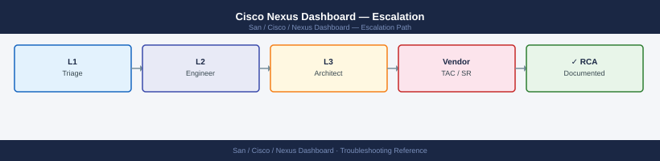
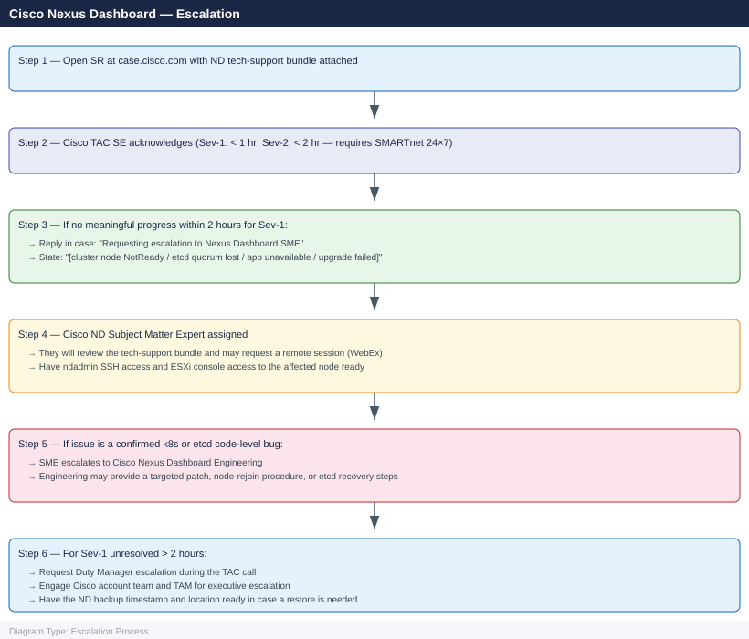

---
tags:
  - san
  - troubleshooting
search:
  boost: 1.5
---
# Cisco Nexus Dashboard — Escalation

<div class="kb-summary">
How to escalate Cisco Nexus Dashboard (ND) issues to Cisco TAC: what data to collect, how to generate the ND tech-support bundle, step-by-step case creation on case.cisco.com, and the escalation path when progress stalls.

*Applies to: Cisco Nexus Dashboard 3.x (VMware OVA or UCS physical) with NDFC 12.x or NDI 6.x*
</div>



---

```d2
direction: down

symptom: Identify Symptom {shape: diamond}
preescalation_selfcheck: "Pre-Escalation Self-Check" {shape: rectangle}
stepbystep_data_collection: "Step-by-Step Data Collection" {shape: rectangle}
how_to_open_the_sr_on_caseciscocom: "How to Open the SR on case.cisco.com" {shape: rectangle}
escalation_path: "Escalation Path" {shape: rectangle}
what_not_to_do: "What NOT to Do" {shape: rectangle}
useful_commands_for_case_updates: "Useful Commands for Case Updates" {shape: rectangle}
resolution: Resolve or Escalate {shape: oval}

symptom -> preescalation_selfcheck: investigate
symptom -> stepbystep_data_collection: investigate
symptom -> how_to_open_the_sr_on_caseciscocom: investigate
symptom -> escalation_path: investigate
symptom -> what_not_to_do: investigate
symptom -> useful_commands_for_case_updates: investigate
preescalation_selfcheck -> resolution
stepbystep_data_collection -> resolution
how_to_open_the_sr_on_caseciscocom -> resolution
escalation_path -> resolution
what_not_to_do -> resolution
useful_commands_for_case_updates -> resolution
```

## Before you begin

- **Access required:** ndadmin SSH access to at least one ND cluster node; Cisco CCO account at case.cisco.com; credentials for managed MDS / Nexus switches if NDFC data is also needed
- **Do NOT collect the tech-support bundle after restarting services** — restart clears the in-memory cluster state and the k8s event log that TAC needs from the moment of failure; collect `acs techsupport` first, then restart if TAC directs it
- **Do NOT make zone or fabric changes** during an active ND incident — if NDFC is partially functional, fabric changes in an unstable state can push an incomplete configuration to MDS switches
- **Do NOT attempt a cluster restore from backup** without verifying the backup timestamp and confirming with TAC — restoring from an old backup may introduce additional configuration loss

---

## Pre-Escalation Self-Check

Run these before opening the case.

| Check | Command | Expected result |
|---|---|---|
| ND platform version | `acs version` | Note full version (e.g., 3.1.1d) |
| App versions | `acs apps status` | All apps Running; note NDFC / NDI versions |
| Cluster health | `acs health` | Cluster health: Healthy |
| Node states | `acs nodes list` | All nodes Active or Ready |
| System resources | `acs system resources` | CPU and memory within normal limits |
| Recent events | `kubectl get events --all-namespaces --sort-by='.lastTimestamp' \| tail -30` | No Evicted or CrashLoopBackOff events |
| Upgrade history | `acs upgrade history` | Last upgrade completed successfully |
| Backup status | ND UI → Admin → Backup | Recent backup available for recovery |

---

## Step-by-Step Data Collection

### 1. Get ND platform and app versions

```bash
# SSH to any ND cluster node as ndadmin
ssh ndadmin@<nd-node-ip>

# ND platform version
acs version

# All installed application versions
acs apps status
```

### 2. Capture cluster health and node states

```bash
# Cluster health summary
acs health > /tmp/nd-health-$(date +%Y%m%d%H%M).txt

# All cluster nodes and their states
acs nodes list >> /tmp/nd-health-$(date +%Y%m%d%H%M).txt

# System resources for the cluster
acs system resources >> /tmp/nd-health-$(date +%Y%m%d%H%M).txt
```

### 3. Capture etcd and Kubernetes state

```bash
# Kubernetes events (all namespaces, sorted by time)
kubectl get events --all-namespaces --sort-by='.lastTimestamp' > /tmp/nd-k8s-events-$(date +%Y%m%d).txt

# Pod states (all namespaces)
kubectl get pods --all-namespaces -o wide >> /tmp/nd-k8s-pods-$(date +%Y%m%d).txt

# Check for any pods in CrashLoopBackOff or Evicted state
kubectl get pods --all-namespaces | grep -vE "Running|Completed"

# etcd cluster health (collect from each node)
for node in $(acs nodes list | awk '/nd-/ {print $2}' | head -5); do
  echo "=== etcd on ${node} ===" >> /tmp/nd-etcd-$(date +%Y%m%d).txt
  ssh ndadmin@${node} \
    "ETCDCTL_API=3 etcdctl \
     --endpoints=https://127.0.0.1:2379 \
     --cacert=/etc/kubernetes/pki/etcd/ca.crt \
     --cert=/etc/kubernetes/pki/etcd/server.crt \
     --key=/etc/kubernetes/pki/etcd/server.key \
     endpoint status --write-out=table 2>&1" >> /tmp/nd-etcd-$(date +%Y%m%d).txt
done
```

### 4. Collect the ND tech-support bundle

```bash
# Primary artifact for Cisco TAC — collect BEFORE any restart
# Takes 5–15 minutes for a 3-node cluster

acs techsupport --output /tmp/nd-support-$(date +%Y%m%d%H%M).tar.gz

# Verify the bundle was created
ls -lh /tmp/nd-support-*.tar.gz

# Transfer to your workstation for upload to the TAC case
scp ndadmin@<nd-node-ip>:/tmp/nd-support-$(date +%Y%m%d%H%M).tar.gz ./
```

### 5. Collect the NDFC tech-support bundle (if NDFC is affected)

```bash
# If the issue is specifically NDFC (SAN fabric management):
# From the ND CLI, generate the NDFC app bundle
acs apps techsupport ndfc --output /tmp/ndfc-support-$(date +%Y%m%d%H%M).tar.gz

# Transfer
scp ndadmin@<nd-node-ip>:/tmp/ndfc-support-$(date +%Y%m%d%H%M).tar.gz ./
```

### 6. Capture upgrade history (if upgrade-related)

```bash
# Upgrade history
acs upgrade history > /tmp/nd-upgrade-history-$(date +%Y%m%d).txt

# Upgrade log (if upgrade failed)
acs system logs --component upgrade --tail 500 > /tmp/nd-upgrade-log-$(date +%Y%m%d).txt
```

### 7. Write the timeline

```text
ND platform version: 3.1.1d
NDFC version: 12.2.1
NDI version: 6.1.2 (also installed)
Deployment: 3-node VMware OVA cluster (ESXi 7.0 U3)
Node IPs: nd-dc1-1.corp.local, nd-dc1-2.corp.local, nd-dc1-3.corp.local
Managed fabrics: SAN Fabric A (MDS 9710 x2, NX-OS 8.4(2a)), SAN Fabric B (MDS 9396T x2)
Issue first observed: 2026-06-15 15:00 UTC
Last confirmed healthy: 2026-06-15 12:00 UTC
Changes in 24h before the issue:
  - 11:00: ND platform upgraded from 3.1.0 to 3.1.1d
  - 12:00: ND appeared healthy post-upgrade; all apps Running
  - 15:00: acs health: "Cluster health: Degraded — 1 of 3 nodes not responding"
  - 15:05: kubectl get nodes: nd-dc1-2 shows NotReady; pods scheduled on nd-dc1-2 evicted
  - 15:10: NDFC app status transitions to "Unavailable"; SAN fabric management stops
  - 15:20: etcd check on nd-dc1-2 times out; etcd quorum still held by nd-dc1-1 and nd-dc1-3
Steps already taken:
  - Ran acs techsupport BEFORE any restart attempt (bundle at /tmp/nd-support-*)
  - Did NOT make any zone changes
  - Verified nd-dc1-2 VM is powered on and accessible via console on ESXi
  - acs nodes list: nd-dc1-1 Active, nd-dc1-2 NotReady, nd-dc1-3 Active
Blast radius: NDFC unavailable; no zone changes possible; NDI telemetry stopped; nd-dc1-2 VM degraded
```

---

## How to Open the SR on case.cisco.com

1. Go to **case.cisco.com** and sign in with your Cisco CCO account.

2. Click **Create New Case**.

3. Under **Product**, type "Nexus Dashboard" and select **Cisco Nexus Dashboard**.

4. Enter the ND platform version and installed app versions from Step 1.

5. Under **Severity**, select:
   - **Severity 1 — Production Down**: ND cluster is completely unavailable and all hosted applications are down; NDFC cannot communicate with any managed fabric; etcd has lost quorum; ND upgrade has failed and the cluster cannot recover
   - **Severity 2 — Major Impact**: One ND node is failed but the cluster is operating with reduced capacity; a specific app (NDFC or NDI) is unavailable but the ND platform is up; zone push is failing; workaround is partial
   - **Severity 3 — Moderate Impact**: ND functioning with minor degradation; specific features not working; telemetry gaps; workaround available
   - **Severity 4 — Minimal Impact**: How-to, ND sizing question, upgrade planning, app configuration question

6. In the **Summary** field: versions + symptom. Example: `Nexus Dashboard 3.1.1d / NDFC 12.2.1 — nd-dc1-2 node NotReady after platform upgrade, NDFC unavailable, SAN management stopped`.

7. In the **Description** field, paste:
   - ND platform and app versions from Step 1
   - `acs health` and `acs nodes list` from Step 2
   - Any pods in CrashLoopBackOff or Evicted from Step 3
   - The timeline from Step 7

8. Under **Attachments**, upload:
   - `nd-support-*.tar.gz` from Step 4 (primary artifact)
   - `ndfc-support-*.tar.gz` from Step 5 if NDFC-specific issue
   - `nd-k8s-events-*.txt` and `nd-etcd-*.txt` from Step 3
   - Upgrade log from Step 6 if upgrade-related

9. Click **Submit**. You receive a case number immediately.

10. **Severity 1 only:** call Cisco TAC after submission:
    - North America: +1-800-553-2447 (24×7)
    - State "Severity 1 — Nexus Dashboard cluster node NotReady, NDFC unavailable, SAN management stopped, case XXXXXXXX" at the start of the call.

---

## Escalation Path



---

## What NOT to Do

| Do NOT do this | Why | What to do instead |
|---|---|---|
| Collect tech-support after restarting services | Restarting services clears the in-memory k8s event log and pod crash state that TAC needs from the moment of failure | Run `acs techsupport` first; then restart only on TAC's explicit direction |
| Restart the failed ND node without TAC direction | Restarting a node in an etcd quorum loss state may introduce additional etcd write errors and make the data irrecoverable | Let TAC assess the etcd state on all nodes before any restart |
| Attempt a cluster restore without verifying the backup | Restoring from an old backup may introduce configuration loss that is harder to recover than the original failure | Confirm with TAC what the latest backup contains and whether a restore is the correct recovery path |
| Make zone or fabric changes in NDFC while degraded | NDFC in a degraded state may push partial zone configurations that leave MDS switches in a mixed zone state | Freeze all fabric changes until NDFC is confirmed fully healthy |
| Upgrade ND or NDFC to try to resolve the issue | Applying a new version to an already-failed cluster state may prevent the cluster from recovering; new packages can conflict with the partially failed state | Only upgrade on TAC's explicit direction with a specific target version and documented rollback path |
| Delete and redeploy an ND node without TAC direction | Removing a node from an etcd quorum loss removes an etcd member; the correct recovery depends on whether the remaining 2 nodes have consistent data | Let TAC confirm the etcd data state on all three nodes before any node removal |

---

## Useful Commands for Case Updates

```bash
# SSH to any healthy ND node — paste into every case update

# ND platform and app versions
acs version
acs apps status

# Cluster and node states
acs health
acs nodes list

# Pod states (look for non-Running pods)
kubectl get pods --all-namespaces | grep -vE "Running|Completed" | head -20

# Recent Kubernetes events
kubectl get events --all-namespaces --sort-by='.lastTimestamp' | tail -20
```

---

## Support SLA Reference

| Contract | Severity | Definition | Initial Response SLA |
|---|---|---|---|
| SMARTnet 24×7 | Sev-1 | ND cluster down; all apps unavailable; etcd quorum lost | < 1 hour (24×7) |
| SMARTnet 24×7 | Sev-2 | Node failed but cluster running; app unavailable; zone push failing | < 2 hours (24×7) |
| SMARTnet 24×7 | Sev-3 | Partial feature degradation; workaround available | < 4 hours (business hours) |
| SMARTnet 24×7 | Sev-4 | How-to, sizing, upgrade planning | Next business day |
| SMARTnet 8×5 | Sev-1 | As above | < 2 hours (business hours) |

---

## See also

- [Nexus Dashboard — Diagnostics](../diagnostics/)
- [Nexus Dashboard — Common Issues](../common-issues/)

---

## Verify resolution

- Run `acs health` and confirm Cluster health: Healthy
- Run `acs nodes list` and confirm all cluster nodes are Active or Ready
- Run `acs apps status` and confirm all installed apps (NDFC, NDI) are Running
- Run `kubectl get pods --all-namespaces | grep -vE "Running|Completed"` and confirm empty output
- Verify NDFC is managing all fabrics: log into the NDFC UI and confirm all managed switches are Manageable
- Run a test zone change push to confirm zone distribution is working end-to-end
- Check `acs system resources` and confirm CPU and memory are within normal operating range
- Monitor `acs health` for 15 minutes to confirm the cluster stays in Healthy state
