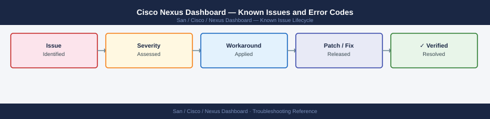

---
tags:
  - troubleshooting
  - nexus-dashboard
  - cisco
  - known-issues
---
# Cisco Nexus Dashboard — Known Issues and Error Codes

<div class="kb-summary">
Catalog of known Nexus Dashboard bugs, error codes, and workarounds covering cluster health, service deployment, and upgrade issues.

*Applies to: Nexus Dashboard 3.x*
</div>



```d2
direction: down

symptom: Identify Symptom {shape: diamond}
cluster_health: "Cluster Health" {shape: rectangle}
services: "Services" {shape: rectangle}
upgrade: "Upgrade" {shape: rectangle}
resolution: Resolve or Escalate {shape: oval}

symptom -> cluster_health: investigate
symptom -> services: investigate
symptom -> upgrade: investigate
cluster_health -> resolution
services -> resolution
upgrade -> resolution
```

## Before you begin

- Nexus Dashboard cluster health: ND UI → Infrastructure → Cluster Configuration → Health.
- ND runs Kubernetes-based services; pod health: `acs health` from ND admin SSH.
- etcd quorum is critical — never lose more than 1 of 3 ND cluster nodes simultaneously.

## Cluster Health

| Error / Symptom | Affected Versions | Cause | Workaround / Fix | Fixed In |
|---|---|---|---|---|
| Node `Unavailable` in ND cluster | ND 3.x | Node OOM, disk full, or network partition | Check node: `kubectl get pods --all-namespaces`; check disk: `df -h` | N/A |
| etcd cluster `Degraded` with one node down | ND 3.x | etcd quorum requires 2/3 nodes | Restore failed node; do not shut down another node with etcd degraded | N/A |
| `Clock skew` alarm on ND node | ND 3.x | NTP offset between ND nodes | Sync all nodes to same NTP source; verify: `chronyc tracking` | N/A |

## Services

| Error / Symptom | Affected Versions | Cause | Workaround / Fix | Fixed In |
|---|---|---|---|---|
| NDFC (Nexus Dashboard Fabric Controller) service `Degraded` | ND 3.x | Insufficient memory for NDFC pod | Verify ND node memory meets minimum for NDFC; scale node count | N/A |
| ND Insights service not collecting fabric data | ND 3.x | APIC or switch credentials incorrect in site configuration | Update site credentials in ND → Sites → Edit | N/A |

## Upgrade

| Error / Symptom | Affected Versions | Cause | Workaround / Fix | Fixed In |
|---|---|---|---|---|
| ND upgrade stuck at `Upgrading node 2 of 3` | ND 3.x | Node not rebooting cleanly during rolling upgrade | SSH to stuck node; check `journalctl -b` for boot errors; manually reboot | N/A |
| Post-upgrade service pods in `CrashLoopBackOff` | ND 3.x | Service requires manual migration step post-upgrade | Check ND upgrade guide for post-upgrade service migration steps | N/A |

## See also

- [Cisco Nexus Dashboard — Common Issues](common-issues/)
- [Cisco DCNM — Known Issues](../../cisco-dcnm/troubleshooting/known-issues.md)
- [Cisco MDS — Known Issues](../../mds/troubleshooting/known-issues.md)
