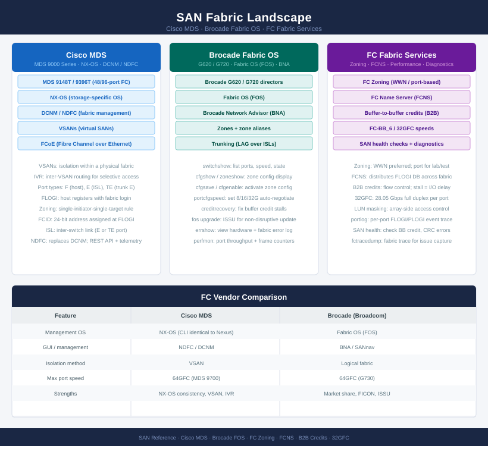
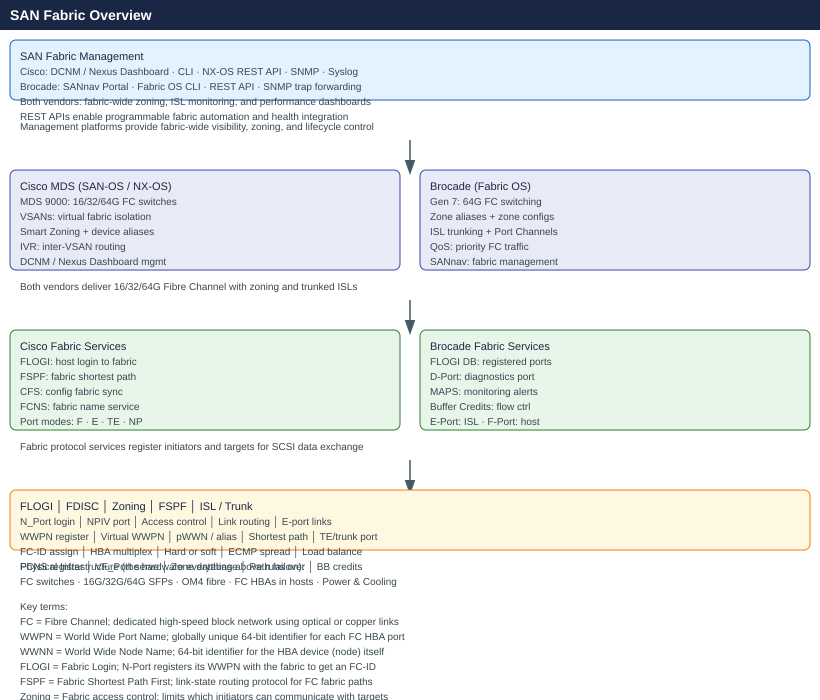

# SAN

SAN knowledge base covering Cisco MDS switches, DCNM, Nexus Dashboard, Brocade Fabric OS, and SANnav. Includes fabric architecture, zoning standards, ISL and port configuration, host connectivity, CLI references, health checks, and troubleshooting guides for Fibre Channel environments.

<a class="kb-card" href="cisco/"><strong>Cisco SAN</strong>MDS switches — architecture, standards, lifecycle, CLI, scripts, troubleshooting, and security.</a>
<a class="kb-card" href="brocade/"><strong>Brocade SAN</strong>Fabric OS switches — architecture, standards, lifecycle, CLI, scripts, troubleshooting, and security.</a>

