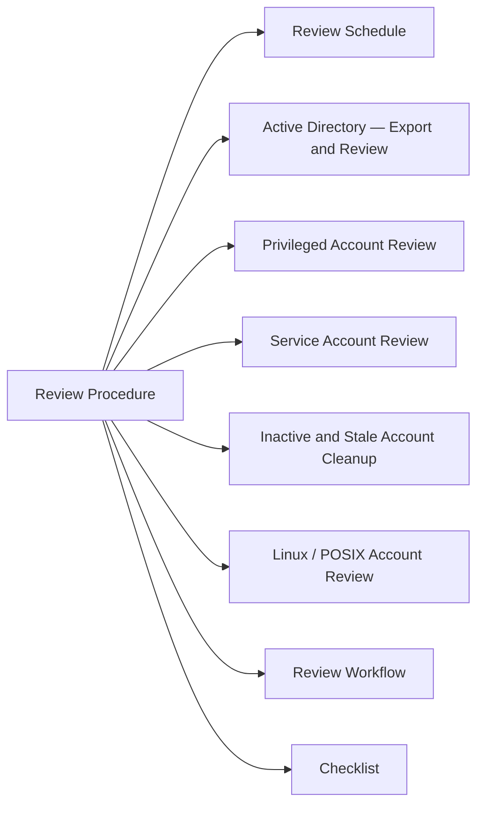

# Access Review Procedure

Periodic access reviews ensure that users and service accounts hold only the permissions required for their current role. Reviews reduce the blast radius of credential compromise and satisfy audit requirements.



## Review Schedule

| Scope | Frequency | Owner |
|---|---|---|
| Privileged / admin accounts | Quarterly | Security team |
| Standard user accounts | Semi-annual | IT operations |
| Service accounts | Quarterly | Application owners |
| External / contractor accounts | Monthly | IT operations |
| Shared / generic accounts | Quarterly | Security team |

## Active Directory — Export and Review

```powershell
# Export all enabled users with last logon and group membership
Get-ADUser -Filter {Enabled -eq $true} -Properties LastLogonDate, MemberOf |
  Select-Object Name, SamAccountName, LastLogonDate,
    @{N='Groups';E={($_.MemberOf | ForEach-Object { (Get-ADGroup $_).Name }) -join '; '}} |
  Export-Csv C:\access-review\users-$(Get-Date -Format yyyyMMdd).csv -NoTypeInformation

# Find accounts inactive for >90 days
$cutoff = (Get-Date).AddDays(-90)
Get-ADUser -Filter {Enabled -eq $true -and LastLogonDate -lt $cutoff} -Properties LastLogonDate |
  Select-Object Name, SamAccountName, LastLogonDate | Sort-Object LastLogonDate
```

## Privileged Account Review

```powershell
# List all Domain Admins
Get-ADGroupMember -Identity "Domain Admins" | Select-Object Name, SamAccountName, ObjectClass

# List all members of Administrators group
Get-ADGroupMember -Identity "Administrators" | Select-Object Name, SamAccountName, ObjectClass

# Find accounts with AdminCount=1 (had privileged group at some point)
Get-ADUser -Filter {AdminCount -eq 1 -and Enabled -eq $true} | Select-Object Name, SamAccountName
```

## Service Account Review

```powershell
# Find service accounts (by naming convention or OU)
Get-ADUser -Filter * -SearchBase "OU=ServiceAccounts,DC=domain,DC=com" -Properties PasswordLastSet, LastLogonDate, Description |
  Select-Object Name, SamAccountName, PasswordLastSet, LastLogonDate, Description
```

## Inactive and Stale Account Cleanup

```powershell
# Disable accounts inactive > 90 days (after review and approval)
$cutoff = (Get-Date).AddDays(-90)
Get-ADUser -Filter {Enabled -eq $true -and LastLogonDate -lt $cutoff} -Properties LastLogonDate |
  Disable-ADAccount -WhatIf   # Remove -WhatIf to execute

# Move disabled accounts to a holding OU before deletion
Get-ADUser -Filter {Enabled -eq $false} -SearchBase "OU=Users,DC=domain,DC=com" |
  Move-ADObject -TargetPath "OU=Disabled,DC=domain,DC=com" -WhatIf
```

## Linux / POSIX Account Review

```bash
# List all non-system users
awk -F: '$3 >= 1000 {print $1, $3, $6, $7}' /etc/passwd

# Last login for all users
lastlog | grep -v "Never logged in" | sort -k4 -r

# Sudoers with unrestricted access
grep -E "^\w+.*ALL.*ALL" /etc/sudoers /etc/sudoers.d/* 2>/dev/null
```

## Review Workflow

1. **Export** — generate user/access report from AD and relevant systems
2. **Distribute** — send lists to line managers and application owners for sign-off
3. **Collect decisions** — approved / revoke / transfer for each account
4. **Remediate** — disable or remove accounts per decisions; update group memberships
5. **Document** — record approvals, changes made, and reviewer sign-off in the ticket
6. **Verify** — re-run export after changes; confirm no accounts missed

## Checklist

- [ ] Privileged accounts reviewed and approved by security team
- [ ] Inactive accounts (>90 days) disabled and moved to holding OU
- [ ] Service accounts confirmed still required; passwords within rotation policy
- [ ] External/contractor accounts checked against active contractors list
- [ ] Shared/generic accounts reviewed; owners documented
- [ ] Evidence of review stored (CSV exports, approval records) for audit
