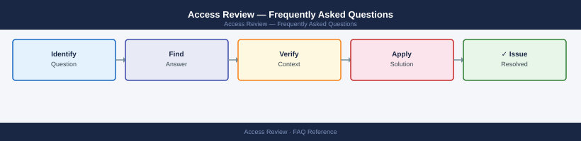

---
tags:
  - access-review
  - faq
  - operations
---
# Access Review — Frequently Asked Questions

*Applies to: All products (Security)*

Common questions about Access Review operations, configuration, and troubleshooting. For step-by-step procedures, see the <a href="index.md">Operations</a> section.

## General

**Q: How do I determine the current access review cycle status?**
A: Check your IGA platform (SailPoint, Saviynt, or similar) for the active campaign. For manual reviews, check the access review register in your GRC tool or SharePoint. Review campaigns typically run quarterly.

**Q: How do I check the current Access Review version?**
A: `Check IGA platform → Campaigns → Active`

## Configuration

**Q: What is the default access review frequency and when should it change?**
A: Quarterly for privileged access, semi-annual for standard user access. High-risk systems (financial, PII) may require monthly reviews. Adjust frequency based on risk classification and regulatory requirements (SOX, ISO 27001).

**Q: How do I enable automated access review reminders?**
A: Configure escalation rules in your IGA platform: send reminder at day 3, escalate to manager at day 7, auto-revoke or flag at day 14. For manual campaigns, use Power Automate or ServiceNow workflow for reminders.

## Operations

**Q: How do I transition from manual to automated access reviews?**
A: Start with an IGA pilot for one application. Map roles and entitlements. Configure reviewers. Run parallel manual and automated reviews for one cycle. Expand to additional applications after validating accuracy.

**Q: What is the correct procedure to add a new application to the access review scope?**
A: Onboard the application to your IGA platform (configure connector or manual import). Define reviewers (application owner, manager, or risk owner). Set review frequency and remediation SLA. Add to the next scheduled campaign.

## Troubleshooting

**Q: Access review shows many 'certify all' approvals without individual review. What does it mean?**
A: Rubber-stamping is a common audit finding. Implement controls: require per-item certification, add justification fields, track review time. Flag reviewers with >50 certifications/minute for manager follow-up.

**Q: Access review completion rate is below 80% — where do I start?**
A: Send targeted reminders to incomplete reviewers. Escalate to their managers. Reduce scope by excluding inactive accounts before the campaign. Consider delegating review to application owners rather than managers.

## Backup and Recovery

**Q: How often should I archive access review evidence?**
A: Retain completed review records for at least 3 years (ISO 27001, SOX requirement). Export certification reports to your GRC tool or document management system after each campaign. Include reviewer decisions and timestamps.

**Q: Can I reopen a completed access review campaign?**
A: Most IGA platforms do not allow reopening completed campaigns. If remediation is needed post-completion, raise an exception in your GRC tool and revoke access manually with documented justification.

## See Also

- [Access Review Operations](index.md)
- [Access Review Troubleshooting](../../troubleshooting/index.md)
