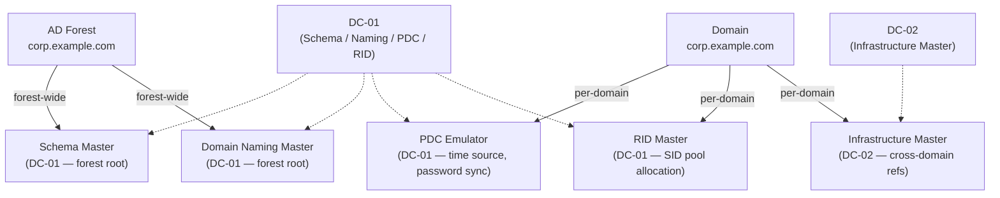
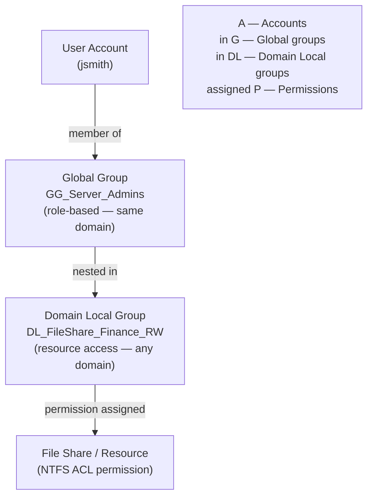
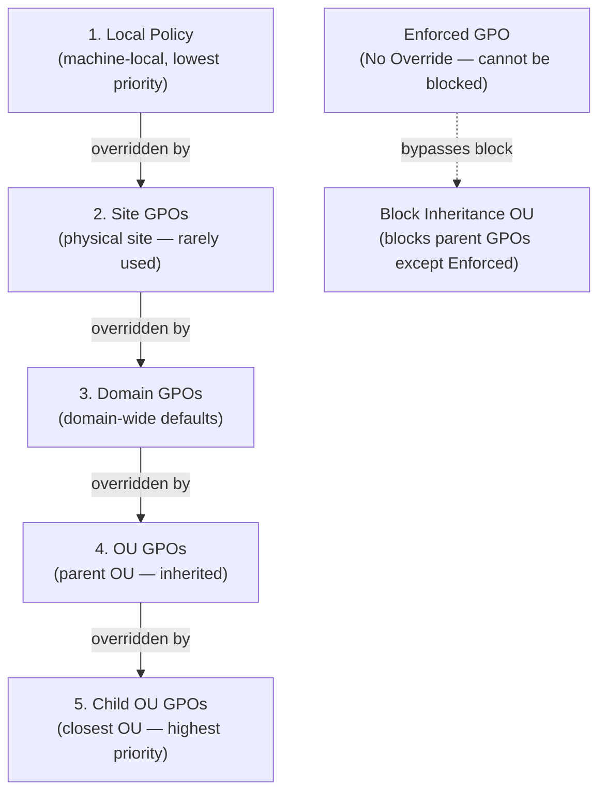

# Active Directory — Components

## Domain Controllers

Domain Controllers host the AD DS database (ntds.dit), authenticate users, and hold FSMO roles. Understanding DC roles and how to manage them is essential for AD operations.

## FSMO Role Placement



### FSMO Roles

Five Flexible Single Master Operations roles exist across forest and domain levels. Only one DC holds each role at a time.

| Role | Scope | Function |
|---|---|---|
| Schema Master | Forest | Controls AD schema changes |
| Domain Naming Master | Forest | Adds/removes domains in the forest |
| PDC Emulator | Domain | Password sync, time authority, legacy client support |
| RID Master | Domain | Allocates RID pools to DCs for new object SIDs |
| Infrastructure Master | Domain | Resolves cross-domain object references |

```cmd
# Show all FSMO role holders
netdom query fsmo

# Show via PowerShell
Get-ADDomain | Select-Object PDCEmulator, RIDMaster, InfrastructureMaster
Get-ADForest | Select-Object SchemaMaster, DomainNamingMaster
```

### Promoting a New DC

```powershell
# Install AD DS role
Install-WindowsFeature -Name AD-Domain-Services -IncludeManagementTools

# Promote as additional DC in existing domain
Import-Module ADDSDeployment
Install-ADDSDomainController `
    -DomainName "corp.example.com" `
    -InstallDns:$true `
    -Credential (Get-Credential) `
    -SafeModeAdministratorPassword (ConvertTo-SecureString "P@ssw0rd!" -AsPlainText -Force) `
    -Force:$true
```

### Demoting a DC

```powershell
# Graceful demotion
Uninstall-ADDSDomainController `
    -LocalAdministratorPassword (ConvertTo-SecureString "P@ssw0rd!" -AsPlainText -Force) `
    -Force:$true

# Metadata cleanup if DC is already offline
ntdsutil
  metadata cleanup
  remove selected server CN=DC02,CN=Servers,CN=Default-First-Site,CN=Sites,CN=Configuration,DC=corp,DC=example,DC=com
```

### Transferring and Seizing FSMO Roles

```powershell
# Transfer PDC Emulator gracefully
Move-ADDirectoryServerOperationMasterRole -Identity "DC02" -OperationMasterRole PDCEmulator

# Transfer multiple roles
Move-ADDirectoryServerOperationMasterRole -Identity "DC02" `
    -OperationMasterRole PDCEmulator,RIDMaster,InfrastructureMaster

# Seize a role (only if original holder is permanently offline)
ntdsutil
  roles
  connections
    connect to server DC02
  quit
  seize pdc
```

### DC Health Validation

```cmd
# Run all dcdiag tests
dcdiag /test:all /v

# Check replication health
repadmin /showrepl

# Check DC services
sc query NTDS
sc query Netlogon
sc query W32Time
sc query DFSR

# Verify AD database integrity
ntdsutil "activate instance ntds" "files" "integrity" quit quit
```

### Time Synchronisation

The PDC Emulator is the authoritative time source for the domain. All other DCs and clients sync from the hierarchy.

```cmd
# Check current time source
w32tm /query /source

# Force resync
w32tm /resync /force

# Configure PDC Emulator to sync from external NTP
w32tm /config /manualpeerlist:"pool.ntp.org" /syncfromflags:manual /reliable:YES /update

# Check time skew across DCs
w32tm /monitor /computers:dc01,dc02,dc03
```

---

## DNS Dependency

Active Directory is fundamentally dependent on DNS. Every DC registration, client logon, and Kerberos ticket request relies on DNS SRV and A records being correct and resolvable. A broken DNS layer is the most common root cause of AD-wide outages.

### SRV Records and DC Locator

DCs register SRV records in DNS automatically via the Netlogon service. The DC Locator process uses these records to find the right DC for a given site and service.

Key SRV record types:

| Record | Purpose |
|---|---|
| `_ldap._tcp.<domain>` | Generic LDAP over TCP |
| `_kerberos._tcp.<domain>` | Kerberos KDC (TCP) |
| `_ldap._tcp.dc._msdcs.<domain>` | DC-specific LDAP |
| `_kerberos._udp.<domain>` | Kerberos KDC (UDP) |
| `_gc._tcp.<domain>` | Global Catalog |
| `_ldap._tcp.<site>._sites.<domain>` | Site-scoped LDAP |

```cmd
# List all AD SRV records in DNS
nslookup -type=SRV _ldap._tcp.corp.example.com
nslookup -type=SRV _kerberos._tcp.corp.example.com
nslookup -type=SRV _gc._tcp.corp.example.com
```

### Checking DNS Health

```cmd
# Run dcdiag DNS tests on local DC
dcdiag /test:dns /v

# Run against a specific DC
dcdiag /test:dns /s:dc01.corp.example.com /v

# Check that Netlogon has registered SRV records
nltest /dsgetdc:corp.example.com

# Force Netlogon to re-register DNS records
nltest /dsregdns

# Verify a DC can be found for a specific site
nltest /dsgetdc:corp.example.com /site:LondonSite
```

### DC Locator Process

When a client needs a DC it sends a DNS query for `_ldap._tcp.<site>._sites.<domain>`. If no site-scoped record is found it falls back to the domain-wide `_ldap._tcp.<domain>` SRV records. The client then sends an LDAP ping (CLDAP) to the returned DCs and selects the fastest responder.

```powershell
# Show which DC a machine is currently using
(Get-ADDomainController -Discover).Name

# Force rediscovery of a DC
nltest /sc_reset:corp.example.com

# Display the DC locator cache
nltest /dclist:corp.example.com
```

### DNS Zone Configuration for AD

AD-integrated DNS zones are recommended. They replicate via AD replication rather than zone transfers and support secure dynamic updates.

```cmd
# Check DNS zone type
dnscmd /zoneinfo corp.example.com

# List all DNS zones on a DC
dnscmd /enumzones

# Force dynamic DNS re-registration from a client
ipconfig /registerdns

# Check _msdcs zone exists (critical for AD)
nslookup -type=NS _msdcs.corp.example.com
```

### DNS Health Checks Runbook

```powershell
# Check all DCs have registered A records
Get-ADDomainController -Filter * | ForEach-Object {
    Resolve-DnsName $_.HostName -Type A -ErrorAction SilentlyContinue
}

# Confirm SRV records are present for every DC
$domain = "corp.example.com"
Resolve-DnsName "_ldap._tcp.$domain" -Type SRV
Resolve-DnsName "_kerberos._tcp.$domain" -Type SRV

# Check for DNS scavenging (stale record removal)
Get-DnsServerZoneAging -Name "corp.example.com"
```

### Common DNS-Caused AD Failures

- Missing SRV records after DC promotion: restart Netlogon and run `nltest /dsregdns`
- Clients caching old DC addresses: flush with `ipconfig /flushdns`
- Split-brain DNS: internal clients resolving to external IPs — ensure internal DNS is authoritative for the AD domain
- Scavenging too aggressive: valid DC records deleted — review AgingEnabled and NoRefreshInterval settings
- Wrong DNS server on DC NIC: DCs must point to AD-integrated DNS, not a public resolver

---

## Groups

AD groups control access to resources and distribution of email. Choosing the correct type and scope prevents replication overhead and simplifies permission management.

## AGDLP Group Model



### Group Types and Scopes

| Scope | Can Contain | Used For | Replicates To |
|---|---|---|---|
| Domain Local | Users, Global, Universal from any domain | Assigning permissions to local resources | Domain only |
| Global | Users and Global from same domain | Grouping users by role | Entire forest |
| Universal | Users, Global, Universal from any domain | Cross-domain role assignments | Global Catalog |
| Distribution | Any | Email only (not security) | Domain only |

Best practice: follow AGDLP — Accounts in Global groups, Global in Domain Local groups, Domain Local assigned Permissions.

### Creating Groups

```powershell
# Create a security group (Global scope)
New-ADGroup -Name "SG-ServerAdmins" `
    -GroupScope Global `
    -GroupCategory Security `
    -Path "OU=Groups,DC=corp,DC=example,DC=com" `
    -Description "Server administrators"

# Create a distribution group
New-ADGroup -Name "DG-ITTeam" `
    -GroupScope Universal `
    -GroupCategory Distribution `
    -Path "OU=Groups,DC=corp,DC=example,DC=com"

# Create a Domain Local group for resource access
New-ADGroup -Name "DL-FileShare-Finance-RW" `
    -GroupScope DomainLocal `
    -GroupCategory Security `
    -Path "OU=Groups,DC=corp,DC=example,DC=com"
```

### Managing Group Membership

```powershell
# Add a single member
Add-ADGroupMember -Identity "SG-ServerAdmins" -Members "jsmith"

# Add multiple members
Add-ADGroupMember -Identity "SG-ServerAdmins" -Members "jsmith","bwilson","DC01$"

# Remove a member
Remove-ADGroupMember -Identity "SG-ServerAdmins" -Members "jsmith" -Confirm:$false

# List all members recursively
Get-ADGroupMember -Identity "SG-ServerAdmins" -Recursive

# List all groups a user belongs to
Get-ADPrincipalGroupMembership -Identity "jsmith" | Select-Object Name, GroupScope, GroupCategory
```

### Group Nesting

```powershell
# Add a Global group into a Domain Local group (AGDLP)
Add-ADGroupMember -Identity "DL-FileShare-Finance-RW" -Members "SG-FinanceUsers"

# Find nested groups inside a group
Get-ADGroupMember -Identity "DL-FileShare-Finance-RW" -Recursive |
    Where-Object {$_.objectClass -eq "group"}

# Show full group chain for a user
Get-ADPrincipalGroupMembership -Identity "jsmith" -Recursive |
    Select-Object Name, GroupScope | Sort-Object Name
```

### Auditing and Reporting

```powershell
# Find empty groups
Get-ADGroup -Filter * -Properties Members |
    Where-Object {$_.Members.Count -eq 0} | Select-Object Name

# Find groups with no members and not nested anywhere
Get-ADGroup -Filter * -Properties Members, MemberOf |
    Where-Object {$_.Members.Count -eq 0 -and $_.MemberOf.Count -eq 0} |
    Select-Object Name, DistinguishedName

# Export group membership to CSV
Get-ADGroupMember "SG-ServerAdmins" |
    Select-Object Name, SamAccountName, objectClass |
    Export-Csv C:\Reports\SG-ServerAdmins.csv -NoTypeInformation

# Find all groups a computer account is in
Get-ADPrincipalGroupMembership -Identity "DC01$" | Select-Object Name
```

---

## GPOs

GPOs apply configuration to computers and users in AD. They are linked to Sites, Domains, or OUs and processed in that order (SDOU). Understanding GPO inheritance, filtering, and result sets is essential for managing policy reliably.

## GPO Processing Order (SDOU)



### GPO Processing Order

| Level | Priority (low to high) | Notes |
|---|---|---|
| Local | 1 | Machine-local policy |
| Site | 2 | Rarely used in practice |
| Domain | 3 | Domain-wide defaults |
| OU | 4 | Closest OU wins |
| Child OU | 5 | Overrides parent OU |

Later-processed policies win unless Block Inheritance or Enforced (No Override) is set.

### Creating and Linking a GPO

```powershell
# Create a new GPO
New-GPO -Name "Security Baseline - Servers" -Comment "CIS Level 1 server policy"

# Link GPO to an OU
New-GPLink -Name "Security Baseline - Servers" -Target "OU=Servers,DC=corp,DC=example,DC=com"

# Create and link in one step
New-GPO -Name "Desktop Lockscreen" | New-GPLink -Target "OU=Workstations,DC=corp,DC=example,DC=com"

# Set link order (lower number = higher priority)
Set-GPLink -Name "Desktop Lockscreen" -Target "OU=Workstations,DC=corp,DC=example,DC=com" -Order 1
```

### Viewing Applied Policy

```cmd
# Show applied GPOs for the current user and computer
gpresult /r

# Verbose HTML report
gpresult /h C:\Temp\gpresult.html /f

# Show GPOs for a specific user on a remote computer
gpresult /s DC01 /u corp\jsmith /r

# Force immediate policy refresh
gpupdate /force

# Refresh user policy only (no reboot)
gpupdate /target:user
```

### RSoP (Resultant Set of Policy)

```cmd
# RSoP wizard (GUI)
rsop.msc

# Full RSoP output to file
gpresult /z > C:\Temp\rsop-full.txt

# Check which GPO set a specific setting
gpresult /r /scope computer | findstr /i "password"
```

### GPO Backup and Restore

```powershell
# Backup all GPOs
Backup-GPO -All -Path "C:\GPOBackups"

# Backup a single GPO
Backup-GPO -Name "Security Baseline - Servers" -Path "C:\GPOBackups"

# Restore a GPO from backup
Restore-GPO -Name "Security Baseline - Servers" -Path "C:\GPOBackups"

# Import settings from backup into existing GPO
Import-GPO -BackupGpoName "Security Baseline - Servers" `
    -TargetName "Security Baseline - Servers" -Path "C:\GPOBackups"
```

### GPO Inheritance and Filtering

```powershell
# Block inheritance on an OU
Set-GPInheritance -Target "OU=Test,DC=corp,DC=example,DC=com" -IsBlocked Yes

# Enforce a GPO link (cannot be blocked by child OUs)
Set-GPLink -Name "Domain Security Policy" -Target "DC=corp,DC=example,DC=com" -Enforced Yes

# Apply GPO to a specific security group only
Set-GPPermission -Name "Desktop Lockscreen" -TargetName "Workstation Admins" `
    -TargetType Group -PermissionLevel GpoApply

# Remove Authenticated Users (for targeted group filtering)
Set-GPPermission -Name "Desktop Lockscreen" -TargetName "Authenticated Users" `
    -TargetType Group -PermissionLevel None
```

---

## LDAP

Active Directory exposes its directory over LDAP on port 389 (LDAPS on 636). LDAP queries are the foundation for searches, integrations, and automation against AD.

### LDAP Search Basics

Every LDAP search has four parts: base DN, scope, filter, and attributes.

| Parameter | Description | Example |
|---|---|---|
| Base DN | Starting point in the tree | `DC=corp,DC=example,DC=com` |
| Scope | base / one / sub | `sub` searches entire subtree |
| Filter | Object selector syntax | `(objectClass=user)` |
| Attributes | Fields to return | `sAMAccountName,mail` |

```bash
# Basic ldapsearch against AD (Linux/macOS)
ldapsearch -H ldap://dc01.corp.example.com \
    -D "cn=svc-ldap,ou=serviceaccounts,dc=corp,dc=example,dc=com" \
    -w 'P@ssw0rd!' \
    -b "DC=corp,DC=example,DC=com" \
    -s sub \
    "(sAMAccountName=jsmith)" \
    cn mail memberOf

# Search for all enabled users
ldapsearch -H ldap://dc01.corp.example.com \
    -D "cn=svc-ldap,ou=serviceaccounts,dc=corp,dc=example,dc=com" \
    -w 'P@ssw0rd!' \
    -b "DC=corp,DC=example,DC=com" \
    "(&(objectClass=user)(!(userAccountControl:1.2.840.113556.1.4.803:=2)))" \
    sAMAccountName displayName mail
```

### PowerShell LDAP Queries

```powershell
# Search with Get-ADObject (raw LDAP)
Get-ADObject -LDAPFilter "(objectClass=computer)" `
    -SearchBase "OU=Servers,DC=corp,DC=example,DC=com" `
    -Properties Name, OperatingSystem

# Find users with specific attributes
Get-ADUser -LDAPFilter "(&(objectClass=user)(mail=*)(department=IT))" `
    -Properties mail, department, title

# Find accounts with password never expires flag set
Get-ADUser -Filter * -Properties PasswordNeverExpires |
    Where-Object {$_.PasswordNeverExpires -eq $true} |
    Select-Object Name, SamAccountName

# Find disabled accounts
Get-ADUser -Filter {Enabled -eq $false} |
    Select-Object Name, SamAccountName, DistinguishedName
```

### Common LDAP Filters

```text
# All users
(objectClass=user)

# All enabled users
(&(objectClass=user)(!(userAccountControl:1.2.840.113556.1.4.803:=2)))

# Members of a specific group
(memberOf=CN=SG-ServerAdmins,OU=Groups,DC=corp,DC=example,DC=com)

# Accounts with SPN set (service accounts / Kerberoastable)
(&(objectClass=user)(servicePrincipalName=*))

# Computers with Windows Server OS
(&(objectClass=computer)(operatingSystem=Windows Server*))

# Objects modified in the last 7 days (100ns intervals since 1601-01-01)
(whenChanged>=20260430000000.0Z)
```

### LDAPS and Signing

```powershell
# Test LDAPS connectivity
Test-NetConnection -ComputerName dc01.corp.example.com -Port 636

# Verify LDAP channel binding / signing settings
Get-ItemProperty "HKLM:\SYSTEM\CurrentControlSet\Services\NTDS\Parameters" |
    Select-Object "LDAPServerIntegrity", "LdapEnforceChannelBinding"

# Check LDAP event log for bind failures
Get-WinEvent -LogName "Directory Service" |
    Where-Object {$_.Id -eq 2889} | Select-Object -First 10 TimeCreated, Message
```

### Troubleshooting LDAP Issues

```bash
# Test anonymous bind (should fail if hardening is applied)
ldapsearch -H ldap://dc01.corp.example.com -x -b "" -s base

# Test with explicit credentials and verbose output
ldapsearch -H ldap://dc01.corp.example.com -v \
    -D "cn=svc-ldap,ou=serviceaccounts,dc=corp,dc=example,dc=com" \
    -w 'P@ssw0rd!' \
    -b "DC=corp,DC=example,DC=com" "(cn=jsmith)"

# Check TLS on LDAPS port
openssl s_client -connect dc01.corp.example.com:636 -showcerts
```
