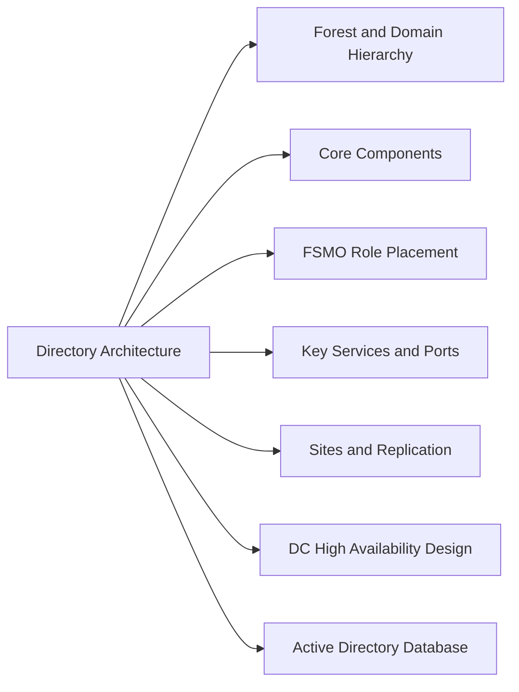

# Active Directory Architecture



## Forest and Domain Hierarchy

Active Directory is organised in a Forest → Domain → OU hierarchy:

```
Forest (security boundary)
└── Forest Root Domain (corp.local)
    ├── Enterprise Admins (forest-wide admin group)
    ├── Schema Master (schema changes — DC in root domain)
    ├── Domain Naming Master
    └── Regional/Child Domains (optional)
        └── domain.corp.local
```

The forest is the ultimate security boundary — Kerberos trust does not cross forest boundaries by default. Child domains share the forest schema and global catalog but have separate administrative boundaries.

## Core Components

| Component | Role |
|---|---|
| Forest Root Domain | Schema master, Enterprise Admins, trust anchor |
| Regional Domains | Administrative boundary per region or business unit |
| Domain Controller (DC) | Hosts AD database (NTDS.DIT), DNS, KDC, SYSVOL |
| Global Catalog (GC) | Partial attribute replica + universal group membership cache |
| FSMO Roles | Five single-master operations (see below) |
| Sites & Site Links | Control replication topology and DC/KDC selection |
| SYSVOL | Shared folder replicated via DFSR; holds GPO templates and logon scripts |

## FSMO Role Placement

| FSMO Role | Scope | Recommended DC |
|---|---|---|
| Schema Master | Forest-wide | Forest root DC 1 |
| Domain Naming Master | Forest-wide | Forest root DC 1 |
| PDC Emulator | Per domain | Most capable DC; close to users (time source) |
| RID Master | Per domain | Same site as PDC Emulator preferred |
| Infrastructure Master | Per domain | Not a GC DC (if single-domain, can be GC) |

Verify current FSMO holders:
```powershell
netdom query fsmo /domain:corp.local
# Or:
Get-ADDomain | Select-Object InfrastructureMaster, RIDMaster, PDCEmulator
Get-ADForest | Select-Object SchemaMaster, DomainNamingMaster
```

## Key Services and Ports

| Service | Port | Protocol | Purpose |
|---|---|---|---|
| LDAP | 389 | TCP/UDP | Directory queries |
| LDAPS | 636 | TCP | Encrypted directory queries |
| Global Catalog | 3268 | TCP | Universal group membership |
| Global Catalog SSL | 3269 | TCP | Encrypted GC queries |
| Kerberos | 88 | TCP/UDP | Authentication tickets |
| DNS | 53 | TCP/UDP | Name resolution (AD-integrated DNS) |
| RPC (replication) | 135 + dynamic | TCP | DC-to-DC replication |
| SMB (SYSVOL) | 445 | TCP | SYSVOL/DFSR replication |
| WinRM | 5985/5986 | TCP | Remote management |

## Sites and Replication

Sites define physical network boundaries for efficient replication and logon:

```powershell
# List sites
Get-ADReplicationSite -Filter *

# List site links
Get-ADReplicationSiteLink -Filter *

# Check replication health
repadmin /showrepl
repadmin /replsummary   # Summary of replication success/failure
dcdiag /test:replications /v
```

AD replicates via multi-master within a site (frequent, fast) and between sites via site links (scheduled, based on link interval).

## DC High Availability Design

Minimum two Domain Controllers per site:
- DC1: PDC Emulator, RID Master for the site's domain
- DC2: Infrastructure Master, GC (if only one domain — GC on both)
- Both DCs act as DNS servers for the site

In the event DC1 fails: DC2 handles all authentication and DNS. FSMO roles should be seized only if DC1 cannot be restored within 24 hours.

## Active Directory Database

The AD database file is `NTDS.DIT`:
```
Location: C:\Windows\NTDS\NTDS.DIT
Log files: C:\Windows\NTDS\*.log (EDB transaction logs)
SYSVOL: C:\Windows\SYSVOL\sysvol\<domain>\
```

Back up via Windows Server Backup (System State backup) or bare-metal backup:
```powershell
# System State backup includes NTDS.DIT
wbadmin start systemstatebackup -backupTarget:D:
```
