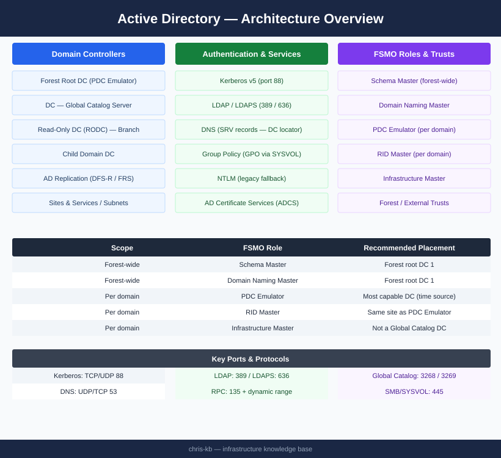
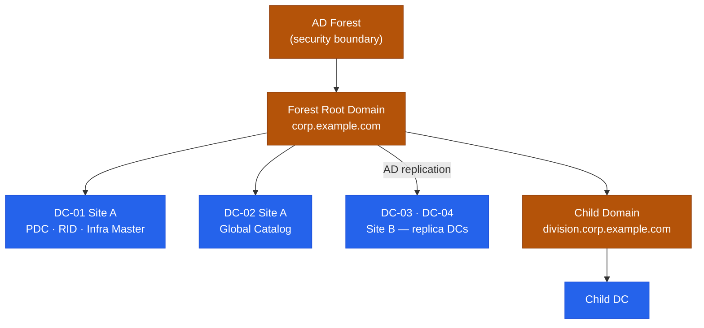

# Active Directory — Architecture

Windows Server Active Directory forest with multi-site domain controllers, Kerberos authentication, LDAP directory services, and FSMO role delegation across primary and replica DCs.

<a class="kb-card" href="how-it-works/">
  <strong>How It Works</strong>
  Forest hierarchy, FSMO roles, Kerberos auth, replication topology, and LDAP flows.
</a>

<a class="kb-card" href="integrations/">
  <strong>Integrations</strong>
  Integration with other platforms and external systems.
</a>

<a class="kb-card" href="design-standards/">
  <strong>Design Standards</strong>
  Sizing guidelines, design standards, and best practices.
</a>

## FSMO Roles

| FSMO Role | Scope | Recommended DC |
|---|---|---|
| Schema Master | Forest-wide | Forest root DC 1 |
| Domain Naming Master | Forest-wide | Forest root DC 1 |
| PDC Emulator | Per domain | Most capable DC; close to users (time source) |
| RID Master | Per domain | Same site as PDC Emulator preferred |
| Infrastructure Master | Per domain | Not a GC DC (if single-domain, can be GC) |

## Forest and Domain Hierarchy

