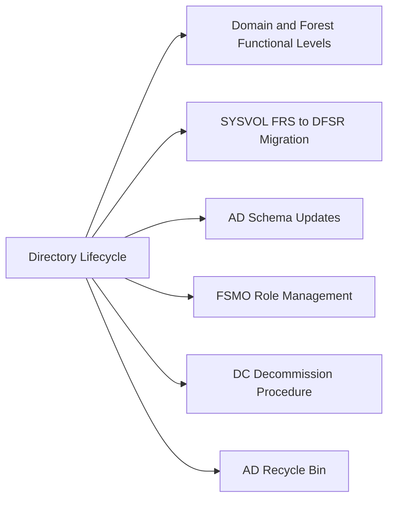

# Active Directory Lifecycle

Active Directory domain and forest functional levels determine which features are available and which DC OS versions are supported. Raising functional levels is a one-way operation and requires all DCs to run at least the corresponding Windows Server version. SYSVOL replication must be migrated from FRS to DFSR before the domain functional level can be raised to Windows Server 2008 R2 or higher.

---



## Domain and Forest Functional Levels

| Domain Functional Level | Minimum DC OS | Key Feature Unlocked |
|---|---|---|
| Windows Server 2016 | Server 2016 | Privileged Access Management, PAC compression |
| Windows Server 2019 | Server 2019 | Feature parity with 2016 |
| Windows Server 2022 | Server 2022 | AES encryption improvements |

Raise domain functional level after confirming all DCs are running the target OS version:

```powershell
# Verify all DC OS versions before raising DFL
Get-ADDomainController -Filter * | Select-Object Name, OperatingSystem, OperatingSystemVersion

# Raise domain functional level
Set-ADDomainMode -Identity "corp.example.com" -DomainMode Windows2016Domain

# Raise forest functional level (requires DFL to already be at target level)
Set-ADForestMode -Identity "example.com" -ForestMode Windows2016Forest
```

---

## SYSVOL FRS to DFSR Migration

Run from the PDC Emulator. Do not skip states — wait for convergence at each stage.

```powershell
# Check current SYSVOL replication state
dfsrmig /GetMigrationState

# Advance through migration states: Prepared -> Redirected -> Eliminated
dfsrmig /SetGlobalState 1   # Prepared
dfsrmig /SetGlobalState 2   # Redirected
dfsrmig /SetGlobalState 3   # Eliminated

# Verify completion
dfsrmig /GetMigrationState
```

---

## AD Schema Updates

Schema updates are required before adding the first DC of a new OS version. Run `adprep` from the media of the highest new OS version being introduced.

```powershell
# From Windows Server installation media, run on the Schema Master:
adprep.exe /forestprep

# Run on each domain that will contain the new OS DC:
adprep.exe /domainprep

# Verify schema version
Get-ADObject (Get-ADRootDSE).schemaNamingContext -Property objectVersion |
  Select-Object objectVersion
```

Schema version reference: Server 2016 = 87, Server 2019 = 88, Server 2022 = 91.

---

## FSMO Role Management

```powershell
# Show current FSMO role holders
netdom query fsmo

# Transfer FSMO roles (preferred — run on the target DC)
Move-ADDirectoryServerOperationMasterRole -Identity "DC02" -OperationMasterRole `
  PDCEmulator, RIDMaster, InfrastructureMaster, SchemaMaster, DomainNamingMaster

# Seize FSMO roles (only when old DC is permanently offline)
ntdsutil
  roles
  connections
    connect to server DC02
    quit
  seize PDC
  seize RID master
  quit
quit
```

---

## DC Decommission Procedure

1. Confirm target DC is not holding any FSMO roles (transfer first if it is).
2. Confirm DNS and SYSVOL are healthy on remaining DCs.
3. Demote the DC gracefully:

```powershell
# Graceful demotion via PowerShell (preferred)
Uninstall-ADDSDomainController `
  -DemoteOperationMasterRole:$true `
  -RemoveDnsDelegation:$true `
  -Credential (Get-Credential)
```

4. If the DC is offline and cannot be demoted, clean up AD metadata:

```cmd
ntdsutil
  metadata cleanup
  remove selected server CN=DC01,OU=Domain Controllers,DC=corp,DC=example,DC=com
  quit
quit
```

5. Remove the associated DNS records and computer account from AD after demotion.

---

## AD Recycle Bin

Enable once per forest; requires DFL 2008 R2 or higher. Cannot be disabled after enabling.

```powershell
# Enable AD Recycle Bin
Enable-ADOptionalFeature 'Recycle Bin Feature' `
  -Scope ForestOrConfigurationSet `
  -Target "example.com"

# Restore a deleted object (default tombstone lifetime: 180 days)
Get-ADObject -Filter {DisplayName -eq "John Smith"} -IncludeDeletedObjects |
  Restore-ADObject
```
