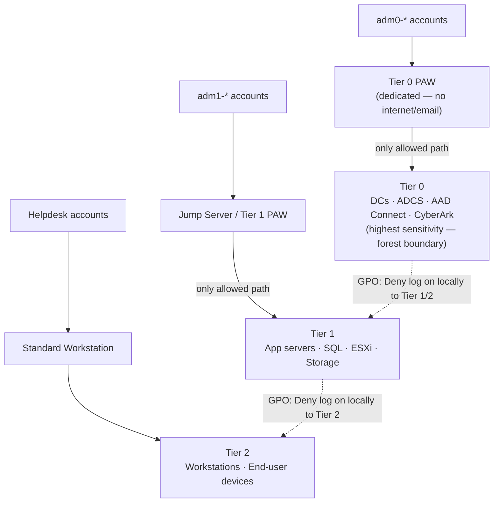

# Active Directory — Access Control


<div class="kb-summary">
Access Control reference covering Tiered Administration Model, Core Security Controls, AdminSDHolder Monitoring.
</div>
```powershell
┌───────────────────────── Security Active Directory Security — Access Control ─────────────────────────┐
│                                                                                                       │
│   ┌───────────────────────────────────────────────────────────────────────────────────────────────┐   │
│   │     Active Directory access control: RBAC roles, least-privilege, and access audit logging    │   │
│   │        Roles: admin (full), operator (read/modify), read-only (view); map to AD groups        │   │
│   │       Authentication: local accounts, LDAP/AD integration, and MFA for privileged users       │   │
│   │          Audit: log all admin actions; review access logs monthly; rotate credentials         │   │
│   └───────────────────────────────────────────────────────────────────────────────────────────────┘   │
│                                                                                                       │
│    Identify user → assign role → enforce MFA → audit → review quarterly                               │
│                                                                                                       │
│                  ▼                                ▼                                ▼                  │
│                                                                                                       │
│   ┌─────────────────────────────┐  ┌─────────────────────────────┐  ┌─────────────────────────────┐   │
│   │            Layer            │  │          Component          │  │            Notes            │   │
│   │             Core            │  │       Primary service       │  │        Main function        │   │
│   │          Management         │  │        Control plane        │  │         Admin access        │   │
│   │          Monitoring         │  │         Health/perf         │  │      Alerts/dashboards      │   │
│   │           Security          │  │         Auth/encrypt        │  │        Access control       │   │
│   │         Integration         │  │        APIs/plug-ins        │  │         Third-party         │   │
│   └─────────────────────────────┘  └─────────────────────────────┘  └─────────────────────────────┘   │
│                                                                                                       │
│                          ▼                                                 ▼                          │
│                                                                                                       │
│   ┌───────────────────────────────────────────────────────────────────────────────────────────────┐   │
│   │       Role       │   Permissions    │       Scope       │       Auth       │   Review cycle   │   │
│   │      Admin       │    Full CRUD     │       Global      │   MFA required   │     Monthly      │   │
│   │     Operator     │   Read/modify    │      Assigned     │   MFA required   │    Quarterly     │   │
│   │    Read-only     │    View only     │      Assigned     │     Password     │    Quarterly     │   │
│   │   Service acct   │     API only     │    Specific API   │    Token/cert    │      Annual      │   │
│   └───────────────────────────────────────────────────────────────────────────────────────────────┘   │
│                                                                                                       │
│    Physical: Security Active Directory Security infrastructure · management network · monitoring      │
│                                                                                                       │
│    Key terms:                                                                                         │
│                                                                                                       │
│    Active Directory   = Security Active Directory Security platform overview and core concepts        │
│    Management         = management console and command-line interface for administration              │
│    Monitoring         = health and performance monitoring dashboards and alerting                     │
│    Automation         = REST API, scripting, and pipeline integration capabilities                    │
│    Security           = access control, authentication, and encryption configuration                  │
│    Backup             = backup and recovery procedures and schedule configuration                     │
│    Upgrade            = software version upgrades and firmware patching procedures                    │
│    Troubleshooting    = diagnostic procedures and common issue resolution steps                       │
│    Escalation         = vendor support escalation path and severity triage process                    │
│    Documentation      = vendor knowledge base and official product documentation                      │
│    Change management  = change ticket requirements for production modifications                       │
│    Audit log          = admin action logging for compliance and security review                       │
│                                                                                                       │
└───────────────────────────────────────────────────────────────────────────────────────────────────────┘
```


## Tiered Administration Model

Active Directory security is built around the three-tier admin model:




| Tier | Scope | Examples | Access Restriction |
|---|---|---|---|
| Tier 0 | Identity infrastructure | DCs, ADCS, AAD Connect, CyberArk | Only from Tier 0 PAW |
| Tier 1 | Servers and services | App servers, SQL, ESXi | Only from Tier 1 PAW or jump host |
| Tier 2 | Workstations | End-user PCs | From standard workstation |

Tier model is enforced by GPO logon restrictions (`Deny log on locally`, `Deny access to this computer from the network`) and CyberArk safe membership.

## Core Security Controls

| Control | Implementation |
|---|---|
| Protected Users group | Disables NTLM, DES, RC4, and unconstrained delegation for members |
| AdminSDHolder | ACL template propagated every 60 min to all protected accounts |
| PAW | Dedicated hardened workstations; Tier 0 access only from Tier 0 PAW |
| LDAP signing | `Domain Controller: LDAP server signing requirements` = Require signing |
| LDAP channel binding | `Domain Controller: LDAP server channel binding token requirements` = Always |
| Kerberos AES-256 only | Disable RC4 via `Network security: Configure encryption types allowed for Kerberos` |
| Fine-grained PSO | Stricter password/lockout policies for admin and service accounts |
| Defender for Identity | Sensor on all DCs; detects lateral movement, pass-the-hash, DCSync |

## AdminSDHolder Monitoring

```powershell
# List all accounts protected by AdminSDHolder (adminCount=1)
Get-ADUser -Filter { AdminCount -eq 1 } -Properties AdminCount |
    Select-Object SamAccountName, DistinguishedName, AdminCount

# Check if non-privileged accounts have adminCount=1 (sign of ACL tampering or orphaned admin membership)
Get-ADUser -Filter { AdminCount -eq 1 } |
    Where-Object { (Get-ADUser $_ -Properties MemberOf).MemberOf -eq $null }
```
