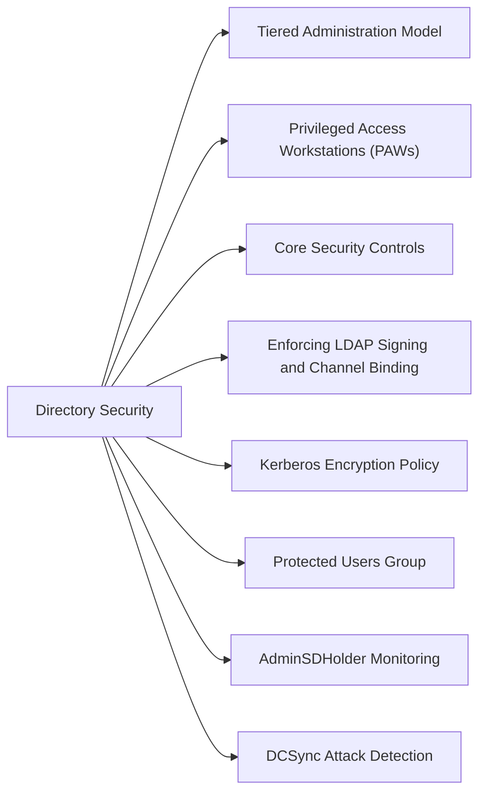

# Active Directory Security



## Tiered Administration Model

Active Directory security is built around the three-tier admin model:

| Tier | Scope | Examples | Access Restriction |
|---|---|---|---|
| Tier 0 | Identity infrastructure | DCs, ADCS, AAD Connect, CyberArk | Only from Tier 0 PAW |
| Tier 1 | Servers and services | App servers, SQL, ESXi | Only from Tier 1 PAW or jump host |
| Tier 2 | Workstations | End-user PCs | From standard workstation |

Tier model is enforced by GPO logon restrictions (`Deny log on locally`, `Deny access to this computer from the network`) and CyberArk safe membership.

## Privileged Access Workstations (PAWs)

PAWs are hardened, dedicated hosts:
- No internet browsing, email, or productivity apps
- AppLocker / WDAC policy allows only admin tools
- BitLocker + TPM + Secure Boot enforced
- Joined to separate PAW OU with restricted GPO

```powershell
# Verify PAW OU GPO — confirm internet-facing apps are blocked
Get-GPInheritance -Target "OU=PAW,OU=Tier0,DC=corp,DC=local"

# Check logon restriction policy on DC
Get-GPOReport -Name "Tier0-Logon-Restrictions" -ReportType Html -Path C:\Reports\tier0-gpo.html
```

## Core Security Controls

| Control | Implementation |
|---|---|
| Protected Users group | Disables NTLM, DES, RC4, and unconstrained delegation for members |
| AdminSDHolder | ACL template propagated every 60 min to all protected accounts |
| PAW | Dedicated hardened workstations; Tier 0 access only from Tier 0 PAW |
| LDAP signing | `Domain Controller: LDAP server signing requirements` = Require signing |
| LDAP channel binding | `Domain Controller: LDAP server channel binding token requirements` = Always |
| Kerberos AES-256 only | Disable RC4 via `Network security: Configure encryption types allowed for Kerberos` |
| Fine-grained PSO | Stricter password/lockout policies for admin and service accounts |
| Defender for Identity | Sensor on all DCs; detects lateral movement, pass-the-hash, DCSync |

## Enforcing LDAP Signing and Channel Binding

```powershell
# Verify current LDAP signing requirement via registry on DC
Get-ItemProperty -Path "HKLM:\System\CurrentControlSet\Services\NTDS\Parameters" |
    Select-Object "LDAPServerIntegrity"
# 2 = Require (desired); 1 = Negotiate; 0 = None

# Verify channel binding token requirements
Get-ItemProperty -Path "HKLM:\System\CurrentControlSet\Services\NTDS\Parameters" |
    Select-Object "LdapEnforceChannelBinding"
# 2 = Always (desired); 1 = When Supported; 0 = Never
```

## Kerberos Encryption Policy

```powershell
# Verify Kerberos encryption GPO is applied to DCs
# GPO setting: Computer → Windows Settings → Security Settings →
# Local Policies → Security Options → "Network security: Configure encryption types allowed for Kerberos"
# Desired: AES128_HMAC_SHA1, AES256_HMAC_SHA1 only (DES and RC4 unchecked)

# Check if RC4 is still in use (legacy clients will fail after disabling)
# Event ID 4769 with "Ticket Encryption Type: 0x17" = RC4 in use
Get-WinEvent -ComputerName dc1 -FilterHashtable @{
    LogName='Security'; Id=4769
} -MaxEvents 500 | Where-Object { $_.Message -match "0x17" } | Select-Object -First 10 TimeCreated, Message
```

## Protected Users Group

```powershell
# Add privileged accounts to Protected Users
Add-ADGroupMember -Identity "Protected Users" -Members "admin-tier0-01","admin-tier0-02"

# Verify current membership
Get-ADGroupMember -Identity "Protected Users" | Select-Object SamAccountName, DistinguishedName
```

Protected Users group members cannot:
- Authenticate with NTLM, DES, or RC4
- Use unconstrained delegation
- Have their credentials cached on non-DCs

## AdminSDHolder Monitoring

```powershell
# List all accounts protected by AdminSDHolder (adminCount=1)
Get-ADUser -Filter { AdminCount -eq 1 } -Properties AdminCount |
    Select-Object SamAccountName, DistinguishedName, AdminCount

# Check if non-privileged accounts have adminCount=1 (sign of ACL tampering or orphaned admin membership)
Get-ADUser -Filter { AdminCount -eq 1 } |
    Where-Object { (Get-ADUser $_ -Properties MemberOf).MemberOf -eq $null }
```

## DCSync Attack Detection

```powershell
# Defender for Identity alert: "Directory Services Replication Request"
# Also: Event ID 4662 with access mask 0x100 (Replicating Directory Changes)
Get-WinEvent -ComputerName dc1 -FilterHashtable @{
    LogName='Security'; Id=4662
} -MaxEvents 200 | Where-Object { $_.Message -match "1131f6aa" -or $_.Message -match "1131f6ad" }
# These GUIDs = Replicating Directory Changes (All)
```

## Defender for Identity Deployment

```powershell
# Install MDI sensor on each DC
# Download sensor installer from MDI portal → Sensors → + Sensor
# On DC:
.\Azure ATP Sensor Setup.exe /quiet NetFrameworkCommandLineArguments="/q" AccessKey="<sensor-key>"

# Verify sensor status
# MDI portal → Sensors → confirm all DCs show "Running"
```

## Hardening Checklist

- [ ] Protected Users group populated with all Tier 0 accounts
- [ ] LDAP signing = Require on all DCs
- [ ] LDAP channel binding = Always on all DCs
- [ ] Kerberos RC4 disabled via GPO
- [ ] AdminSDHolder ACL reviewed for unexpected permissions
- [ ] Defender for Identity sensor on all DCs, alerting active
- [ ] Privileged accounts have no email, no SPN, no internet
- [ ] PAW policy applied and enforced
- [ ] Fine-grained password policy applied to admin groups (min 20-char passphrase)
- [ ] AD Recycle Bin enabled (forest functional level 2008 R2+)
- [ ] Audit policy: Account logon, Directory Service Access, Account Management all enabled
