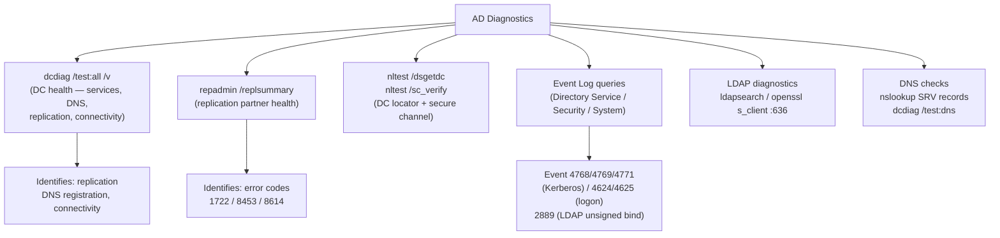

# Active Directory — Diagnostics

## DC Diagnostic Tool Map



## Dcdiag Tests

```cmd
# Full dcdiag run
dcdiag /test:all /v /f:C:\dcdiag-output.txt

# DNS-specific test
dcdiag /test:dns /v

# Connectivity test only
dcdiag /test:connectivity

# Run against a remote DC
dcdiag /s:dc02.corp.example.com /test:replications
```

## Replication Diagnostics

```cmd
# Show replication status for all partners
repadmin /showrepl

# Show replication summary
repadmin /replsummary

# Show replication errors only
repadmin /showrepl * /csv > C:\repl-errors.csv

# Force replication from a specific source DC
repadmin /replicate dc02.corp.example.com dc01.corp.example.com "DC=corp,DC=example,DC=com"
```

## Event Log Diagnostics

```powershell
# Check Directory Service log for replication errors
Get-WinEvent -LogName "Directory Service" |
    Where-Object {$_.Level -le 3} | Select-Object -First 20 TimeCreated, Id, Message

# Check System log for Netlogon errors
Get-WinEvent -LogName System -ProviderName Netlogon |
    Select-Object -First 20 TimeCreated, Id, Message

# Check for Kerberos errors in Security log
Get-WinEvent -LogName Security |
    Where-Object {$_.Id -in @(4768,4769,4771)} |
    Select-Object -First 20 TimeCreated, Id, Message
```

---

## LDAP Diagnostics

Active Directory exposes its directory over LDAP on port 389 (LDAPS on 636). LDAP queries are the foundation for searches, integrations, and automation against AD.

### LDAP Search Basics

Every LDAP search has four parts: base DN, scope, filter, and attributes.

| Parameter | Description | Example |
|---|---|---|
| Base DN | Starting point in the tree | `DC=corp,DC=example,DC=com` |
| Scope | base / one / sub | `sub` searches entire subtree |
| Filter | Object selector syntax | `(objectClass=user)` |
| Attributes | Fields to return | `sAMAccountName,mail` |

```bash
# Basic ldapsearch against AD (Linux/macOS)
ldapsearch -H ldap://dc01.corp.example.com \
    -D "cn=svc-ldap,ou=serviceaccounts,dc=corp,dc=example,dc=com" \
    -w 'P@ssw0rd!' \
    -b "DC=corp,DC=example,DC=com" \
    -s sub \
    "(sAMAccountName=jsmith)" \
    cn mail memberOf

# Search for all enabled users
ldapsearch -H ldap://dc01.corp.example.com \
    -D "cn=svc-ldap,ou=serviceaccounts,dc=corp,dc=example,dc=com" \
    -w 'P@ssw0rd!' \
    -b "DC=corp,DC=example,DC=com" \
    "(&(objectClass=user)(!(userAccountControl:1.2.840.113556.1.4.803:=2)))" \
    sAMAccountName displayName mail
```

### LDAPS and Signing

```powershell
# Test LDAPS connectivity
Test-NetConnection -ComputerName dc01.corp.example.com -Port 636

# Verify LDAP channel binding / signing settings
Get-ItemProperty "HKLM:\SYSTEM\CurrentControlSet\Services\NTDS\Parameters" |
    Select-Object "LDAPServerIntegrity", "LdapEnforceChannelBinding"

# Check LDAP event log for bind failures
Get-WinEvent -LogName "Directory Service" |
    Where-Object {$_.Id -eq 2889} | Select-Object -First 10 TimeCreated, Message
```

### Troubleshooting LDAP Issues

```bash
# Test anonymous bind (should fail if hardening is applied)
ldapsearch -H ldap://dc01.corp.example.com -x -b "" -s base

# Test with explicit credentials and verbose output
ldapsearch -H ldap://dc01.corp.example.com -v \
    -D "cn=svc-ldap,ou=serviceaccounts,dc=corp,dc=example,dc=com" \
    -w 'P@ssw0rd!' \
    -b "DC=corp,DC=example,DC=com" "(cn=jsmith)"

# Check TLS on LDAPS port
openssl s_client -connect dc01.corp.example.com:636 -showcerts
```

---

## DNS Dependency

Active Directory is fundamentally dependent on DNS. Every DC registration, client logon, and Kerberos ticket request relies on DNS SRV and A records being correct and resolvable. A broken DNS layer is the most common root cause of AD-wide outages.

### SRV Records and DC Locator

DCs register SRV records in DNS automatically via the Netlogon service. The DC Locator process uses these records to find the right DC for a given site and service.

Key SRV record types:

| Record | Purpose |
|---|---|
| `_ldap._tcp.<domain>` | Generic LDAP over TCP |
| `_kerberos._tcp.<domain>` | Kerberos KDC (TCP) |
| `_ldap._tcp.dc._msdcs.<domain>` | DC-specific LDAP |
| `_kerberos._udp.<domain>` | Kerberos KDC (UDP) |
| `_gc._tcp.<domain>` | Global Catalog |
| `_ldap._tcp.<site>._sites.<domain>` | Site-scoped LDAP |

```cmd
# List all AD SRV records in DNS
nslookup -type=SRV _ldap._tcp.corp.example.com
nslookup -type=SRV _kerberos._tcp.corp.example.com
nslookup -type=SRV _gc._tcp.corp.example.com
```

### Checking DNS Health

```cmd
# Run dcdiag DNS tests on local DC
dcdiag /test:dns /v

# Run against a specific DC
dcdiag /test:dns /s:dc01.corp.example.com /v

# Check that Netlogon has registered SRV records
nltest /dsgetdc:corp.example.com

# Force Netlogon to re-register DNS records
nltest /dsregdns

# Verify a DC can be found for a specific site
nltest /dsgetdc:corp.example.com /site:LondonSite
```

### DC Locator Process

When a client needs a DC it sends a DNS query for `_ldap._tcp.<site>._sites.<domain>`. If no site-scoped record is found it falls back to the domain-wide `_ldap._tcp.<domain>` SRV records. The client then sends an LDAP ping (CLDAP) to the returned DCs and selects the fastest responder.

```powershell
# Show which DC a machine is currently using
(Get-ADDomainController -Discover).Name

# Force rediscovery of a DC
nltest /sc_reset:corp.example.com

# Display the DC locator cache
nltest /dclist:corp.example.com
```

### DNS Health Checks Runbook

```powershell
# Check all DCs have registered A records
Get-ADDomainController -Filter * | ForEach-Object {
    Resolve-DnsName $_.HostName -Type A -ErrorAction SilentlyContinue
}

# Confirm SRV records are present for every DC
$domain = "corp.example.com"
Resolve-DnsName "_ldap._tcp.$domain" -Type SRV
Resolve-DnsName "_kerberos._tcp.$domain" -Type SRV

# Check for DNS scavenging (stale record removal)
Get-DnsServerZoneAging -Name "corp.example.com"
```

### Common DNS-Caused AD Failures

- Missing SRV records after DC promotion: restart Netlogon and run `nltest /dsregdns`
- Clients caching old DC addresses: flush with `ipconfig /flushdns`
- Split-brain DNS: internal clients resolving to external IPs — ensure internal DNS is authoritative for the AD domain
- Scavenging too aggressive: valid DC records deleted — review AgingEnabled and NoRefreshInterval settings
- Wrong DNS server on DC NIC: DCs must point to AD-integrated DNS, not a public resolver
