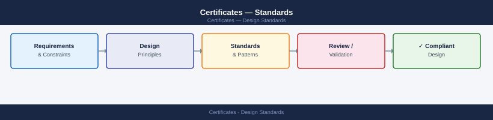

---
tags:
  - architecture
  - security
---
# Certificates — Standards


<div class="kb-summary">
Validity period standards: internal server certificates 2 years, external/public-facing certificates 1 year maximum (aligned with CA/Browser Forum requirements), code signing certificates 3 years.
</div>



 Key size minimum is RSA-4096 or ECDSA P-256; RSA-2048 is not acceptable for new certificates. Hash algorithm must be SHA-256 or stronger — SHA-1 is prohibited.

All certificates must use Subject Alternative Names (SANs); the Common Name field alone does not satisfy browser and client validation requirements. Wildcards are permitted for internal domains but restricted for external use. Revocation must be supported via both CRL Distribution Points and OCSP.

| Standard | Requirement |
|---|---|
| Internal server validity | 2 years |
| External / public validity | 1 year maximum |
| Code signing validity | 3 years |
| Key algorithm | RSA-4096 or ECDSA P-256 minimum |
| Hash algorithm | SHA-256 minimum (SHA-1 prohibited) |
| SAN usage | Mandatory — CN alone not sufficient |
| Wildcards (external) | Restricted — approval required |
| Revocation | CRL Distribution Points and OCSP required |

```d2
direction: down

network_controls: "Network Controls" {shape: rectangle}
os_hardening: "OS Hardening" {shape: rectangle}
application_security: "Application Security" {shape: rectangle}
audit_monitoring: "Audit & Monitoring" {shape: rectangle}

network_controls -> os_hardening: hardens
os_hardening -> application_security: hardens
application_security -> audit_monitoring: hardens
```

## Before you begin

- **Access:** Admin credentials on all affected systems
- **Change management:** security changes require CAB approval in most environments
- **Rollback plan:** document current state before any security control change
- **Testing:** validate in a non-production environment first where possible

---

