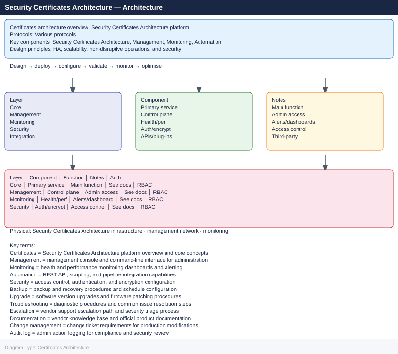
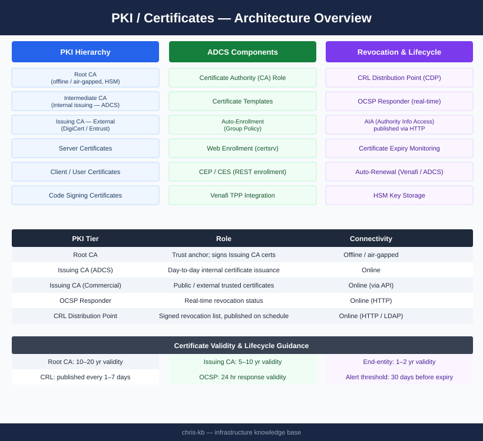
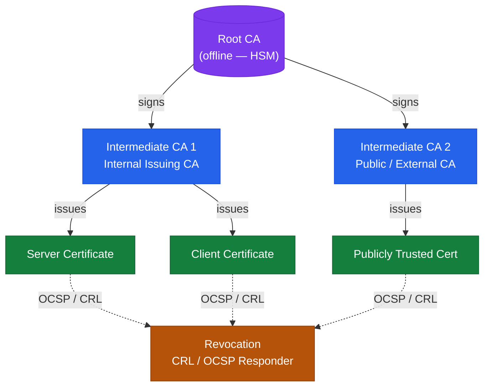

---
tags:
  - architecture
  - security
---
# Certificates — Architecture

Three-tier PKI hierarchy with offline Root CA, ADCS-backed Issuing CA, and commercial CA integrations; certificate lifecycle managed via auto-enrollment, OCSP revocation, and Venafi TPP.

<a class="kb-card" href="how-it-works/">
  <strong>How It Works</strong>
  PKI hierarchy, certificate lifecycle, ADCS roles, CDP/AIA, and revocation flows.
</a>

<a class="kb-card" href="integrations/">
  <strong>Integrations</strong>
  Integration with other platforms and external systems.
</a>

<a class="kb-card" href="design-standards/">
  <strong>Design Standards</strong>
  Sizing guidelines, design standards, and best practices.
</a>

## PKI Tiers

| Tier | Role | Connectivity |
|---|---|---|
| Root CA | Trust anchor; signs Issuing CA certificates | Offline / air-gapped |
| Issuing CA (ADCS) | Day-to-day certificate issuance to internal hosts | Online |
| Issuing CA (Commercial) | External and publicly trusted certificates | Online (via API) |
| OCSP Responder | Real-time revocation status for relying parties | Online (HTTP) |
| CRL Distribution Point | Signed revocation list published on schedule | Online (HTTP / LDAP) |

## PKI Hierarchy

