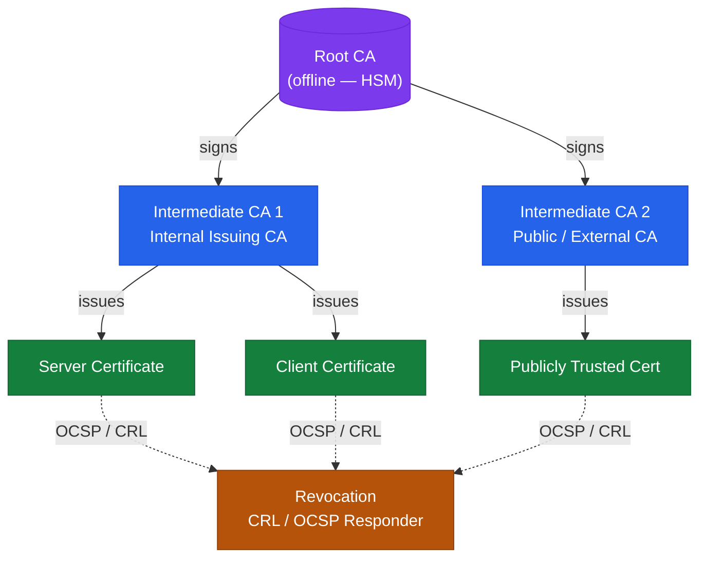
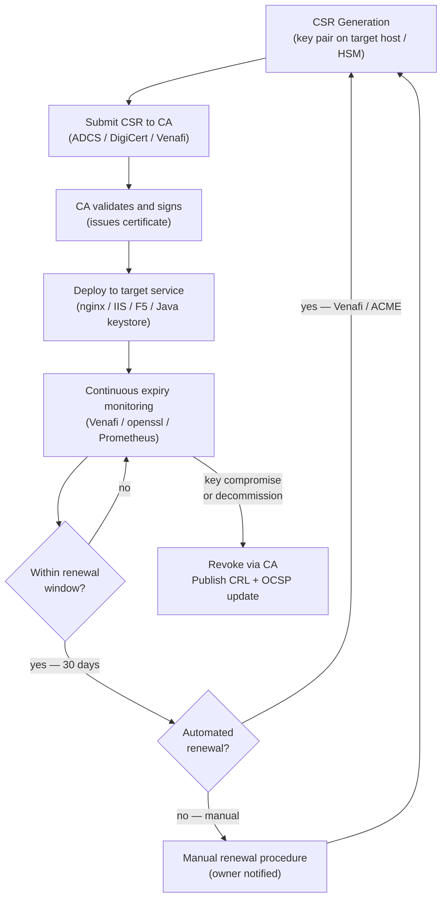
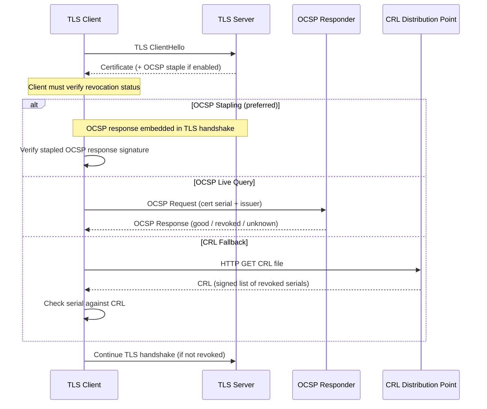

# Certificates Architecture

Certificate infrastructure follows a three-tier PKI hierarchy: an offline, air-gapped Root CA at the trust anchor, an online Issuing CA for day-to-day issuance, and optionally a Registration Authority (RA) to separate enrolment approval from issuance. Internal PKI is implemented with Microsoft ADCS. External and public-facing services use commercial CAs (DigiCert, Entrust) or Let's Encrypt via ACME.

---
## PKI Hierarchy



## Certificate Lifecycle Flow



---

## ADCS Role Components

| Component | Description |
|---|---|
| Certification Authority (CA) | Core CA service; issues and revokes certificates |
| CA Web Enrollment | Browser-based manual certificate requests (legacy) |
| Network Device Enrollment Service (NDES) | SCEP for network devices and mobile MDM |
| Online Responder (OCSP) | Real-time revocation status; preferred over CRL for large deployments |
| Certificate Enrollment Web Service (CEP/CES) | HTTP(S)-based auto-enrollment for non-domain members |

---

## Certificate Templates

Templates are created on the Issuing CA and determine key usage, validity, and enrollment permissions.

Common templates in use:

| Template Name | Purpose | Key Usage | Validity |
|---|---|---|---|
| `WebServer-Internal` | Internal HTTPS services | Server Authentication | 2 years |
| `WorkstationAuth` | Computer authentication (802.1X) | Client Authentication | 1 year |
| `SmartcardLogon` | User smart card / FIDO logon | Smart Card Logon | 1 year |
| `CodeSigning-Internal` | Internal script / binary signing | Code Signing | 1 year |
| `SubCA` | Issuing CA certificate | All key usages | 10 years |

```powershell
# List all published certificate templates on the CA
certutil -catemplates

# View key details of a specific template
Get-CATemplate -TemplateName "WebServer-Internal"

# Duplicate a template from the CA MMC snap-in:
# certsrv.msc -> Certificate Templates -> right-click -> Duplicate Template
```

---

## CDP and AIA Configuration

CRL Distribution Points (CDP) and Authority Information Access (AIA) extensions must be resolvable by all relying parties — including non-domain members.

```powershell
# View current CDP and AIA configuration
certutil -getreg CA\CRLPublicationURLs
certutil -getreg CA\CACertPublicationURLs

# Recommended CDP URLs (set on Issuing CA):
# 1. LDAP://... (domain members only)
# 2. http://pki.corp.example.com/crl/<CAName><CRLNameSuffix><DeltaCRLAllowed>.crl
# (HTTP CDP must be accessible to ALL systems that receive certificates)

# Set CDP via PowerShell (restart CertSvc after changes)
$cdpUrls = @(
  "1:C:\Windows\system32\CertSrv\CertEnroll\%3%8%9.crl",
  "2:ldap:///CN=%7%8,CN=%2,CN=CDP,CN=Public Key Services,CN=Services,%6%10",
  "2:http://pki.corp.example.com/crl/%3%8%9.crl"
)
certutil -setreg CA\CRLPublicationURLs ($cdpUrls -join "\n")
Restart-Service CertSvc
```

---

## Auto-Enrollment via Group Policy

Auto-enrollment automatically issues and renews certificates to domain members without user interaction.

```
GPO Path: Computer Configuration > Windows Settings > Security Settings >
          Public Key Policies > Certificate Services Client - Auto-Enrollment

Settings:
  - Configuration Model: Enabled
  - Renew expired certificates: Checked
  - Update certificates that use certificate templates: Checked
  - Expiry notification: 10% before expiry
```

```powershell
# Trigger manual auto-enrollment on a client (useful for testing)
certutil -pulse

# View certificates in the machine store
Get-ChildItem Cert:\LocalMachine\My | Select-Object Subject, NotAfter, Thumbprint
```

---

## OCSP and CRL Revocation Validation Flow



---

## Root CA Key Ceremony

The Root CA private key is the most sensitive component of the PKI. Key ceremony requirements:

- Performed in a secure, access-controlled room with at least two witnesses.
- Key generated inside an HSM (e.g., nCipher, Thales) or a verified offline server.
- Key backup stored in HSM firmware card set with M-of-N quorum (e.g., 3-of-5).
- Ceremony is documented, signed by all witnesses, and stored with the CA policy documentation.
- Root CA certificate renewed 12 months before expiry with a new key pair.

---

## CRL and OCSP Monitoring

```powershell
# Check CRL validity and next publish time
certutil -URL http://pki.corp.example.com/crl/IssuingCA.crl

# Verify the CRL is accessible and not expired
certutil -verify -urlfetch <certificate.cer>

# Check OCSP responder health
certutil -URL http://ocsp.corp.example.com/ocsp
```

Set a monitoring alert to fire when the CRL validity period drops below 24 hours. The Issuing CA CRL overlap period should be set to at least 10% of the publication interval to avoid gaps.

---

## In this section

<div class="kb-grid kb-grid-3">
<a class="kb-card" href="components/"><strong>Components</strong><span>Core components, services, and technical specifications.</span></a>
<a class="kb-card" href="integrations/"><strong>Integrations</strong><span>Integration with other platforms and external systems.</span></a>
<a class="kb-card" href="standards/"><strong>Standards</strong><span>Sizing guidelines, design standards, and best practices.</span></a>
</div>
