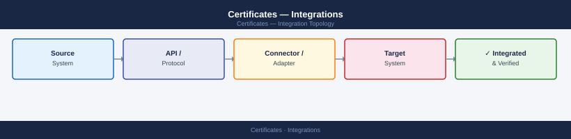
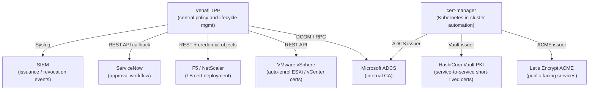

---
tags:
  - architecture
  - security
---
# Certificates — Integrations


<div class="kb-summary">
Venafi TPP (or TLS Protect Cloud) provides the centralised policy and automation layer across all certificate sources. ADCS serves as the enterprise CA backend for internal certificates.
</div>



```d2
direction: right

center: "Integrations" {shape: hexagon}
certificate_integration_topology: "Certificate Integration Topology" {shape: rectangle}
integration_map: "Integration Map" {shape: rectangle}
venafi_tpp_adcs_ca_integration: "Venafi TPP — ADCS CA Integration" {shape: rectangle}
hashicorp_vault_pki: "HashiCorp Vault PKI" {shape: rectangle}
kubernetes_certmanager: "Kubernetes cert-manager" {shape: rectangle}
lets_encrypt_acme_dns01_challenge: "Let's Encrypt ACME (DNS-01 Challenge)" {shape: rectangle}

center -> certificate_integration_topology
center -> integration_map
center -> venafi_tpp_adcs_ca_integration
center -> hashicorp_vault_pki
center -> kubernetes_certmanager
center -> lets_encrypt_acme_dns01_challenge
```

## Before you begin

- **Access:** Admin credentials on all affected systems
- **Change management:** security changes require CAB approval in most environments
- **Rollback plan:** document current state before any security control change
- **Testing:** validate in a non-production environment first where possible

---

## Certificate Integration Topology



## Integration Map

| Integration | Purpose | Protocol |
|---|---|---|
| Venafi TPP ↔ ADCS | Issue internal certs via Microsoft CA | DCOM / RPC |
| Venafi TPP ↔ vSphere | Auto-enrol and renew vCenter/ESXi certs | REST API |
| Venafi TPP ↔ F5 / NetScaler | LB certificate deployment automation | REST + credential objects |
| Venafi TPP ↔ ServiceNow | Certificate request approval workflow | REST API |
| Venafi TPP ↔ SIEM | Issuance, renewal, revocation events | Syslog |
| HashiCorp Vault PKI | Short-lived certs for service-to-service mTLS | REST (Vault API) |
| cert-manager ↔ ADCS / Vault | Kubernetes in-cluster cert automation | ACME / Vault issuer |
| Let's Encrypt ACME | Public-facing service certificates | ACME (RFC 8555) |

## Venafi TPP — ADCS CA Integration

```powershell
# On the Venafi server — verify CA connector is reachable
# TPP UI → Configuration → Certificate Authorities → Test Connection

# ADCS template must have "Enroll" permission granted to the Venafi service account
# Certificate Templates → Right-click → Properties → Security → Add svc-venafi → Enroll
```

## HashiCorp Vault PKI

```bash
# Enable PKI secrets engine
vault secrets enable -path=pki pki
vault secrets tune -max-lease-ttl=87600h pki

# Generate or import CA
vault write pki/root/generate/internal common_name="corp.local Internal CA" ttl=87600h

# Create a role for issuing certs
vault write pki/roles/internal-services \
    allowed_domains="corp.local,svc.cluster.local" \
    allow_subdomains=true \
    max_ttl=720h

# Issue a certificate
vault write pki/issue/internal-services common_name="myservice.svc.cluster.local" ttl=168h
```

## Kubernetes cert-manager

```yaml
# ClusterIssuer pointing at Vault PKI
apiVersion: cert-manager.io/v1
kind: ClusterIssuer
metadata:
  name: vault-issuer
spec:
  vault:
    server: https://vault.example.local:8200
    path: pki/sign/internal-services
    auth:
      kubernetes:
        role: cert-manager
        mountPath: /v1/auth/kubernetes
        serviceAccountRef:
          name: cert-manager
```

```bash
# Check certificate status in cluster
kubectl get certificates -A
kubectl describe certificate <name> -n <namespace>

# Check cert-manager logs for issuance errors
kubectl logs -n cert-manager deploy/cert-manager | tail -50
```

## Let's Encrypt ACME (DNS-01 Challenge)

```bash
# Using certbot with Route53 DNS-01 challenge
certbot certonly \
  --dns-route53 \
  -d "*.corp.example.com" \
  --email certs@corp.example.com \
  --agree-tos \
  --non-interactive

# Auto-renewal via cron (certbot renew checks expiry < 30 days)
0 3 * * * /usr/bin/certbot renew --quiet --post-hook "systemctl reload nginx"
```

## ServiceNow Approval Workflow

Venafi TPP can trigger a ServiceNow workflow for certificates that require business approval:

1. Certificate request submitted via Venafi self-service portal or API.
2. TPP policy engine evaluates request — if approval required, raises a ServiceNow change/task.
3. Approver approves via ServiceNow → TPP receives callback → certificate issued.
4. Certificate deployed to target system via TPP driver.

## Expiry Alerting

```bash
# Check certificate expiry on a remote host
echo | openssl s_client -connect host.example.local:443 2>/dev/null | \
  openssl x509 -noout -dates

# Bulk expiry scan (Bash loop)
for host in vcenter nsxmgr aria-ops aria-auto; do
  expiry=$(echo | openssl s_client -connect ${host}.example.local:443 2>/dev/null | \
    openssl x509 -noout -enddate 2>/dev/null | cut -d= -f2)
  echo "${host}: ${expiry}"
done
```

Venafi TPP / Aria Operations integrations provide dashboard-level expiry visibility — raw CLI checks above are for ad-hoc verification.
