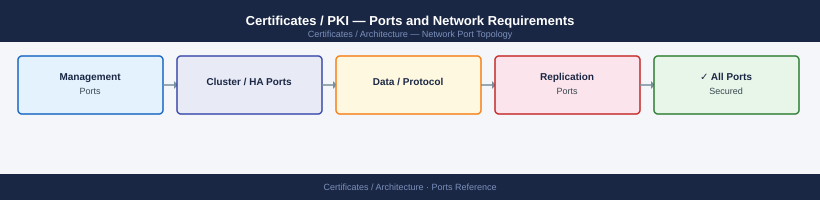

---
tags:
  - certificates
  - pki
  - tls
  - networking
  - firewall
  - ports
  - security
---
# Certificates / PKI — Ports and Network Requirements

<div class="kb-summary">
Firewall port reference for PKI and certificate infrastructure. Covers certificate enrollment (SCEP, EST, ACME), revocation checking (OCSP, CRL), Microsoft ADCS, and Let's Encrypt / public CA access.

*Applies to: Microsoft ADCS / Venafi TPP / Let's Encrypt / ACME protocol*
</div>


## Before you begin

- OCSP responder and CRL distribution point URLs are **embedded in every issued certificate** (AIA/CDP extensions) — all client zones must reach these URLs or certificate validation will fail silently.
- ADCS DCOM (port 135 + dynamic range) is Windows-only; Linux/MDM enrollments use SCEP (80) or EST/ACME (443).
- For Let's Encrypt HTTP-01, the server requesting the certificate must have **inbound port 80** reachable from Let's Encrypt validation IPs — cannot be blocked by a firewall or CDN.
- DNS-01 challenge requires only outbound 443 to the DNS provider API — no inbound ports needed.

## Certificate Enrollment Protocols

| Port | Protocol | Source | Destination | Purpose |
|---|---|---|---|---|
| 443 | TCP | Clients / enrollment systems | ADCS Web Enrollment, EST server, ACME server | HTTPS certificate enrollment (modern preferred method) |
| 80 | TCP | Clients (SCEP) | ADCS NDES / SCEP server | SCEP enrollment (HTTP — some MDM/network device integrations use SCEP) |
| 135 | TCP | ADCS clients (Windows CA operations) | ADCS CA server | DCOM/RPC — Windows Certificate Authority management |
| 49152–65535 | TCP | ADCS clients | ADCS CA server | Dynamic RPC (Windows CA DCOM) |

## Certificate Revocation Checking (Outbound from Clients)

Clients verify certificate revocation before trusting a certificate. These are outbound from the client to the CA's responders.

| Port | Protocol | Destination | Purpose |
|---|---|---|---|
| 80 | TCP | OCSP responder (e.g., ocsp.digicert.com, ocsp.globalsign.com) | OCSP — Online Certificate Status Protocol. Uses HTTP (not HTTPS) for most public CAs |
| 80 | TCP | CRL distribution point (CDP URL in certificate) | CRL download — Certificate Revocation List via HTTP CDP |
| 443 | TCP | OCSP responders (some internal CAs use HTTPS) | OCSP over HTTPS (less common but supported) |

Internal CAs (ADCS): configure CDP and AIA URLs that are reachable from all client networks — typically an internal HTTP server or Active Directory `ldap://` path.

## Let's Encrypt / ACME (Public CA Automation)

| Port | Protocol | Source | Destination | Purpose |
|---|---|---|---|---|
| 443 | TCP | ACME client (certbot, acme.sh, Caddy) | acme-v02.api.letsencrypt.org | ACME account operations, order management |
| 80 | TCP (inbound) | Let's Encrypt validation servers | Server requesting certificate | HTTP-01 challenge — LE validates domain ownership via HTTP |
| 443 | TCP (inbound) | Let's Encrypt validation servers | Server requesting certificate | TLS-ALPN-01 challenge — domain validation via TLS |

For DNS-01 challenge: only DNS API access (443) required — no inbound HTTP needed.

## Microsoft ADCS — Certificate Authority

| Port | Protocol | Source | Destination | Purpose |
|---|---|---|---|---|
| 135 | TCP | Certificate request scripts, MMC | ADCS CA server | DCOM enrollment and CA management |
| 49152–65535 | TCP | Certificate request scripts, MMC | ADCS CA server | Dynamic RPC |
| 443 | TCP | Web enrollment clients | ADCS CA server (IIS Web Enrollment) | HTTPS web enrollment for certificates |
| 389 | TCP | ADCS CA | Active Directory DCs | LDAP — CA database, template publishing |
| 636 | TCP | ADCS CA | Active Directory DCs | LDAPS |

## ADCS OCSP Responder

| Port | Protocol | Source | Destination | Purpose |
|---|---|---|---|---|
| 80 | TCP | Certificate clients (all systems that verify certs) | OCSP responder URL (from AIA extension) | OCSP revocation status check — must be reachable from ALL zones |

The OCSP responder URL is embedded in every issued certificate (AIA extension). All zones that receive certificates from this CA must reach the OCSP URL.

## Firewall Zone Summary

| From | To | Ports | Notes |
|---|---|---|---|
| Enrollment clients | ADCS / EST / ACME server | 443 | Certificate enrollment |
| Enrollment clients | ADCS (DCOM) | 135, 49152-65535 | Windows DCOM enrollment — restrict range |
| All certificate-using hosts | OCSP responder | 80 | Revocation check — must be globally reachable |
| All certificate-using hosts | CRL CDP URL | 80 | CRL download fallback |
| ACME client | Let's Encrypt API | 443 | ACME order management |
| Let's Encrypt | ACME client (HTTP-01) | 80 (inbound) | HTTP challenge validation |

## Verify

```bash
# Test OCSP responder for a certificate
openssl s_client -connect <host>:443 </dev/null 2>/dev/null | openssl x509 -noout -ocsp_uri
# Then test the OCSP URL:
curl -s http://<ocsp-url>/ | head -c 20

# Test CRL download
# Get CRL URL from certificate:
openssl s_client -connect <host>:443 </dev/null 2>/dev/null | openssl x509 -noout -text | grep -A2 "CRL Distribution"
curl -sk http://<crl-url> -o /dev/null -w "%{http_code}"

# Test ADCS web enrollment
curl -sk -o /dev/null -w "%{http_code}" https://<adcs-host>/certsrv/

# Test ACME endpoint
curl -sk -o /dev/null -w "%{http_code}" https://acme-v02.api.letsencrypt.org/directory
```

## See also

- [Certificates — Architecture](how-it-works/)
- [Venafi — Ports](../../venafi/architecture/ports.md)
- [Active Directory — Ports](../../../compute/windows-server/active-directory/architecture/ports.md)
