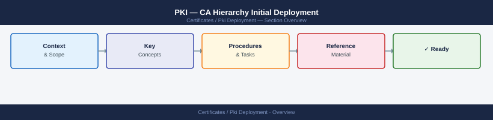

---
tags:
  - deployment
  - security
search:
  boost: 1.5
---
# PKI — CA Hierarchy Initial Deployment

<div class="kb-summary">
Two-tier PKI hierarchy deployment: offline standalone Root CA and domain-joined Enterprise Issuing CA — the recommended Microsoft PKI pattern for enterprise environments.

*Applies to: Windows Server 2019 / 2022 CA role*
</div>



```d2
direction: right

center: "Pki Deployment" {shape: hexagon}
prerequisites: "Prerequisites" {shape: rectangle}
deploy_the_offline_root_ca: "Deploy the Offline Root CA" {shape: rectangle}
configure_root_ca_cdp_and_aia: "Configure Root CA CDP and AIA" {shape: rectangle}
deploy_the_intermediateissuing_ca: "Deploy the Intermediate/Issuing CA" {shape: rectangle}
publish_root_ca_certificate_to_ad: "Publish Root CA Certificate to AD" {shape: rectangle}
configure_certificate_templates: "Configure Certificate Templates" {shape: rectangle}

center -> prerequisites
center -> deploy_the_offline_root_ca
center -> configure_root_ca_cdp_and_aia
center -> deploy_the_intermediateissuing_ca
center -> publish_root_ca_certificate_to_ad
center -> configure_certificate_templates
```

## Before you begin

- **Access:** admin credentials for the target system and any upstream dependencies (DNS, NTP, vCenter, directory services)
- **Timing:** safe to run during a scheduled maintenance window; allow 1-2 hours for initial deployment
- **Dependencies:** network connectivity verified; DNS resolvable; NTP configured; any licence keys available
- **Logging:** record every IP address, hostname, and credential set assigned during this deployment

---


This guide covers deploying a two-tier PKI hierarchy: an offline standalone Root CA and a domain-joined Enterprise Issuing CA. This is the recommended Microsoft PKI pattern for enterprise environments.

---

## Prerequisites

| Role | Server | Notes |
|------|--------|-------|
| Root CA | Air-gapped Windows Server 2022 | Never domain-joined; kept offline after configuration |
| Issuing CA | Domain-joined Windows Server 2022 | Online, issues certificates to clients |
| Web Server | Any IIS server (can be DC) | Hosts CDP and AIA HTTP endpoints |
| HSM | Optional | Recommended for Root CA key storage in regulated environments |

Before starting, plan your CA naming scheme and CRL Distribution Point (CDP) URLs. These are baked into every certificate issued and cannot be changed later without re-issuing.

Example CDP base URL: `http://pki.corp.local/CertEnroll`

---

## Deploy the Offline Root CA

The Root CA is standalone (not domain-joined) and will be taken offline after configuration. All steps run locally on the Root CA server.

**Install the AD CS role:**

```powershell
Install-WindowsFeature ADCS-Cert-Authority -IncludeManagementTools
```

**Configure the Root CA:**

```powershell
Install-AdcsCertificationAuthority `
    -CAType StandaloneRootCA `
    -CryptoProviderName "RSA#Microsoft Software Key Storage Provider" `
    -KeyLength 4096 `
    -HashAlgorithmName SHA256 `
    -ValidityPeriod Years `
    -ValidityPeriodUnits 20 `
    -CACommonName "Corp Root CA" `
    -Force
```

The Root CA certificate is valid for 20 years. Certificates issued by this CA (to the Issuing CA) should be set to 10 years maximum.

---

## Configure Root CA CDP and AIA

CDP and AIA URLs tell certificate consumers where to retrieve the CRL and the CA certificate. Configure them to point to an HTTP server that will remain available.

Open an elevated command prompt on the Root CA:

```cmd
# Remove LDAP and default file paths — only keep HTTP
certutil -setreg CA\CRLPublicationURLs "1:C:\Windows\system32\CertSrv\CertEnroll\%%3%%8%%9.crl\n2:http://pki.corp.local/CertEnroll/%%3%%8%%9.crl"
certutil -setreg CA\CACertPublicationURLs "2:http://pki.corp.local/CertEnroll/%%1_%%3%%4.crt"
```

Set the CRL validity period:

```cmd
certutil -setreg CA\CRLPeriodUnits 52
certutil -setreg CA\CRLPeriod "Weeks"
certutil -setreg CA\CRLDeltaPeriodUnits 0
```

Restart the CA service and publish the CRL:

```powershell
Restart-Service certsvc
certutil -crl
```

Copy the Root CA certificate and CRL to the web server's `CertEnroll` virtual directory:

```text
C:\Windows\System32\CertSrv\CertEnroll\*.crt  →  web server
C:\Windows\System32\CertSrv\CertEnroll\*.crl  →  web server
```

After this step, shut down the Root CA. It only needs to be powered on to sign the Issuing CA certificate or renew the CRL.

---

## Deploy the Intermediate/Issuing CA

The Issuing CA is domain-joined and online. It signs end-entity certificates and handles auto-enrolment.

**Install AD CS role on the Issuing CA:**

```powershell
Install-WindowsFeature ADCS-Cert-Authority -IncludeManagementTools
```

**Configure as Enterprise Subordinate CA:**

```powershell
Install-AdcsCertificationAuthority `
    -CAType EnterpriseSubordinateCA `
    -CryptoProviderName "RSA#Microsoft Software Key Storage Provider" `
    -KeyLength 2048 `
    -HashAlgorithmName SHA256 `
    -CACommonName "Corp Issuing CA" `
    -Force
```

This generates a CSR at `C:\Corp Issuing CA.req`.

**Sign the CSR on the Root CA:**

1. Power on the Root CA (isolated/air-gapped).
2. Copy the CSR to the Root CA.
3. Submit and sign:

```cmd
certreq -submit -config ".\Corp Root CA" "Corp Issuing CA.req"
```

4. Retrieve the signed certificate and copy it back to the Issuing CA.

**Install the signed certificate on the Issuing CA:**

```powershell
certutil -installcert "C:\Corp Issuing CA.crt"
Start-Service certsvc
```

---

## Publish Root CA Certificate to AD

Distributing the Root CA certificate through Active Directory pushes it to the Trusted Root store of all domain-joined machines automatically.

Run the following from an elevated command prompt on a domain controller or the Issuing CA:

```cmd
certutil -dspublish -f RootCA.crt RootCA
```

Verify the certificate is published in AD:

```cmd
certutil -viewstore -enterprise Root
```

All domain-joined machines will receive the Root CA certificate at the next Group Policy refresh.

---

## Configure Certificate Templates

Enterprise CAs use templates to define certificate type, validity, key usage, and enrolment permissions.

**Open the Certificate Templates console:**

```text
certtmpl.msc
```

**Duplicate and configure templates** for common use cases:

| Source Template | New Name | Key Usage | Validity |
|----------------|----------|-----------|---------|
| Workstation Authentication | Corp Workstation Auth | Digital Signature, Key Encipherment | 1 year |
| Web Server | Corp Web Server | Digital Signature, Key Encipherment | 2 years |
| User | Corp User | Digital Signature, Key Encipherment, Key Agreement | 1 year |

For each duplicated template:
- Set the **Compatibility** tab to Windows Server 2008 R2 or higher.
- On the **Security** tab, grant `Enroll` permission to the appropriate group (e.g., `Domain Computers` for Workstation Auth).
- On the **Request Handling** tab, set the minimum key size.

**Publish templates to the CA:**

```powershell
Add-CATemplate -Name "Corp Workstation Auth"
Add-CATemplate -Name "Corp Web Server"
Add-CATemplate -Name "Corp User"
```

---

## Enable Auto-Enrolment

Auto-enrolment allows domain members to request and renew certificates automatically via Group Policy.

**Computer auto-enrolment GPO:**

1. Open Group Policy Management → create or edit a GPO linked to the domain.
2. Navigate to:
   `Computer Configuration → Windows Settings → Security Settings → Public Key Policies → Certificate Services Client — Auto-Enrollment`
3. Set to **Enabled**.
4. Check both:
   - `Renew expired certificates, update pending certificates, and remove revoked certificates`
   - `Update certificates that use certificate templates`

**User auto-enrolment GPO:**

1. Same GPO → `User Configuration → Windows Settings → Security Settings → Public Key Policies → Certificate Services Client — Auto-Enrollment`
2. Same settings as above.

Apply the GPO:

```powershell
gpupdate /force
```

---

## Validate the Deployment

**Verify certificate chain and revocation:**

```cmd
certutil -verify -urlfetch <path-to-issued-cert.crt>
```

All fields should show `OK`. Pay attention to:
- `Certificate is valid`
- `CRL check passed`
- `AIA fetch succeeded`

**Verify auto-enrolment on a test machine:**

```powershell
gpupdate /force
certmgr.msc
```

Check `Personal → Certificates` — a certificate issued by `Corp Issuing CA` should be present.

**Verify CDP and AIA URLs are accessible:**

```powershell
Invoke-WebRequest -Uri "http://pki.corp.local/CertEnroll/<RootCA>.crl" -UseBasicParsing
```

HTTP 200 response confirms the CRL is reachable.

**Check CA health:**

```cmd
certutil -ping
certutil -CRL
```

`certutil -ping` should return `Server "Corp Issuing CA" ICertRequest2 interface is alive`.

---

## Verify

- Confirm the service or component is running and reachable
- Check management UI for any errors or warnings
- Run a basic functional test (login, read, write) to confirm end-to-end operation

## See also

