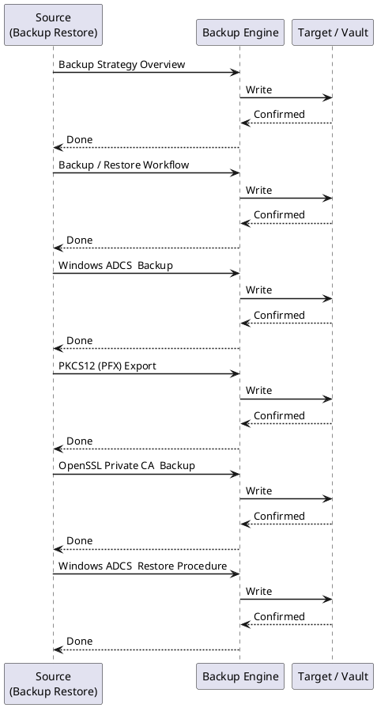
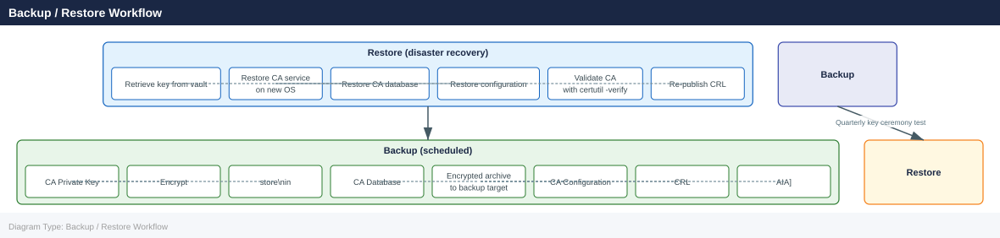
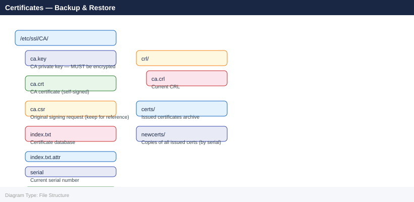

---
tags:
  - operations
  - security
description: "Losing a Certificate Authority's private key is an unrecoverable event — every certificate it issued becomes untrusted."
---
# Certificates — Backup & Restore

<div class="kb-summary">
Losing a Certificate Authority's private key is an unrecoverable event — every certificate it issued becomes untrusted.
</div>

 This page covers the full backup and restore lifecycle for both Windows Active Directory Certificate Services (ADCS) and OpenSSL-based private CAs, including key ceremony documentation, PKCS#12 export, and validated restore procedures.

---



## Before you begin

- **Access:** Admin credentials on all affected systems
- **Timing:** safe to run during business hours unless a step is marked ⚠ (causes interruption)
- **Dependencies:** no active upgrades or migrations on the same infrastructure
- **Logging:** capture command output — paste into the change record on completion

---

## Backup Strategy Overview

| Component | What to Back Up | Tool |
|---|---|---|
| Windows CA private key | CA certificate + private key | `certutil -backupKey` |
| Windows CA database | Issued certificate database | `certutil -backupDB` |
| Windows CA configuration | Registry hive under `HKLM\SYSTEM\CurrentControlSet\Services\CertSvc` | `reg export` |
| OpenSSL CA | `ca.key`, `ca.crt`, `index.txt`, `serial`, `crlnumber` | `openssl`, filesystem copy |
| PKCS#12 bundle | Certificate + chain + key (portable) | `openssl pkcs12` / `certutil` |
| Issued end-entity certs | PEM/PFX archives | Application-specific |

---

## Backup / Restore Workflow



---

## Windows ADCS — Backup

### Back Up the CA Private Key

```cmd
REM Back up the CA private key and certificate to a password-protected PFX
REM Run on the CA server as a local administrator

certutil -backupKey C:\CABackup\
```

This creates a `.p12` file in the target directory. Protect it with a strong password when prompted.

Alternatively, export non-interactively (for automation):

```powershell
# Export CA key using certutil with a password file
$pwd = "VaultStoredPassphrase"
certutil -p $pwd -backupKey C:\CABackup\
```

### Back Up the CA Database

```cmd
REM Back up the CA database (issued certificates, pending requests, CRL)
certutil -backupDB C:\CABackup\

REM Incremental backup (since last full)
certutil -backupDB C:\CABackup\ -incremental
```

The target directory will contain:
- `<CAName>.edb` — Extensible Storage Engine (ESE) database
- `<CAName>*.log` — Transaction logs

### Back Up the CA Registry Configuration

```cmd
REM Export the CA registry hive
reg export "HKLM\SYSTEM\CurrentControlSet\Services\CertSvc" C:\CABackup\CertSvc.reg /y
```

### Full ADCS Backup Script

```powershell
$BackupRoot = "\\backup-srv\CA-Backups\$(Get-Date -Format 'yyyy-MM-dd')"
New-Item -ItemType Directory -Path $BackupRoot -Force

# Key backup
certutil -backupKey "$BackupRoot\Key\"

# Database backup
certutil -backupDB "$BackupRoot\DB\"

# Registry backup
reg export "HKLM\SYSTEM\CurrentControlSet\Services\CertSvc" "$BackupRoot\CertSvc.reg" /y

# Copy CA certificate and CRL
Copy-Item "C:\Windows\System32\CertSrv\CertEnroll\*" "$BackupRoot\CertEnroll\" -Recurse -Force

Write-Host "CA backup completed to $BackupRoot"
```

---

## PKCS#12 (PFX) Export

PKCS#12 bundles a certificate, its private key, and the chain into a single portable file. Use this format for CA migration, archival, and handing off certificates between systems.

### Windows — Export with certutil

```cmd
REM Export a certificate by thumbprint from the local machine store
certutil -exportpfx -p "StrongPassphrase" My <Thumbprint> C:\export\cert.pfx
```

### OpenSSL — Create a PKCS#12 Bundle

```bash
# Combine certificate, private key, and CA chain into a PFX
openssl pkcs12 -export \
  -in server.crt \
  -inkey server.key \
  -certfile ca-chain.pem \
  -out server.pfx \
  -passout pass:StrongPassphrase \
  -name "server.corp.example.com"
```


```text title="Expected output"
(no output — command completes silently)
```

!!! warning "Common errors"
    | Error | Fix |
    |---|---|
    | `unable to load private key` | Verify the private key file path is correct and the file has read permissions (`chmod 600 server.key`). |
    | `Error outputting keys and certificates` | Ensure the certificate file (server.crt) and CA chain file (ca-chain.pem) are in PEM format and not corrupted; validate with `openssl x509 -in server.crt -text -noout`. |
    | `MAC verification failure` | The PFX file was created but cannot be read back; regenerate the PFX with a simpler passphrase or use `-passin pass:` to match the original key encryption password if the key is encrypted. |
### OpenSSL — Import a PKCS#12 Bundle

```bash
# Extract certificate from PFX
openssl pkcs12 -in server.pfx -clcerts -nokeys -out server.crt -passin pass:StrongPassphrase

# Extract private key from PFX (no encryption on output key — store securely)
openssl pkcs12 -in server.pfx -nocerts -nodes -out server.key -passin pass:StrongPassphrase

# Extract CA chain from PFX
openssl pkcs12 -in server.pfx -cacerts -nokeys -out ca-chain.pem -passin pass:StrongPassphrase
```


```text title="Expected output"
(no output — command completes silently)
(no output — command completes silently)
(no output — command completes silently)
```

!!! warning "Common errors"
    | Error | Fix |
    |---|---|
    | `Error opening input file server.pfx` | Verify the PFX file exists in the current directory with `ls -la server.pfx` and correct the path if needed. |
    | `Mac verify failure` | Ensure the password is correct; if the PFX was created with a different passphrase, try `openssl pkcs12 -in server.pfx -passin pass:CorrectPassword` or use `-passin file:` to read from a file. |
    | `unable to load private key` | If extracting the key fails silently, the PFX may be corrupted or the `-nodes` flag was omitted; re-export the PFX from the certificate authority or use `-nodes` to skip encryption on the output key. |
---

## OpenSSL Private CA — Backup

The OpenSSL CA directory structure must be backed up atomically (while no signing operations are in progress).

### Typical OpenSSL CA Directory



### Backup Command

```bash
# Encrypted tar archive of the entire CA directory
tar czf - /etc/ssl/CA/ | \
  openssl enc -aes-256-cbc -pbkdf2 -pass pass:VaultPassphrase \
  -out /backup/ca-backup-$(date +%Y%m%d).tar.gz.enc

# Verify the archive is readable
openssl enc -d -aes-256-cbc -pbkdf2 -pass pass:VaultPassphrase \
  -in /backup/ca-backup-$(date +%Y%m%d).tar.gz.enc | \
  tar tzvf -
```


```text title="Expected output"
x /etc/ssl/CA/
x /etc/ssl/CA/private/
x /etc/ssl/CA/private/ca-key.pem
x /etc/ssl/CA/certs/
x /etc/ssl/CA/certs/ca-cert.pem
x /etc/ssl/CA/certs/intermediate-cert.pem
x /etc/ssl/CA/crl/
x /etc/ssl/CA/crl/ca.crl
x /etc/ssl/CA/index.txt
x /etc/ssl/CA/serial
x /etc/ssl/CA/newcerts/
x /etc/ssl/CA/newcerts/01.pem
x /etc/ssl/CA/newcerts/02.pem
...
```

!!! warning "Common errors"
    | Error | Fix |
    |---|---|
    | `bad decrypt` | Verify the passphrase matches exactly and that the encrypted file was not corrupted during transfer. |
    | `tar: /etc/ssl/CA/: Cannot open: Permission denied` | Run the tar command with `sudo` to ensure read access to private key files in the CA directory. |
### Verify CA Key Integrity

```bash
# Check that the key and certificate match (modulus comparison)
openssl rsa  -noout -modulus -in /etc/ssl/CA/ca.key | openssl md5
openssl x509 -noout -modulus -in /etc/ssl/CA/ca.crt | openssl md5
# Both outputs must be identical
```


```text title="Expected output"
(stdin)= d41d8cd98f00b204e9800998ecf8427e
(stdin)= d41d8cd98f00b204e9800998ecf8427e
```

!!! warning "Common errors"
    | Error | Fix |
    |---|---|
    | `unable to load Private Key` | Verify the key file exists at `/etc/ssl/CA/ca.key` and you have read permissions with `ls -l /etc/ssl/CA/ca.key`. |
    | `unable to load certificate` | Confirm the certificate file exists at `/etc/ssl/CA/ca.crt` and is in valid PEM format with `file /etc/ssl/CA/ca.crt`. |
---

## Windows ADCS — Restore Procedure

### Prerequisites

- OS reinstalled or clean Windows Server instance
- ADCS role installed but **not yet configured**
- CA backup files accessible

### Steps

1. Install ADCS role and select *Certification Authority* role service (do not configure yet):

```powershell
Install-WindowsFeature ADCS-Cert-Authority -IncludeManagementTools
```

2. Restore the CA database:

```cmd
certutil -restoreDB C:\CABackup\DB\
```

3. Restore the CA registry configuration:

```cmd
reg import C:\CABackup\CertSvc.reg
```

4. Restore the CA private key:

```cmd
certutil -restoreKey C:\CABackup\Key\<CAName>.p12
```

5. Start the Certificate Services:

```powershell
Start-Service CertSvc
```

6. Verify CA functionality:

```cmd
REM Check CA status
certutil -ping

REM Verify the CA certificate chain
certutil -verify -urlfetch C:\CABackup\CertEnroll\<CAName>.crt

REM Confirm database is intact
certutil -view -restrict "Disposition=20" -out CertificateTemplate,CommonName | more
```

7. Re-publish the CRL and Delta CRL:

```cmd
certutil -CRL
```

---

## OpenSSL CA — Restore Procedure

```bash
# Stop any services that might be calling the CA
systemctl stop nginx  # or whatever signs/serves via this CA

# Restore from encrypted backup
openssl enc -d -aes-256-cbc -pbkdf2 -pass pass:VaultPassphrase \
  -in /backup/ca-backup-YYYYMMDD.tar.gz.enc | \
  tar xzvf - -C /

# Fix permissions
chmod 700 /etc/ssl/CA
chmod 600 /etc/ssl/CA/ca.key
chmod 644 /etc/ssl/CA/ca.crt
chown -R root:ssl-cert /etc/ssl/CA

# Verify integrity
openssl rsa  -noout -modulus -in /etc/ssl/CA/ca.key | openssl md5
openssl x509 -noout -modulus -in /etc/ssl/CA/ca.crt | openssl md5
openssl x509 -noout -text -in /etc/ssl/CA/ca.crt | grep -E "Subject:|Not After"
```


```text title="Expected output"
Stopping nginx.service...
Stopping nginx.service...
Stopped nginx.service.
x /etc/ssl/CA/
x /etc/ssl/CA/ca.key
x /etc/ssl/CA/ca.crt
x /etc/ssl/CA/index.txt
x /etc/ssl/CA/serial
(stdin)= d41d8cd98f00b204e9800998ecf8427e
(stdin)= d41d8cd98f00b204e9800998ecf8427e
        Subject: C = US, ST = California, L = San Francisco, O = Example Corp, CN = Example Root CA
            Not After : Dec 15 14:32:18 2034 GMT
```

!!! warning "Common errors"
    | Error | Fix |
    |---|---|
    | `tar: /etc/ssl/CA: Cannot open: Permission denied` | Run the restore command with `sudo` or as root user. |
    | `openssl: error in enc` | Verify the backup file exists at the specified path and the encryption passphrase is correct. |
    | `chown: invalid user 'ssl-cert'` | Replace `ssl-cert` with an existing group name (e.g., `root` or check available groups with `getent group`). |
---

## Key Ceremony Documentation

A key ceremony is the formal, witnessed procedure for generating or accessing a CA's root private key. It should be documented and signed off by at least two authorized personnel.

### Ceremony Checklist

| Step | Action | Witness Required |
|---|---|---|
| 1 | Verify identity of all participants | Yes |
| 2 | Confirm air-gapped environment (or HSM) | Yes |
| 3 | Generate CA key pair with specified algorithm and key length | Yes |
| 4 | Record key fingerprint / serial in the ceremony log | Yes |
| 5 | Encrypt key material and split into ≥2 key custodians (Shamir's Secret Sharing or dual-control) | Yes |
| 6 | Store encrypted copies in separate physical locations | Yes |
| 7 | Destroy plaintext key material from ceremony host | Yes |
| 8 | Sign ceremony log | Yes |
| 9 | Schedule next ceremony date | No |

### Ceremony Log Template Fields

```text
Date/Time (UTC):
Location:
CA Distinguished Name:
Key Algorithm / Length:
Serial Number:
SHA-256 Thumbprint:
Participants (Name / Role / Signature):
Key Custodians:
Backup Locations:
Next Ceremony Date:
```

---

## Backup Schedule and Retention

| Backup Type | Frequency | Retention | Storage |
|---|---|---|---|
| CA database (full) | Weekly | 6 months | Encrypted, off-site |
| CA database (incremental) | Daily | 30 days | Encrypted, on-site |
| CA private key | At key generation / change only | Forever | HSM or offline vault |
| CA registry config | After any config change | 6 months | With DB backup |
| PKCS#12 export (offline copy) | Quarterly ceremony | Forever | Fireproof, off-site |

---

## Verify

- Confirm the operation completed without errors in the log or management UI
- Verify the expected state change is visible (service running, object created, config applied)
- Document the outcome in the change record

## See also

- [Certificates — Procedures](../procedures/)
- [Certificates — Health Checks](../health-checks/)
- [Certificates — CLI Reference](../cli-reference/)
- [Certificates — Scripts](../scripts/)
- [Certificates — Install and Upgrade](../install-upgrade/)
- [Certificates — Common Issues](../../troubleshooting/common-issues/)
