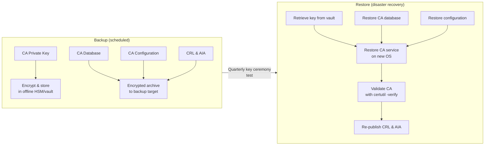

# Certificates — Backup & Restore


<div class="kb-summary">
Losing a Certificate Authority's private key is an unrecoverable event — every certificate it issued becomes untrusted.
</div>
```text
┌──────────────────────── Security Certificates Operations — Backup and Restore ────────────────────────┐
│                                                                                                       │
│   ┌───────────────────────────────────────────────────────────────────────────────────────────────┐   │
│   │    Certificates backup: snapshots, replication, and external backup application integration   │   │
│   │        Snapshot schedule: hourly for 24 h, daily for 7 days, weekly for 4 weeks minimum       │   │
│   │            Replication: async or sync to DR site for off-site data protection copy            │   │
│   │       Restore: volume-level or file-level restore from snapshot; test restore quarterly       │   │
│   └───────────────────────────────────────────────────────────────────────────────────────────────┘   │
│                                                                                                       │
│    Snapshot → replicate to DR → verify → document → test restore                                      │
│                                                                                                       │
│                  ▼                                ▼                                ▼                  │
│                                                                                                       │
│   ┌─────────────────────────────┐  ┌─────────────────────────────┐  ┌─────────────────────────────┐   │
│   │            Layer            │  │          Component          │  │            Notes            │   │
│   │             Core            │  │       Primary service       │  │        Main function        │   │
│   │          Management         │  │        Control plane        │  │         Admin access        │   │
│   │          Monitoring         │  │         Health/perf         │  │      Alerts/dashboards      │   │
│   │           Security          │  │         Auth/encrypt        │  │        Access control       │   │
│   │         Integration         │  │        APIs/plug-ins        │  │         Third-party         │   │
│   └─────────────────────────────┘  └─────────────────────────────┘  └─────────────────────────────┘   │
│                                                                                                       │
│                          ▼                                                 ▼                          │
│                                                                                                       │
│   ┌───────────────────────────────────────────────────────────────────────────────────────────────┐   │
│   │       Type       │     Schedule     │     Retention     │     Offsite?     │    Test cycle    │   │
│   │     Snapshot     │   Hourly/daily   │    7/30/90 days   │        No        │     Monthly      │   │
│   │   Replication    │  Policy-driven   │     Per policy    │     Yes (DR)     │    Quarterly     │   │
│   │    Backup app    │ Daily full+incr  │      90+ days     │ Yes (tape/cloud  │    Quarterly     │   │
│   │     Archive      │     Monthly      │      7+ years     │   Yes (object)   │      Annual      │   │
│   └───────────────────────────────────────────────────────────────────────────────────────────────┘   │
│                                                                                                       │
│    Physical: Security Certificates Operations infrastructure · management network · monitoring        │
│                                                                                                       │
│    Key terms:                                                                                         │
│                                                                                                       │
│    Certificates       = Security Certificates Operations platform overview and core concepts          │
│    Management         = management console and command-line interface for administration              │
│    Monitoring         = health and performance monitoring dashboards and alerting                     │
│    Automation         = REST API, scripting, and pipeline integration capabilities                    │
│    Security           = access control, authentication, and encryption configuration                  │
│    Backup             = backup and recovery procedures and schedule configuration                     │
│    Upgrade            = software version upgrades and firmware patching procedures                    │
│    Troubleshooting    = diagnostic procedures and common issue resolution steps                       │
│    Escalation         = vendor support escalation path and severity triage process                    │
│    Documentation      = vendor knowledge base and official product documentation                      │
│    Change management  = change ticket requirements for production modifications                       │
│    Audit log          = admin action logging for compliance and security review                       │
│                                                                                                       │
└───────────────────────────────────────────────────────────────────────────────────────────────────────┘
```


 This page covers the full backup and restore lifecycle for both Windows Active Directory Certificate Services (ADCS) and OpenSSL-based private CAs, including key ceremony documentation, PKCS#12 export, and validated restore procedures.

---

## Backup Strategy Overview

| Component | What to Back Up | Tool |
|---|---|---|
| Windows CA private key | CA certificate + private key | `certutil -backupKey` |
| Windows CA database | Issued certificate database | `certutil -backupDB` |
| Windows CA configuration | Registry hive under `HKLM\SYSTEM\CurrentControlSet\Services\CertSvc` | `reg export` |
| OpenSSL CA | `ca.key`, `ca.crt`, `index.txt`, `serial`, `crlnumber` | `openssl`, filesystem copy |
| PKCS#12 bundle | Certificate + chain + key (portable) | `openssl pkcs12` / `certutil` |
| Issued end-entity certs | PEM/PFX archives | Application-specific |

---

## Backup / Restore Workflow



---

## Windows ADCS — Backup

### Back Up the CA Private Key

```cmd
REM Back up the CA private key and certificate to a password-protected PFX
REM Run on the CA server as a local administrator

certutil -backupKey C:\CABackup\
```

This creates a `.p12` file in the target directory. Protect it with a strong password when prompted.

Alternatively, export non-interactively (for automation):

```powershell
# Export CA key using certutil with a password file
$pwd = "VaultStoredPassphrase"
certutil -p $pwd -backupKey C:\CABackup\
```

### Back Up the CA Database

```cmd
REM Back up the CA database (issued certificates, pending requests, CRL)
certutil -backupDB C:\CABackup\

REM Incremental backup (since last full)
certutil -backupDB C:\CABackup\ -incremental
```

The target directory will contain:
- `<CAName>.edb` — Extensible Storage Engine (ESE) database
- `<CAName>*.log` — Transaction logs

### Back Up the CA Registry Configuration

```cmd
REM Export the CA registry hive
reg export "HKLM\SYSTEM\CurrentControlSet\Services\CertSvc" C:\CABackup\CertSvc.reg /y
```

### Full ADCS Backup Script

```powershell
$BackupRoot = "\\backup-srv\CA-Backups\$(Get-Date -Format 'yyyy-MM-dd')"
New-Item -ItemType Directory -Path $BackupRoot -Force

# Key backup
certutil -backupKey "$BackupRoot\Key\"

# Database backup
certutil -backupDB "$BackupRoot\DB\"

# Registry backup
reg export "HKLM\SYSTEM\CurrentControlSet\Services\CertSvc" "$BackupRoot\CertSvc.reg" /y

# Copy CA certificate and CRL
Copy-Item "C:\Windows\System32\CertSrv\CertEnroll\*" "$BackupRoot\CertEnroll\" -Recurse -Force

Write-Host "CA backup completed to $BackupRoot"
```

---

## PKCS#12 (PFX) Export

PKCS#12 bundles a certificate, its private key, and the chain into a single portable file. Use this format for CA migration, archival, and handing off certificates between systems.

### Windows — Export with certutil

```cmd
REM Export a certificate by thumbprint from the local machine store
certutil -exportpfx -p "StrongPassphrase" My <Thumbprint> C:\export\cert.pfx
```

### OpenSSL — Create a PKCS#12 Bundle

```bash
# Combine certificate, private key, and CA chain into a PFX
openssl pkcs12 -export \
  -in server.crt \
  -inkey server.key \
  -certfile ca-chain.pem \
  -out server.pfx \
  -passout pass:StrongPassphrase \
  -name "server.corp.example.com"
```

### OpenSSL — Import a PKCS#12 Bundle

```bash
# Extract certificate from PFX
openssl pkcs12 -in server.pfx -clcerts -nokeys -out server.crt -passin pass:StrongPassphrase

# Extract private key from PFX (no encryption on output key — store securely)
openssl pkcs12 -in server.pfx -nocerts -nodes -out server.key -passin pass:StrongPassphrase

# Extract CA chain from PFX
openssl pkcs12 -in server.pfx -cacerts -nokeys -out ca-chain.pem -passin pass:StrongPassphrase
```

---

## OpenSSL Private CA — Backup

The OpenSSL CA directory structure must be backed up atomically (while no signing operations are in progress).

### Typical OpenSSL CA Directory

```text
/etc/ssl/CA/
├── ca.key          # CA private key — MUST be encrypted
├── ca.crt          # CA certificate (self-signed)
├── ca.csr          # Original signing request (keep for reference)
├── index.txt       # Certificate database
├── index.txt.attr
├── serial          # Current serial number
├── crlnumber       # CRL serial counter
├── crl/
│   └── ca.crl      # Current CRL
├── certs/          # Issued certificates archive
└── newcerts/       # Copies of all issued certs (by serial)
```

### Backup Command

```bash
# Encrypted tar archive of the entire CA directory
tar czf - /etc/ssl/CA/ | \
  openssl enc -aes-256-cbc -pbkdf2 -pass pass:VaultPassphrase \
  -out /backup/ca-backup-$(date +%Y%m%d).tar.gz.enc

# Verify the archive is readable
openssl enc -d -aes-256-cbc -pbkdf2 -pass pass:VaultPassphrase \
  -in /backup/ca-backup-$(date +%Y%m%d).tar.gz.enc | \
  tar tzvf -
```

### Verify CA Key Integrity

```bash
# Check that the key and certificate match (modulus comparison)
openssl rsa  -noout -modulus -in /etc/ssl/CA/ca.key | openssl md5
openssl x509 -noout -modulus -in /etc/ssl/CA/ca.crt | openssl md5
# Both outputs must be identical
```

---

## Windows ADCS — Restore Procedure

### Prerequisites

- OS reinstalled or clean Windows Server instance
- ADCS role installed but **not yet configured**
- CA backup files accessible

### Steps

1. Install ADCS role and select *Certification Authority* role service (do not configure yet):

```powershell
Install-WindowsFeature ADCS-Cert-Authority -IncludeManagementTools
```

2. Restore the CA database:

```cmd
certutil -restoreDB C:\CABackup\DB\
```

3. Restore the CA registry configuration:

```cmd
reg import C:\CABackup\CertSvc.reg
```

4. Restore the CA private key:

```cmd
certutil -restoreKey C:\CABackup\Key\<CAName>.p12
```

5. Start the Certificate Services:

```powershell
Start-Service CertSvc
```

6. Verify CA functionality:

```cmd
REM Check CA status
certutil -ping

REM Verify the CA certificate chain
certutil -verify -urlfetch C:\CABackup\CertEnroll\<CAName>.crt

REM Confirm database is intact
certutil -view -restrict "Disposition=20" -out CertificateTemplate,CommonName | more
```

7. Re-publish the CRL and Delta CRL:

```cmd
certutil -CRL
```

---

## OpenSSL CA — Restore Procedure

```bash
# Stop any services that might be calling the CA
systemctl stop nginx  # or whatever signs/serves via this CA

# Restore from encrypted backup
openssl enc -d -aes-256-cbc -pbkdf2 -pass pass:VaultPassphrase \
  -in /backup/ca-backup-YYYYMMDD.tar.gz.enc | \
  tar xzvf - -C /

# Fix permissions
chmod 700 /etc/ssl/CA
chmod 600 /etc/ssl/CA/ca.key
chmod 644 /etc/ssl/CA/ca.crt
chown -R root:ssl-cert /etc/ssl/CA

# Verify integrity
openssl rsa  -noout -modulus -in /etc/ssl/CA/ca.key | openssl md5
openssl x509 -noout -modulus -in /etc/ssl/CA/ca.crt | openssl md5
openssl x509 -noout -text -in /etc/ssl/CA/ca.crt | grep -E "Subject:|Not After"
```

---

## Key Ceremony Documentation

A key ceremony is the formal, witnessed procedure for generating or accessing a CA's root private key. It should be documented and signed off by at least two authorized personnel.

### Ceremony Checklist

| Step | Action | Witness Required |
|---|---|---|
| 1 | Verify identity of all participants | Yes |
| 2 | Confirm air-gapped environment (or HSM) | Yes |
| 3 | Generate CA key pair with specified algorithm and key length | Yes |
| 4 | Record key fingerprint / serial in the ceremony log | Yes |
| 5 | Encrypt key material and split into ≥2 key custodians (Shamir's Secret Sharing or dual-control) | Yes |
| 6 | Store encrypted copies in separate physical locations | Yes |
| 7 | Destroy plaintext key material from ceremony host | Yes |
| 8 | Sign ceremony log | Yes |
| 9 | Schedule next ceremony date | No |

### Ceremony Log Template Fields

```text
Date/Time (UTC):
Location:
CA Distinguished Name:
Key Algorithm / Length:
Serial Number:
SHA-256 Thumbprint:
Participants (Name / Role / Signature):
Key Custodians:
Backup Locations:
Next Ceremony Date:
```

---

## Backup Schedule and Retention

| Backup Type | Frequency | Retention | Storage |
|---|---|---|---|
| CA database (full) | Weekly | 6 months | Encrypted, off-site |
| CA database (incremental) | Daily | 30 days | Encrypted, on-site |
| CA private key | At key generation / change only | Forever | HSM or offline vault |
| CA registry config | After any config change | 6 months | With DB backup |
| PKCS#12 export (offline copy) | Quarterly ceremony | Forever | Fireproof, off-site |
