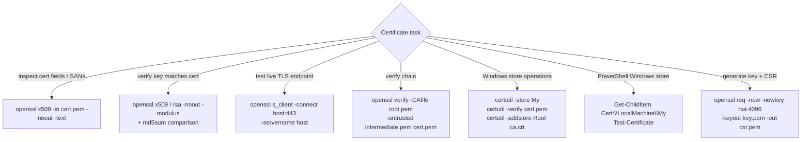

---
tags:
  - operations
  - security
---
# Certificates CLI Reference


<div class="kb-summary">
Windows certificate operations use `certutil` for verification, revocation, and store management. Linux operations rely on `openssl` for inspection, verification, and TLS connectivity testing.
</div>
```text
┌────────────────────────── Security Certificates Operations — CLI Reference ───────────────────────────┐
│                                                                                                       │
│   ┌───────────────────────────────────────────────────────────────────────────────────────────────┐   │
│   │       Certificates CLI: command-line interface for all management and operational tasks       │   │
│   │            Access: SSH or REST client to management IP; authenticate as admin role            │   │
│   │        Commands: status, list, create, modify, delete, show, and diagnostic operations        │   │
│   │          Scripting: use REST API or CLI in automation for provisioning and reporting          │   │
│   └───────────────────────────────────────────────────────────────────────────────────────────────┘   │
│                                                                                                       │
│    SSH → authenticate → show status → configure → verify → log output                                 │
│                                                                                                       │
│                  ▼                                ▼                                ▼                  │
│                                                                                                       │
│   ┌─────────────────────────────┐  ┌─────────────────────────────┐  ┌─────────────────────────────┐   │
│   │            Layer            │  │          Component          │  │            Notes            │   │
│   │             Core            │  │       Primary service       │  │        Main function        │   │
│   │          Management         │  │        Control plane        │  │         Admin access        │   │
│   │          Monitoring         │  │         Health/perf         │  │      Alerts/dashboards      │   │
│   │           Security          │  │         Auth/encrypt        │  │        Access control       │   │
│   │         Integration         │  │        APIs/plug-ins        │  │         Third-party         │   │
│   └─────────────────────────────┘  └─────────────────────────────┘  └─────────────────────────────┘   │
│                                                                                                       │
│                          ▼                                                 ▼                          │
│                                                                                                       │
│   ┌───────────────────────────────────────────────────────────────────────────────────────────────┐   │
│   │     Category     │     Command      │      Purpose      │      Output      │      Notes       │   │
│   │      Status      │   show status    │    Health check   │   State/alerts   │    Daily run     │   │
│   │       List       │     list all     │     Inventory     │   Name/ID/size   │    Read-only     │   │
│   │      Create      │  create volume   │     Provision     │    New object    │    Change req    │   │
│   │      Delete      │ delete resource  │    Decommission   │   Confirmation   │   Irreversible   │   │
│   └───────────────────────────────────────────────────────────────────────────────────────────────┘   │
│                                                                                                       │
│    Physical: Security Certificates Operations infrastructure · management network · monitoring        │
│                                                                                                       │
│    Key terms:                                                                                         │
│                                                                                                       │
│    Certificates       = Security Certificates Operations platform overview and core concepts          │
│    Management         = management console and command-line interface for administration              │
│    Monitoring         = health and performance monitoring dashboards and alerting                     │
│    Automation         = REST API, scripting, and pipeline integration capabilities                    │
│    Security           = access control, authentication, and encryption configuration                  │
│    Backup             = backup and recovery procedures and schedule configuration                     │
│    Upgrade            = software version upgrades and firmware patching procedures                    │
│    Troubleshooting    = diagnostic procedures and common issue resolution steps                       │
│    Escalation         = vendor support escalation path and severity triage process                    │
│    Documentation      = vendor knowledge base and official product documentation                      │
│    Change management  = change ticket requirements for production modifications                       │
│    Audit log          = admin action logging for compliance and security review                       │
│                                                                                                       │
└───────────────────────────────────────────────────────────────────────────────────────────────────────┘
```


 PowerShell provides `Get-ChildItem Cert:\` for the Windows certificate store and `Test-Certificate` for chain validation.

## Tool Selection by Task



---

## openssl — Inspection

Inspect certificates, keys, and chains before deploying or renewing.

```bash
# View all certificate fields
openssl x509 -in cert.pem -noout -text

# Show subject, issuer, and expiry only
openssl x509 -in cert.pem -noout -subject -issuer -dates

# Show SANs (Subject Alternative Names)
openssl x509 -in cert.pem -noout -text | grep -A1 "Subject Alternative"

# Compute SHA-1 thumbprint
openssl x509 -in cert.pem -noout -fingerprint -sha1

# Compute SHA-256 fingerprint
openssl x509 -in cert.pem -noout -fingerprint -sha256

# Inspect a PKCS#12 bundle
openssl pkcs12 -info -in cert.p12 -noout

# View a CSR
openssl req -in request.csr -noout -text
```

---

## openssl — Verification

```bash
# Verify certificate matches the private key (moduli must match)
openssl x509 -noout -modulus -in cert.pem | md5sum
openssl rsa  -noout -modulus -in key.pem  | md5sum

# Verify certificate against a CA bundle
openssl verify -CAfile ca-bundle.pem cert.pem

# Verify full chain (intermediate + root)
openssl verify -CAfile root.pem -untrusted intermediate.pem cert.pem

# Check days until expiry
openssl x509 -enddate -noout -in cert.pem |   awk -F= '{print $2}' | xargs -I{} date -d "{}" +%s |   awk -v now=$(date +%s) '{print int(($1-now)/86400)" days remaining"}'
```

---

## openssl — TLS Testing

```bash
# Test TLS handshake and show server certificate
openssl s_client -connect <host>:443 -servername <host>

# Check specific TLS version support
openssl s_client -connect <host>:443 -tls1_2
openssl s_client -connect <host>:443 -tls1_3

# Show full certificate chain from a live endpoint
openssl s_client -connect <host>:443 -servername <host> 2>/dev/null |   openssl x509 -noout -text

# Test LDAPS
openssl s_client -connect <ldap_host>:636

# Test SMTPS
openssl s_client -connect <smtp_host>:465 -starttls smtp
```

---

## certutil — Windows

```bash
# Verify a certificate file
certutil -verify cert.pem

# Display certificate detail
certutil -dump cert.pem

# Check revocation (CRL/OCSP)
certutil -verify -urlfetch cert.pem

# Add a certificate to the Trusted Root store
certutil -addstore Root ca.crt

# Remove a certificate from the store by thumbprint
certutil -delstore My <thumbprint>

# List all certs in the Personal store
certutil -store My
```

---

## PowerShell — Windows Certificate Store

```powershell
# List all certs in the Personal (My) store
Get-ChildItem Cert:\LocalMachine\My | Select Subject, Thumbprint, NotAfter

# Find certificates expiring within 30 days
$cutoff = (Get-Date).AddDays(30)
Get-ChildItem Cert:\LocalMachine\My | Where-Object { $_.NotAfter -lt $cutoff }

# Find by thumbprint
Get-ChildItem Cert:\LocalMachine\My | Where-Object { $_.Thumbprint -eq "<thumbprint>" }

# Validate certificate chain
Get-ChildItem Cert:\LocalMachine\My | Test-Certificate

# Export certificate to PEM
$cert = Get-ChildItem Cert:\LocalMachine\My | Where-Object { $_.Subject -like "*<cn>*" }
[System.IO.File]::WriteAllBytes("C:\cert.cer", $cert.Export([System.Security.Cryptography.X509Certificates.X509ContentType]::Cert))
```

---

## Key & CSR Generation

```bash
# Generate a 2048-bit RSA private key
openssl genrsa -out key.pem 2048

# Generate a 4096-bit RSA key
openssl genrsa -out key.pem 4096

# Generate an EC key (P-256)
openssl ecparam -name prime256v1 -genkey -noout -out ec-key.pem

# Create a CSR from an existing key
openssl req -new -key key.pem -out request.csr   -subj "/CN=<common_name>/O=<org>/C=<country>"

# Create a CSR with SANs (using a config file)
openssl req -new -key key.pem -out request.csr -config <(cat <<EOF
[req]
distinguished_name = dn
req_extensions = v3_req
prompt = no
[dn]
CN = <common_name>
[v3_req]
subjectAltName = DNS:<san1>,DNS:<san2>
EOF
)
```
