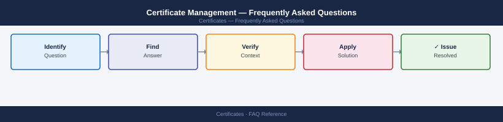

---
tags:
  - certificates
  - faq
  - operations
---
# Certificate Management — Frequently Asked Questions

Common questions about Certificate Management operations, configuration, and troubleshooting. For step-by-step procedures, see the <a href="index.md">Operations</a> section.

## General

**Q: How do I check certificate expiry dates across my infrastructure?**
A: Use `openssl x509 -in cert.pem -noout -dates` for individual certs. For bulk checks: use Venafi, cert-manager, or a script with `echo | openssl s_client -connect host:443 2>/dev/null | openssl x509 -noout -dates`.

**Q: How do I check the current Certificate Management version?**
A: `openssl x509 -in cert.pem -noout -dates`

## Configuration

**Q: What is the recommended certificate validity period?**
A: TLS certificates: maximum 397 days (browser requirement since 2020). Internal CA certificates: 5 years for intermediate, 10-20 years for root. Code signing: 1-3 years. Shorter validity reduces exposure window from key compromise.

**Q: How do I enable automatic certificate renewal with ACME/Let's Encrypt?**
A: Deploy cert-manager in Kubernetes (`kubectl apply -f cert-manager.yaml`), or use Certbot on standalone servers (`certbot renew --pre-hook 'stop nginx' --post-hook 'start nginx'`). Configure renewal at 30 days before expiry.

## Operations

**Q: How do I rotate a wildcard certificate across multiple servers without downtime?**
A: Stage the new cert on all servers before the cutover. Use a load balancer to health-check each server. Reload (not restart) nginx/Apache per server: `nginx -s reload`. Verify with `openssl s_client -connect host:443`.

**Q: What is the correct procedure to issue a new internal certificate?**
A: Generate CSR: `openssl req -new -key server.key -out server.csr -subj '/CN=hostname.corp.local'`. Submit to internal CA (EJBCA, ADCS, Vault PKI). Verify SAN fields include all hostnames and IPs. Install cert and chain.

## Troubleshooting

**Q: Browser shows 'Certificate Not Trusted' for an internal site. What does it mean?**
A: The internal CA root certificate is not in the client's trust store. Deploy the root CA cert via GPO (Windows), `/etc/ssl/certs/` (Linux), or MDM (macOS/iOS). Alternatively, issue a cert from a public CA for externally accessible services.

**Q: TLS handshake latency is high — where do I start?**
A: Check OCSP stapling is enabled on the server (`ssl_stapling on` in nginx). Ensure session resumption is configured. Review certificate chain length — intermediate certs should be bundled. Use ECDSA certs (faster) over RSA 4096.

## Backup and Recovery

**Q: How often should I back up certificate private keys?**
A: Private keys should be stored in a secrets manager (HashiCorp Vault, AWS Secrets Manager) with automatic backups. For HSM-backed keys, the HSM backup schedule applies. Never store private keys in Git or shared drives.

**Q: Can I recover a lost private key?**
A: No — private keys cannot be recovered if lost. Issue a new certificate with a new key pair. Revoke the old certificate via CRL or OCSP. This is why private keys must be backed up securely at issuance time.

## See Also

- [Certificate Management Operations](index.md)
- [Certificate Management Troubleshooting](../../troubleshooting/index.md)
